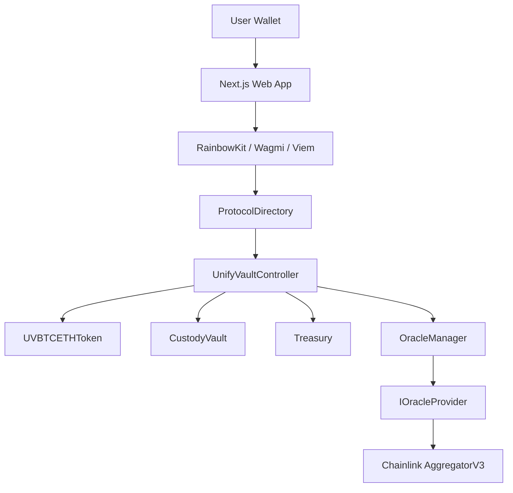

# UnifyVault-UV


**UnifyVault-UV** is a DeFi protocol monorepo for a Base-native vault and index-token system. The current implementation centers on the `UVBTCETH` ERC-20 share token, collateral custody, oracle-backed deposit previews, redemption flows, protocol fee routing, and a Next.js Web3 frontend.

> ⚠️ This repository is under active development. Review the contract tests, deployment configuration, and security documentation before using any deployment with real funds.

## Table of Contents

- [Key Features](#key-features)
- [Architecture Overview](#architecture-overview)
- [Smart Contract Architecture](#smart-contract-architecture)
- [Frontend Architecture](#frontend-architecture)
- [Folder Structure](#folder-structure)
- [Tech Stack](#tech-stack)
- [Installation](#installation)
- [Local Development](#local-development)
- [Environment Variables](#environment-variables)
- [Deployment](#deployment)
- [Supported Networks](#supported-networks)
- [Screenshots](#screenshots)
- [Documentation](#documentation)
- [Security](#security)
- [Testing](#testing)
- [Roadmap](#roadmap)
- [Contributing](#contributing)
- [License](#license)

## Key Features

| Area                   | Implemented in repository                                                                                                                        |
| :--------------------- | :----------------------------------------------------------------------------------------------------------------------------------------------- |
| 🧱 Protocol registry   | `ProtocolDirectory` stores module addresses behind `bytes32` identifiers and supports a one-way `freeze()` action.                               |
| 🪙 Index share token   | `UVBTCETHToken` is an ERC-20 + Permit token named `UnifyVault BTC ETH Index` with symbol `UVBTCETH`. Minting and burning are restricted by role. |
| 🏦 Collateral custody  | `CustodyVault` accounts for enabled ERC-20 collateral assets and restricts deposits/withdrawals to controller-role callers.                      |
| 💸 Fee routing         | `Treasury` receives protocol fees and supports governance-controlled withdrawals.                                                                |
| 📈 Oracle abstraction  | `OracleManager` coordinates primary/fallback `IOracleProvider` implementations and normalizes prices to 18 decimals.                             |
| 🔗 Chainlink adapter   | `ChainlinkOracleProvider` reads AggregatorV3 feeds, validates positive prices, complete rounds, and heartbeat freshness.                         |
| 🔐 Safety controls     | Role-based access control, pausability, reentrancy guards, custom errors, slippage checks, and deadline checks are present in the Solidity code. |
| 🌐 Web app             | Next.js App Router frontend with RainbowKit, Wagmi, Viem, React Query, deposit/redeem pages, wallet state, network checks, and dashboard views.  |
| 🧪 Contract test suite | Foundry unit, integration, fuzz, and invariant tests cover core protocol paths.                                                                  |

## Architecture Overview



The repository is organized as a `pnpm` + Turborepo workspace:

- `packages/protocol` contains the Solidity contracts, Foundry configuration, deployment script, and protocol tests.
- `apps/web` contains the current production-facing Web3 frontend.
- `services/api`, `apps/admin`, `packages/sdk`, `packages/shared`, and `packages/design-system` currently contain workspace scaffolding and placeholder entry points.
- `docs`, `SECURITY.md`, and protocol review files capture design notes, audit-readiness notes, and project documentation.

## Smart Contract Architecture

| Contract                  | Purpose                                                                                                                                                   |
| :------------------------ | :-------------------------------------------------------------------------------------------------------------------------------------------------------- |
| `ProtocolDirectory`       | Canonical registry for core module addresses. Governance can register, update, remove, and permanently freeze entries.                                    |
| `UnifyVaultController`    | Main workflow coordinator for deposits, redemptions, fee routing, share minting/burning, quote generation, and emergency pause/resume.                    |
| `UVBTCETHToken`           | ERC-20 share token with EIP-2612 permit support. Controller-role accounts mint and burn; guardian/governance roles pause and resume.                      |
| `CustodyVault`            | Passive collateral vault with asset registration, enable/disable controls, accounted asset tracking, and controller-only movement.                        |
| `Treasury`                | Passive fee and protocol-owned asset vault with registered assets, fee collection, ERC-20 withdrawals, native ETH receipt/withdrawal, and pause controls. |
| `OracleManager`           | Price coordinator that stores asset provider configuration and falls back to a secondary provider when available.                                         |
| `ChainlinkOracleProvider` | Chainlink AggregatorV3 adapter with stale-price, non-positive price, incomplete-round, and heartbeat validation.                                          |
| `MockOracleProvider`      | Deterministic oracle provider for tests and local deployment flows.                                                                                       |

Key protocol constants and behavior:

- Solidity compiler: `0.8.24`
- Deposit fee: `25` bps
- Redemption fee: `25` bps
- Basis point denominator: `10_000`
- Share precision: `18` decimals
- Foundry optimizer: enabled, `200` runs, `via_ir = true`

## Frontend Architecture

The active frontend lives in `apps/web` and is built with Next.js App Router.

| Layer          | Files                                                                                                                         |
| :------------- | :---------------------------------------------------------------------------------------------------------------------------- |
| Routes         | `apps/web/app/page.tsx`, `dashboard`, `deposit`, `redeem`, `portfolio`, `settings`                                            |
| Layout         | `components/layout`, `providers/AppProvider.tsx`, `ThemeProvider.tsx`, `Web3Provider.tsx`                                     |
| Web3 UI        | `components/web3` wallet button, wallet menu, network badge, wrong-network banner, address display                            |
| Contract hooks | `hooks/useDeposit.ts`, `useRedeem.ts`, `useDepositPreview.ts`, `useRedeemPreview.ts`, `useVaultMetrics.ts`, `usePortfolio.ts` |
| Configuration  | `lib/config/chains.ts`, `contracts.ts`, `assets.ts`, `abis.ts`, `env.ts`                                                      |
| Styling        | Tailwind CSS, CSS variables, `next-themes`, `lucide-react`, `framer-motion`                                                   |

The frontend reads supported chain and directory configuration from public Next.js environment variables and resolves protocol modules through the on-chain directory.

## Folder Structure

```text
.
├── apps/
│   ├── admin/                 # Admin workspace scaffold
│   └── web/                   # Next.js Web3 frontend
├── docs/                      # Product, architecture, security, roadmap, and protocol docs
├── infra/                     # Infrastructure documentation
├── packages/
│   ├── design-system/         # Shared UI package scaffold
│   ├── eslint-config/         # Shared ESLint config
│   ├── prettier-config/       # Shared Prettier config
│   ├── protocol/              # Solidity contracts, Foundry tests, deployment script
│   ├── sdk/                   # TypeScript SDK scaffold
│   ├── shared/                # Shared utility package scaffold
│   └── tsconfig/              # Shared TypeScript configs
├── services/
│   └── api/                   # API service workspace scaffold
├── scripts/                   # Operational helper scripts
├── tests/                     # Higher-level test documentation
├── docker-compose.yml         # Local PostgreSQL and Redis services
├── pnpm-workspace.yaml
├── turbo.json
└── package.json
```

## Tech Stack

| Category         | Stack                                                      |
| :--------------- | :--------------------------------------------------------- |
| Monorepo         | pnpm workspaces, Turborepo                                 |
| Smart contracts  | Solidity `0.8.24`, Foundry, OpenZeppelin Contracts         |
| Contract testing | Forge unit, integration, fuzz, and invariant tests         |
| Frontend         | Next.js `15`, React `19`, TypeScript, Tailwind CSS         |
| Web3 frontend    | Wagmi v2, Viem, RainbowKit, WalletConnect                  |
| State/data       | TanStack Query, React hooks, Zod environment validation    |
| UI               | Radix primitives, lucide-react, framer-motion, next-themes |
| Local services   | Docker Compose, PostgreSQL 15, Redis 7                     |
| Tooling          | ESLint, Prettier, commitlint, Husky, lint-staged           |

## Installation

### Prerequisites

- Node.js `>=18.0.0`
- pnpm `>=8.0.0` (the repo pins `pnpm@9.4.0`)
- Foundry (`forge`, `cast`, `anvil`) for protocol work
- Docker and Docker Compose for local PostgreSQL/Redis services

### Install dependencies

```bash
pnpm install
```

## Local Development

### Run the web app

```bash
cp apps/web/.env.example apps/web/.env.local
pnpm --filter @unifyvault/web dev
```

The web app runs with Next.js defaults, typically at `http://localhost:3000`.

### Run local infrastructure

```bash
docker compose up -d
```

This starts:

| Service    | Port   | Purpose                                  |
| :--------- | :----- | :--------------------------------------- |
| PostgreSQL | `5432` | Development state store for backend work |
| Redis      | `6379` | Cache / queue broker for backend work    |

### Build workspaces

```bash
pnpm run build
```

### Protocol commands

```bash
pnpm --filter @unifyvault/protocol build
pnpm --filter @unifyvault/protocol test
pnpm --filter @unifyvault/protocol clean
```

### Root commands

| Command           | Description                                                         |
| :---------------- | :------------------------------------------------------------------ |
| `pnpm run dev`    | Runs the web app through Turborepo with `--filter=@unifyvault/web`. |
| `pnpm run build`  | Runs workspace builds.                                              |
| `pnpm run lint`   | Runs workspace lint tasks.                                          |
| `pnpm run test`   | Runs workspace test tasks.                                          |
| `pnpm run format` | Formats TypeScript, JavaScript, JSON, Markdown, Solidity, YAML.     |

## Environment Variables

Create `apps/web/.env.local` from `apps/web/.env.example`.

| Variable                                |             Required             | Used by                    | Description                                           |
| :-------------------------------------- | :------------------------------: | :------------------------- | :---------------------------------------------------- |
| `NEXT_PUBLIC_WALLET_CONNECT_PROJECT_ID` |               Yes                | Web                        | WalletConnect Cloud project ID used by RainbowKit.    |
| `NEXT_PUBLIC_RPC_URL_BASE_MAINNET`      |               Yes                | Web                        | Base mainnet RPC URL.                                 |
| `NEXT_PUBLIC_RPC_URL_BASE_SEPOLIA`      |               Yes                | Web                        | Base Sepolia RPC URL.                                 |
| `NEXT_PUBLIC_DIRECTORY_ADDRESS_MAINNET` |               Yes                | Web                        | `ProtocolDirectory` address for Base mainnet.         |
| `NEXT_PUBLIC_DIRECTORY_ADDRESS_SEPOLIA` |               Yes                | Web                        | `ProtocolDirectory` address for Base Sepolia.         |
| `NEXT_PUBLIC_ACTIVE_CHAIN`              |               Yes                | Web                        | One of `base`, `base-sepolia`, `8453`, or `84532`.    |
| `BASE_SEPOLIA_RPC_URL`                  |         Deployment only          | Foundry                    | RPC URL for Base Sepolia deployments.                 |
| `PRIVATE_KEY`                           |         Deployment only          | Foundry                    | Deployer private key. Never commit this value.        |
| `BASESCAN_API_KEY`                      | Optional deployment verification | Foundry / explorer tooling | Basescan API key for contract verification workflows. |

> 🔒 Do not commit `.env`, `.env.local`, or private keys. The root `.gitignore` excludes environment files.

## Deployment

The protocol deployment script is located at:

```text
packages/protocol/script/Deploy.s.sol
```

Local dry-run style execution:

```bash
cd packages/protocol
forge script script/Deploy.s.sol:DeployScript
```

Broadcast to Base Sepolia:

```bash
cd packages/protocol
forge script script/Deploy.s.sol:DeployScript \
  --rpc-url "$BASE_SEPOLIA_RPC_URL" \
  --private-key "$PRIVATE_KEY" \
  --broadcast
```

After deployment, update the web app directory address:

```bash
NEXT_PUBLIC_DIRECTORY_ADDRESS_SEPOLIA=<deployed_protocol_directory>
NEXT_PUBLIC_ACTIVE_CHAIN=base-sepolia
```

Deployment notes and address records are kept in:

- `docs/deployment/DEPLOYMENT_REPORT.md`
- `docs/deployment/DEPLOYMENT_ADDRESSES.md`
- `docs/deployment/SEPOLIA_TRANSACTION_LOG.md`
- `docs/testing/SEPOLIA_TEST_RESULTS.md`

## Supported Networks

| Network      | Chain ID | Frontend support | Assets listed in `apps/web/lib/config/assets.ts` |
| :----------- | :------: | :--------------: | :----------------------------------------------- |
| Base Mainnet |  `8453`  |        ✅        | `cbBTC`, `WETH`, `USDC`                          |
| Base Sepolia | `84532`  |        ✅        | `USDC`                                           |

The frontend defaults to Base Sepolia unless `NEXT_PUBLIC_ACTIVE_CHAIN` is configured otherwise.

## Screenshots

Add production screenshots here when the UI is ready for public release.

| Home                        | Dashboard                        |
| :-------------------------- | :------------------------------- |
| `docs/screenshots/home.png` | `docs/screenshots/dashboard.png` |

| Deposit                        | Redeem                        |
| :----------------------------- | :---------------------------- |
| `docs/screenshots/deposit.png` | `docs/screenshots/redeem.png` |

## Documentation

The repository documentation is centralized in the [`docs/`](docs/) directory and indexed in [docs/INDEX.md](docs/INDEX.md).

- 🏛️ [**Architecture & Specifications**](docs/architecture/) — Protocol whitepaper, tokenomics, smart contract specs, and backend/frontend manuals
- 🛡️ [**Audits & Security**](docs/audits/) — Internal security audits, Slither zero-warning report, and security policy
- 🧪 [**Testing & QA**](docs/testing/) — Testing strategies, continuous security pipeline, and Sepolia test results
- 🚀 [**Deployment & Operations**](docs/deployment/) — Deployed contract addresses, deployment report, and transaction logs
- 💻 [**Development & Specs**](docs/development/) — Contributing guidelines, roadmap, product decisions, and Solidity standards
- 📦 [**Releases & Production**](docs/releases/) — Changelogs and production release approvals
- 🗄️ [**Archive**](docs/archive/) — Historical cleanup reports and milestone retrospectives

For a complete file-by-file directory, see the [Documentation Index](docs/INDEX.md).

## Security

Security-relevant controls present in the repository include:

- OpenZeppelin `AccessControl` roles for governance, guardian, bot, and controller responsibilities.
- `Pausable` emergency controls across token, controller, vault, and treasury contracts.
- `ReentrancyGuard` on state-changing vault, treasury, deposit, and redemption flows.
- Custom errors for gas-efficient and explicit failure modes.
- Oracle heartbeat, positive-price, and incomplete-round validation.
- Slippage checks for deposits and redemptions.
- Redemption deadline enforcement.
- Separation between user collateral custody (`CustodyVault`) and protocol-owned fees (`Treasury`).
- Foundry invariant and integration tests for protocol behavior.

Please report vulnerabilities privately. See [SECURITY.md](docs/audits/SECURITY.md).

> ⚠️ The repository contains local environment examples and may contain developer-local untracked `.env` files. Rotate any exposed keys immediately if they were ever shared or committed.

## Testing

### Smart contracts

```bash
pnpm --filter @unifyvault/protocol test
```

Equivalent direct Foundry command:

```bash
cd packages/protocol
forge test
```

The protocol test tree includes:

- Unit tests in `packages/protocol/test/unit`
- Integration tests in `packages/protocol/test/integration`
- Invariant tests in `packages/protocol/test/invariant`
- Additional fuzz/invariant coverage in `packages/protocol/test/*.t.sol`

### Frontend and workspace checks

```bash
pnpm --filter @unifyvault/web lint
pnpm --filter @unifyvault/web build
pnpm run lint
pnpm run test
```

Some non-protocol packages currently expose placeholder test scripts such as `echo 'api: test'`.

## Roadmap

Based on the current repository state:

- [x] Monorepo workspace with shared tooling
- [x] Core Solidity contracts for registry, controller, token, vault, treasury, and oracle providers
- [x] Foundry test coverage for unit, integration, fuzz, and invariant paths
- [x] Next.js Web3 frontend foundation
- [x] Wallet, network, dashboard, deposit, redeem, and portfolio hooks/views
- [ ] Complete production deployment verification and public address publication
- [ ] Expand API service beyond scaffolded TypeScript entry point
- [ ] Expand admin workspace beyond scaffolded entry point
- [ ] Publish production screenshots
- [ ] Complete external security audit before any mainnet launch

## Contributing

Contributions are welcome. Please read [CONTRIBUTING.md](docs/development/CONTRIBUTING.md) before opening a pull request.

Expected local checks:

```bash
pnpm run format
pnpm run lint
pnpm run test
```

Use Conventional Commits for commit messages, for example:

```text
feat: add oracle provider health check
fix: enforce redemption deadline validation
docs: update deployment notes
```

## License

This project is licensed under the [MIT License](LICENSE).
