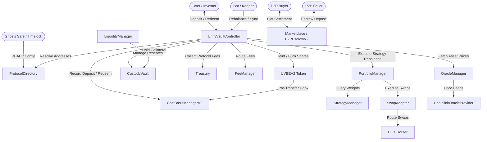

# UnifyVault Protocol V2

UnifyVault is an institutional-grade, multi-asset yield and vault management protocol deployed on Ethereum Layer-2 networks (Base Mainnet and Base Sepolia). It provides automated portfolio rebalancing, real-time Net Asset Value (NAV) pricing via multi-provider oracle aggregators, strict slippage protection, donation-immune collateral custody, on-chain cost basis & P&L accounting, and a non-custodial P2P crypto-fiat settlement engine.

---

## Table of Contents

- [Overview](#overview)
- [Vision](#vision)
- [Key Features](#key-features)
- [Protocol Architecture](#protocol-architecture)
- [Repository Structure](#repository-structure)
- [Tech Stack](#tech-stack)
- [Quick Start](#quick-start)
- [Local Development](#local-development)
- [Build Instructions](#build-instructions)
- [Testing](#testing)
- [Canonical Deployed Contracts](#canonical-deployed-contracts)
- [Environment Variables](#environment-variables)
- [Security Notes](#security-notes)
- [Documentation Index](#documentation-index)
- [Contributing](#contributing)
- [License](#license)

---

## Overview

UnifyVault V2 combines high-performance multi-asset vault accounting with decentralized governance controls. Users deposit supported collateral assets (USDC, cbBTC, and WETH) to mint `UVBE` (`UVBEV2`) share tokens representing proportional ownership of the vault's underlying net asset value.

The protocol features:

- **Dynamic Module Discovery** through `ProtocolDirectory`.
- **Multi-Provider Oracle Pricing** with heartbeat monitoring and multi-state status checks (`LIVE`, `STALE`, `REVERTED`, `UNAVAILABLE`) via `OracleManager` and `ChainlinkOracleProvider`.
- **Automated Portfolio Management** through `PortfolioManager`, `StrategyManager`, and `SwapAdapter`.
- **On-Chain Cost Basis & P&L Accounting** through `CostBasisManagerV2` and `PerformanceManager`.
- **Non-Custodial P2P Marketplace & Escrow** through `P2PEscrowV2` and `Marketplace` (pure crypto ↔ fiat settlement with zero collateral exposure, zero supply inflation, and zero cost basis contamination).
- **Governance Execution** enforced by `UnifyVaultTimelock` (48-hour mandatory delay).

---

## Vision

UnifyVault aims to set the benchmark for transparent, non-custodial, and security-first asset management on EVM-compatible Layer-2 networks. By eliminating single points of failure, enforcing on-chain rate limits, and implementing strict role segregation, UnifyVault delivers institutional liquidity routing with zero compromise on decentralization.

---

## Key Features

- **Dynamic Module Directory**: `ProtocolDirectory` serves as the single source of truth for contract addresses, allowing seamless module updates without hardcoding contract dependencies.
- **Oracle Resilience & Staleness Guard**: `OracleManager` aggregates price feeds from Chainlink (`ChainlinkOracleProvider`), enforcing heartbeat limits, staleness bounds, and multi-state error handling.
- **Donation-Immune Custody**: `CustodyVault` separates tracked user deposits from untracked asset transfers, immunizing share pricing against balance inflation attacks.
- **Automated Portfolio Management**: `PortfolioManager` and `StrategyManager` manage target asset allocations (BPS) and execute trades via `SwapAdapter` with strict slippage limits.
- **On-Chain Cost Basis & P&L Tracking**: `CostBasisManagerV2` tracks user deposits, redemptions, entry prices, realized P&L, and unrealized returns via a locked pre-transfer hook in `UVBEV2`.
- **Non-Custodial P2P OTC Marketplace**: `P2PEscrowV2` and `Marketplace` allow decentralized limit order matching and fiat settlement with cryptographic receipt hashing (`evidenceHash`), bank reference tracking (`paymentReference`), and multi-sig arbitration.
- **Timelock Governance**: `UnifyVaultTimelock` enforces a 48-hour delay on administrative and governance actions, requiring multi-sig (Gnosis Safe) proposal approval.
- **Role-Based Access Control (RBAC)**: Fine-grained OpenZeppelin `AccessControl` permissions (`GOVERNANCE_ROLE`, `GUARDIAN_ROLE`, `CONTROLLER_ROLE`, `BOT_ROLE`, `ARBITRATOR_ROLE`).
- **Emergency Circuit Breakers**: Granular pause/resume controls (`Pausable`) on controller, token, and vault modules managed by designated Guardians.

---

## Protocol Architecture


```mermaid
flowchart TD
    User([User / Investor]) <-->|Deposit / Redeem| Controller[UnifyVaultController]
    Keeper([Bot / Keeper]) -->|Rebalance / Sync| Controller
    Governance([Gnosis Safe / Timelock]) -->|RBAC / Config| Directory[ProtocolDirectory]

    Controller -->|Resolve Addresses| Directory
    Controller -->|Mint / Burn Shares| Token[UVBEV2 Token]
    Controller -->|Hold Collateral| Vault[CustodyVault]
    Controller -->|Collect Protocol Fees| Treasury[Treasury]
    Controller -->|Route Fees| FeeManager[FeeManager]
    Controller -->|Fetch Asset Prices| Oracle[OracleManager]
    Controller -->|Execute Strategy Rebalance| Portfolio[PortfolioManager]
    Controller -->|Record Deposit / Redeem| CBM[CostBasisManagerV2]

    Token -->|Pre-Transfer Hook| CBM
    Portfolio -->|Query Weights| Strategy[StrategyManager]
    Portfolio -->|Execute Swaps| Swap[SwapAdapter]
    Swap -->|Route Swaps| Router[DEX Router]
    Oracle -->|Price Feeds| Chainlink[ChainlinkOracleProvider]
    Liquidity[LiquidityManager] -->|Manage Reserves| Vault

    P2PBuyer([P2P Buyer]) <-->|Fiat Settlement| Marketplace[Marketplace / P2PEscrowV2]
    P2PSeller([P2P Seller]) <-->|Escrow Deposit| Marketplace
```

---

## Repository Structure

```
UnifyVault-UV/
├── apps/
│   ├── web-v2/             # Next.js 15 production web interface (app.unifyvault.xyz)
│   └── web-v2-testnet/     # Staging/testnet web interface build
├── packages/
│   ├── protocol/           # Foundry smart contracts, scripts, & test suites
│   ├── design-system/      # Shared UI component primitives
│   ├── sdk/                # TypeScript client SDK for protocol interaction
│   ├── shared/             # Shared TypeScript utilities and type definitions
│   ├── eslint-config/      # Shared ESLint configuration
│   ├── prettier-config/    # Shared Prettier code formatting rules
│   └── tsconfig/           # Base TypeScript configuration files
├── scripts/                # QA audit and automation scripts
├── docs/                   # Full protocol documentation suite
├── pnpm-workspace.yaml     # pnpm monorepo workspace definition
├── turbo.json              # Turborepo build orchestration configuration
└── package.json            # Root workspace scripts & dev dependencies
```

---

## Tech Stack

### Smart Contracts (`packages/protocol`)

- **Solidity**: `0.8.24` (EVM version: London/Paris)
- **Framework**: Foundry (`forge`)
- **Standards**: OpenZeppelin Contracts v5.0.2 (`AccessControl`, `Pausable`, `ReentrancyGuard`, `SafeERC20`, `TimelockController`, `ERC20`, `ERC20Permit`)

### Frontend (`apps/web-v2`)

- **Framework**: Next.js 15.0.3 (React 19, App Router)
- **Styling**: TailwindCSS 3.4, Framer Motion, Lucide Icons
- **Web3 Integration**: Wagmi v2, Viem v2, RainbowKit v2, TanStack Query v5
- **Unit & Integration Testing**: Vitest 4.1

---

## Quick Start

### Prerequisites

- Node.js `>= 18.0.0`
- pnpm `>= 9.4.0`
- Foundry (`forge` `>= 0.2.0`)

### Installation

```bash
# Clone repository
git clone git@github.com:DigiClums/UnifyVault-UV.git
cd UnifyVault-UV

# Install pnpm workspace dependencies
pnpm install
```

---

## Local Development

To run the Next.js frontend locally:

```bash
# Run web-v2 application in dev mode (default port: 3005)
pnpm dev

# Or run directly via Turbo
pnpm turbo run dev --filter=@unifyvault/web-v2
```

---

## Build Instructions

```bash
# Build smart contracts via Foundry
pnpm --filter @unifyvault/protocol build

# Build Next.js web application
pnpm --filter @unifyvault/web-v2 build

# Build all monorepo packages
pnpm build
```

---

## Testing

```bash
# Run all smart contract tests via Foundry
pnpm --filter @unifyvault/protocol test

# Run frontend Vitest test suite
cd apps/web-v2 && npx vitest run

# Run specific protocol test suite
cd packages/protocol && forge test --match-contract "P2P"
```

---

## Canonical Deployed Contracts (Base Sepolia - Chain ID 84532)

| Contract Module                        | Address                                      |
| :------------------------------------- | :------------------------------------------- |
| **ProtocolDirectory**                  | `0x8040006d6907a84911aaC0a9aC08278311B156e2` |
| **Treasury**                           | `0xB8c8113a042f39936dD966A5983fAaE2bF7b7290` |
| **FeeManager**                         | `0x07f8BD7DAf5002C3C62B3c1280e9258AbBEfA2f1` |
| **CustodyVault**                       | `0x5534469dA659dC4bB092Df9F7421Ec08fD2588A0` |
| **OracleManager**                      | `0xc96d36Acf3ef58d03fdEA56aa90a30d02ceb73BF` |
| **ChainlinkOracleProvider**            | `0xCF46A80BbF2e92c16f7e1953F9AC73935340f69B` |
| **LiquidityManager**                   | `0xd1DCd311ACD1176E35823360652FCb356a7F227F` |
| **UVBEV2 (UVBEToken)**                 | `0x006c5DF13C716E5224b33956651C4356BB90DEc0` |
| **UnifyVaultController (UUPS Proxy)**  | `0x7DC190a0bFa08c9596DfdC20E602821619E776ea` |
| **UnifyVaultControllerImplementation** | `0x717e39A34e81A81b75B78Ff7abFfaE4822f42415` |
| **StrategyManager**                    | `0x73c894DEFBBd69F09134D53a73A0F6bfaeF5A7Bb` |
| **PortfolioManager**                   | `0xd34A8d9cE90ebc2987c40ceafE126E5EF2931D9b` |
| **SwapAdapter**                        | `0xbc97337dE85654aCD96182C93841f21168da65B4` |
| **CostBasisManagerV2**                 | `0x57869372AFbd7b61752f2f8d3e7F37701e28517B` |
| **PerformanceManager**                 | `0xF1670ca0054D649d1E3dd2f1d642Cc8Ed70109F6` |
| **P2PEscrowV2**                        | `0xd2A5489618759a6c8CA07163ACdC845Cf7D104Bb` |
| **TimelockController**                 | `0x9094145Cd2AEA2f309eDf14237444a07edF98d02` |

---

## Environment Variables

Root `.env` template:

```env
BASE_SEPOLIA_RPC_URL=https://sepolia.base.org
BASE_MAINNET_RPC_URL=https://mainnet.base.org
NEXT_PUBLIC_ADMIN_ADDRESS=0xd905920c91853039060246Ed5724AA72B91a96DA
BASESCAN_API_KEY=your_basescan_api_key
NEXT_PUBLIC_WALLET_CONNECT_PROJECT_ID=your_walletconnect_project_id
PORT=3001
```

Frontend `apps/web-v2/.env.local`:

```env
NEXT_PUBLIC_WALLET_CONNECT_PROJECT_ID=146781145b65a1c63ffcd7d6eaf03bd1
NEXT_PUBLIC_APP_DOMAIN=https://app.unifyvault.xyz
NEXT_PUBLIC_ACTIVE_CHAIN=base-sepolia
NEXT_PUBLIC_RPC_URL=https://sepolia.base.org
NEXT_PUBLIC_DIRECTORY_ADDRESS_SEPOLIA=0x8040006d6907a84911aaC0a9aC08278311B156e2
NEXT_PUBLIC_P2P_ESCROW_ADDRESS_SEPOLIA=0xd2A5489618759a6c8CA07163ACdC845Cf7D104Bb
NEXT_PUBLIC_MARKETPLACE_ADDRESS_SEPOLIA=0xe908377f96F313a6b7771570ff6Fb414D38F451A
```

---

## Security Notes

- **Access Control**: All administrative functions require `GOVERNANCE_ROLE` or `DEFAULT_ADMIN_ROLE`.
- **Reentrancy Protection**: `ReentrancyGuard` applied on all state-changing financial interactions (`deposit`, `redeem`, `rebalance`, `createTrade`, `fundTrade`, `confirmAndRelease`, `refund`).
- **Inflation Protection**: First deposit burns `DEAD_SHARES` (`1000` wei) to prevent share ratio manipulation.
- **P2P Escrow Isolation**: P2P transfers are filtered out in `CostBasisManagerV2` via `_isEscrow` guards, preventing fiat trades from mutating portfolio investment basis or vault valuation.
- **Circuit Breakers**: Emergency pause capability allows Guardians to halt deposits and redemptions instantly during security incidents.

---

## Documentation Index

Detailed architectural and technical guides are available in the [`docs/`](docs/) directory:

- [`Architecture.md`](docs/Architecture.md) — System design, data flow, & component interaction.
- [`Contracts.md`](docs/Contracts.md) — Comprehensive contract specification & reference.
- [`Deployment.md`](docs/Deployment.md) — Deployment scripts, sequence, & active contract addresses.
- [`Governance.md`](docs/Governance.md) — Timelock, roles, & governance controls.
- [`Security.md`](docs/Security.md) — Threat model, security invariants, & emergency controls.
- [`Frontend.md`](docs/Frontend.md) — Web application structure, pages, P2P routes, & Web3 integration.
- [`DeveloperGuide.md`](docs/DeveloperGuide.md) — Development setup, workflows, & coding standards.
- [`API.md`](docs/API.md) — EVM RPC query layer & Next.js P2P payment API routes.
- [`Testing.md`](docs/Testing.md) — Testing strategy, test suites, & mock architecture.
- [`Repository.md`](docs/Repository.md) — Workspace layout & package descriptions.

---

## Contributing

Please review [`CONTRIBUTING.md`](CONTRIBUTING.md) for guidelines on code standards, pull request processes, and branch naming conventions.

---

## License

This project is licensed under the [MIT License](LICENSE).
