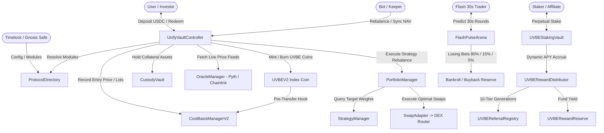

# UnifyVault Protocol V2

<div align="center">
  
  <h3>Institutional-Grade Decentralized 60/40 Crypto Index Protocol on Base</h3>
  <p><strong>cbBTC (60%) + WETH (40%) Balanced Exposure • Automated On-Chain Drift Rebalancing • Flash 30s Prediction Arena • Perpetual Staking Engine</strong></p>
  
  <p>
    <a href="https://unifyvault.xyz"><strong>unifyvault.xyz</strong></a> •
    <a href="https://app.unifyvault.xyz"><strong>app.unifyvault.xyz</strong></a> •
    <a href="https://docs.unifyvault.xyz"><strong>docs.unifyvault.xyz</strong></a> •
    <a href="https://v2.unifyvault.xyz"><strong>v2.unifyvault.xyz</strong></a>
  </p>
</div>

---

## 📑 Table of Contents

- [Overview](#-overview)
- [Multi-Domain Architecture](#-multi-domain-ecosystem)
- [Key Features](#-key-features)
- [Protocol Architecture](#-protocol-architecture)
- [Products & Subsystems](#-products--subsystems)
  - [1. UVBE Index Coin (60/40 Strategy)](#1-uvbe-index-coin-6040-strategy)
  - [2. Flash 30s Rapid Binary Markets](#2-flash-30s-rapid-binary-markets)
  - [3. Perpetual Dynamic Staking & 10-Tier MLM](#3-perpetual-dynamic-staking--10-tier-mlm)
  - [4. Dynamic Cost-Basis & FIFO Accounting](#4-dynamic-cost-basis--fifo-accounting)
  - [5. P2P Fiat-to-Crypto Escrow Marketplace](#5-p2p-fiat-to-crypto-escrow-marketplace)
- [Repository Structure](#-repository-structure)
- [Tech Stack](#-tech-stack)
- [Quick Start](#-quick-start)
- [Local Development](#-local-development)
- [Build & Deployment](#-build--deployment)
- [Canonical Deployed Contracts](#-canonical-deployed-contracts-base-sepolia--base-mainnet)
- [Security & Timelocks](#-security--timelocks)
- [Documentation Portal](#-documentation-portal)
- [License](#-license)

---

## 🌟 Overview

**UnifyVault Protocol V2** is an institutional-grade, non-custodial multi-asset index and yield management protocol deployed on Ethereum Layer-2 (**Base Network**).

By depositing collateral (**USDC**), users receive **UVBE Index Coins** that represent 1:1 backed, proportional ownership of a dynamically managed portfolio consisting of **60% Coinbase Wrapped Bitcoin (cbBTC)** and **40% Wrapped Ether (WETH)** with zero impermanent loss and automated on-chain drift rebalancing.

---

## 🌐 Multi-Domain Ecosystem

The platform operates across four dedicated domains:

| Domain | Purpose | Shell / Features |
| :--- | :--- | :--- |
| [**unifyvault.xyz**](https://unifyvault.xyz) | **Institutional Landing** | Hero showcase, live UVBE NAV ticker, Pyth prices, features grid, strategy visualizer |
| [**app.unifyvault.xyz**](https://app.unifyvault.xyz) | **Full DeFi DApp** | Portfolio, Deposit, Redeem, Flash 30s (`/predict`), Staking, P2P Escrow, QR Transfer |
| [**docs.unifyvault.xyz**](https://docs.unifyvault.xyz) | **Documentation Portal** | Human-readable guides, contract directory, API specs, interactive sidebar |
| [**v2.unifyvault.xyz**](https://v2.unifyvault.xyz) | **Protocol Admin Console** | Module directory controller, oracle configuration, emergency circuit breakers |

---

## ⚡ Key Features

- **Automated 60/40 Portfolio**: Single-coin exposure to cbBTC (60%) and WETH (40%) with automated $\pm2.5\%$ drift rebalancing.
- **Dual-Oracle Resilience**: Low-latency millisecond price feeds from **Pyth Network** paired with **Chainlink** heartbeat fallbacks.
- **Donation-Immune Custody**: Internal accounting separates tracked user collateral from untracked transfers, immunizing against ERC-4626 inflation attacks.
- **On-Chain FIFO Cost-Basis**: Automated tax-lot accounting tracks user acquisition prices, realized returns, and gross/net unrealized PnL.
- **Flash 30s Rapid Arena**: 30-second binary rounds on BTC/ETH with custom reward multipliers (**2x**, **3x**, **5x**, **10x**, **20x**) backed by an 80% bankroll vault.
- **Perpetual Staking & 10-Tier MLM**: Dynamic APY calculated from real protocol surplus capacity, 10-generation overrides, 6 leadership ranks, and a 1% DAO pool.
- **Non-Custodial P2P Escrow**: Trustless fiat-to-crypto OTC marketplace with cryptographic receipts and automated dispute timeouts.
- **48-Hour Timelock Governance**: Critical parameter updates and contract upgrades require an on-chain 48-hour timelock delay.

---

## 🏗️ Protocol Architecture


```mermaid
flowchart TD
    User([User / Investor]) <-->|Deposit USDC / Redeem| Controller[UnifyVaultController]
    Keeper([Bot / Keeper]) -->|Rebalance / Sync NAV| Controller
    Governance([Timelock / Gnosis Safe]) -->|Config / Modules| Directory[ProtocolDirectory]

    Controller -->|Resolve Modules| Directory
    Controller -->|Mint / Burn UVBE Coins| Token[UVBEV2 Index Coin]
    Controller -->|Hold Collateral Assets| Vault[CustodyVault]
    Controller -->|Fetch Live Price Feeds| Oracle[OracleManager - Pyth / Chainlink]
    Controller -->|Execute Strategy Rebalance| Portfolio[PortfolioManager]
    Controller -->|Record Entry Price / Lots| CBM[CostBasisManagerV2]

    Token -->|Pre-Transfer Hook| CBM
    Portfolio -->|Query Target Weights| Strategy[StrategyManager]
    Portfolio -->|Execute Optimal Swaps| Swap[SwapAdapter -> DEX Router]

    Staker([Staker / Affiliate]) <-->|Perpetual Stake| StakingVault[UVBEStakingVault]
    StakingVault -->|Dynamic APY Accrual| Distributor[UVBERewardDistributor]
    Distributor -->|10-Tier Generations| Registry[UVBEReferralRegistry]
    Distributor -->|Fund Yield| Reserve[UVBERewardReserve]

    Predictor([Flash 30s Trader]) <-->|Predict 30s Rounds| FlashPulse[FlashPulseArena]
    FlashPulse -->|Losing Bets 80% / 15% / 5%| BankrollVault[Bankroll / Buyback Reserve]
```

---

## 🎯 Products & Subsystems

### 1. UVBE Index Coin (60/40 Strategy)
- **Target Weights**: 60% cbBTC + 40% WETH.
- **Drift Threshold**: Automated on-chain rebalancing triggered when asset allocation diverges beyond $\pm2.5\%$.
- **Zero Impermanent Loss**: Unlike AMM LP pools, assets are held in pure non-custodial custody.

### 2. Flash 30s Rapid Binary Markets
- **Round Duration**: 30 seconds total (10s betting window, 20s live active tracking).
- **Custom Multipliers**: Auto mode (~1.95x - 2.00x) or fixed risk targets (**2x**, **3x**, **5x**, **10x**, **20x**).
- **Losing Bet Flow**:
  - **80% Payout Bankroll Vault**: Instant liquidity buffer for high multiplier hits.
  - **15% Protocol Buyback & Burn**: UVBE deflationary market purchase and burn.
  - **5% Keeper Gas Subsidy**: Settlement bot automation refund.

### 3. Perpetual Dynamic Staking & 10-Tier MLM
- **Perpetual Staked Position**: 50 UVBE minimum stake (47.5 UVBE net principal after 5% treasury allocation).
- **Dynamic APY Formula**:
  $$\text{Dynamic APY (BPS)} = \frac{\text{Surplus Capacity} \times 10{,}000}{\text{Total Permanent Staked}}$$
  *(Enforced 100.00% annual APY safety ceiling).*
- **10-Generation Overrides**: Gen 1 (5.00%), Gen 2 (2.00%), Gen 3 (1.50%), Gen 4 (1.00%), Gen 5 (0.75%), Gen 6 & 7 (0.50%), Gen 8, 9 & 10 (0.25%).
- **6 Leadership Ranks**: Bronze, Silver, Gold, Platinum (+1 DAO share), Diamond (+3 DAO shares), Crown Ambassador (+10 DAO shares).
- **1.00% DAO Leadership Pool**: Weekly revenue distributions to qualified rank leaders.

### 4. Dynamic Cost-Basis & FIFO Accounting
- **On-Chain Tax Lots**: Tracks individual mint lot timestamps and entry prices.
- **FIFO Realization**: Oldest lots realized first upon redemption.
- **Weighted Average**: Real-time display of average acquisition cost and gross/net unrealized PnL.

### 5. P2P Fiat-to-Crypto Escrow Marketplace
- **Non-Custodial Escrow**: Seller collateral locked in `P2PEscrow.sol`.
- **Fiat Settlement**: Direct bank / UPI transfer with cryptographic payment receipt proof.
- **Arbitration Support**: Automated timeout refunds and dispute arbitration resolution.

---

## 📁 Repository Structure

```
UnifyVault-UV/
├── apps/
│   ├── web-v2/             # Next.js 15 App (unifyvault.xyz, app.unifyvault.xyz, docs.unifyvault.xyz)
│   └── telegram-bot/       # Real-time Telegram alert & price bot
├── packages/
│   ├── protocol/           # Foundry smart contracts, test suites, & scripts
│   ├── design-system/      # Shared UI primitives & themes
│   ├── sdk/                # TypeScript client SDK
│   ├── shared/             # Shared TypeScript types & constants
│   ├── eslint-config/      # Monorepo ESLint config
│   └── tsconfig/           # TypeScript base configs
├── docs/                   # Markdown specifications & audit reports
├── pnpm-workspace.yaml     # Monorepo workspace
├── turbo.json              # Turborepo orchestration pipeline
└── package.json            # Root workspace scripts
```

---

## 💻 Tech Stack

- **Smart Contracts**: Solidity `0.8.24`, Foundry (`forge`), OpenZeppelin v5.0.2.
- **Web Frontend**: Next.js 15 (React 19), TailwindCSS, Framer Motion, Lucide Icons.
- **Web3 Layer**: Wagmi v2, Viem v2, RainbowKit v2, TanStack Query v5.
- **Oracles**: Pyth Network low-latency price feeds + Chainlink Data Feeds.
- **Network**: Base Mainnet (Chain ID `8453`) & Base Sepolia (Chain ID `84532`).

---

## 🚀 Quick Start

### Prerequisites
- Node.js `>= 18.0.0`
- pnpm `>= 9.4.0`
- Foundry (`forge` `>= 0.2.0`)

```bash
# 1. Clone repository
git clone git@github.com:DigiClums/UnifyVault-UV.git
cd UnifyVault-UV

# 2. Install dependencies
pnpm install

# 3. Start local development server
pnpm dev
```

---

## 🛠️ Build Instructions

```bash
# Build all smart contracts
pnpm --filter @unifyvault/protocol build

# Run smart contract test suites
pnpm --filter @unifyvault/protocol test

# Build production web application
pnpm --filter @unifyvault/web-v2 build
```

---

## 📋 Canonical Deployed Contracts (Base Sepolia)

| Contract Module | Address | Verification Status |
| :--- | :--- | :--- |
| **ProtocolDirectory** | `0xD2715141a0F5998B707BaA963990bFC2E94cF145` | Verified |
| **UVBEV2 (UVBE Index Coin)** | `0xA3Db7c3DeE9A50D966A06e19b5DF4FCDee615BdE` | Verified |
| **UnifyVaultController** | `0x07f3D3432B64DBF67c5b061AF2bC8Aef70221Cea` | Verified |
| **PortfolioManager** | `0x1C65B1667c8cC03138b8e57cDd40b0Bf28a4cDc4` | Verified |
| **OracleManager** | `0x5B6067982C6ccE2DC760EB4731c1b40136776D4A` | Verified |
| **CostBasisManagerV2** | `0xF71706A2Fd8692e3C739855B2A33C0E679b4c382` | Verified |
| **UVBEStakingVault** | `0xaa5deaF54BCfb5ddf4C7196eDEd2A4B981a327e4` | Verified |
| **UVBEReferralRegistry** | `0xc1F00539B6869b2445d85056EDc036114b939Ddd` | Verified |
| **UVBERewardDistributor** | `0x49D3Fef686b838a26b9B14E9728Ab99b66e320E9` | Verified |
| **UVBERewardReserve** | `0xf1E40C0e7aA253CE259A224f1CFEDEDEd6D77Fda` | Verified |
| **P2PEscrowV2** | `0xbAc9C1b440adf74688abBD5be950ABd2766E5B7b` | Verified |
| **TimelockController** | `0x9094145Cd2AEA2f309eDf14237444a07edF98d02` | Verified (48h) |

---

## 🔒 Security & Timelocks

1. **48-Hour Timelock**: All parameter adjustments, module updates, and fee changes require a 48-hour timelock execution queue.
2. **Reentrancy Protection**: OpenZeppelin `ReentrancyGuard` on all state-changing financial entrypoints.
3. **Dead Share Protection**: Initial deposit burns `1000` wei dead shares to prevent ERC-4626 inflation attacks.
4. **P2P Escrow Isolation**: P2P transfers are isolated from cost-basis and share valuation mutations.
5. **Emergency Circuit Breakers**: Guardians can immediately pause deposits/redemptions in response to oracle or market anomalies.

---

## 📚 Documentation Portal

Comprehensive human-readable guides and technical specifications are available at:
👉 **[https://docs.unifyvault.xyz](https://docs.unifyvault.xyz)**

---

## 📄 License

This repository is licensed under the [MIT License](LICENSE).
