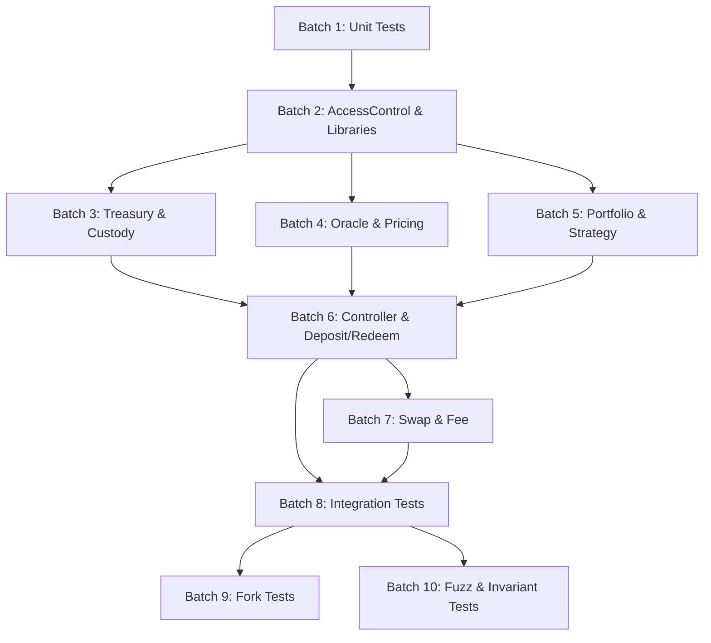

# Foundry Test Execution Batches

This document describes the logical batching strategy implemented for the UnifyVault Protocol Foundry test suite. The test suite has been decomposed into 10 independent, isolated batches to minimize CPU spikes during development, accelerate feedback loops, and preserve 100% test coverage.

---

## 📊 Summary of Batches

| Batch # | Name | Core Focus Area | Test Files | Total Tests | Est. Runtime (Cached) |
| :--- | :--- | :--- | :--- | :--- | :--- |
| **Batch 1** | Unit Tests | Fast isolated unit tests | 7 files (2 active) | 8 | ~15 ms |
| **Batch 2** | AccessControl & Libraries | Roles, Directory, Validation libs | 8 files | 42 | ~50 ms |
| **Batch 3** | Treasury & Custody | Vault storage, fee custody, rate limits | 4 files | 32 | ~150 ms |
| **Batch 4** | Oracle & Pricing | Chainlink, Pyth, circuit breakers, manager | 5 files | 49 | ~100 ms |
| **Batch 5** | Portfolio & Strategy | Asset allocations, liquidity & portfolio | 3 files | 40 | ~20 ms |
| **Batch 6** | Controller & Deposit/Redeem | Minting, burning, collateral validation | 6 files | 71 | ~250 ms |
| **Batch 7** | Swap & Fee | Router adapters & fee distribution | 3 files | 27 | ~100 ms |
| **Batch 8** | Integration Tests | Multi-component & end-to-end flows | 14 files (9 active) | 48 | ~120 ms |
| **Batch 9** | Fork Tests | Mainnet fork simulations & validation | 3 files | 12 | ~10.5 s |
| **Batch 10** | Fuzz & Invariant Tests | Stateful invariant & fuzz tests | 16 files (14 active) | 60 | ~2.0 s |

---

## 📁 Detailed Batch Breakdown

### Batch 1: Unit Tests
- **Filter**: `test/unit/*`
- **Estimated Runtime**: ~15 ms
- **Test Files**:
  - `packages/protocol/test/unit/CostBasisManager.t.sol`
  - `packages/protocol/test/unit/PerformanceManager.t.sol`
  - `packages/protocol/test/unit/CustodyVault.t.sol` *(Placeholder)*
  - `packages/protocol/test/unit/OracleManager.t.sol` *(Placeholder)*
  - `packages/protocol/test/unit/Treasury.t.sol` *(Placeholder)*
  - `packages/protocol/test/unit/UnifyVaultController.t.sol` *(Placeholder)*
  - `packages/protocol/test/unit/UVBTCETHToken.t.sol` *(Placeholder)*

### Batch 2: AccessControl & Libraries
- **Filter**: `test/{AddressValidationLib,MathValidationLib,OracleValidationLib,ShareLibPrecision,GovernanceMigration,ProtocolDirectory,TimelockHardening,SecurityMonitoringEvents}.t.sol`
- **Estimated Runtime**: ~50 ms
- **Test Files**:
  - `packages/protocol/test/AddressValidationLib.t.sol`
  - `packages/protocol/test/MathValidationLib.t.sol`
  - `packages/protocol/test/OracleValidationLib.t.sol`
  - `packages/protocol/test/ShareLibPrecision.t.sol`
  - `packages/protocol/test/GovernanceMigration.t.sol`
  - `packages/protocol/test/ProtocolDirectory.t.sol`
  - `packages/protocol/test/TimelockHardening.t.sol`
  - `packages/protocol/test/SecurityMonitoringEvents.t.sol`

### Batch 3: Treasury & Custody
- **Filter**: `test/{Treasury,CustodyVault,AccountingModel,RateLimits}.t.sol`
- **Estimated Runtime**: ~150 ms
- **Test Files**:
  - `packages/protocol/test/Treasury.t.sol`
  - `packages/protocol/test/CustodyVault.t.sol`
  - `packages/protocol/test/AccountingModel.t.sol`
  - `packages/protocol/test/RateLimits.t.sol`

### Batch 4: Oracle & Pricing
- **Filter**: `test/{ChainlinkOracleProvider,OracleAdapter,OracleCircuitBreaker,OracleManager,OracleProvider}.t.sol`
- **Estimated Runtime**: ~100 ms
- **Test Files**:
  - `packages/protocol/test/ChainlinkOracleProvider.t.sol`
  - `packages/protocol/test/OracleAdapter.t.sol`
  - `packages/protocol/test/OracleCircuitBreaker.t.sol`
  - `packages/protocol/test/OracleManager.t.sol`
  - `packages/protocol/test/OracleProvider.t.sol`

### Batch 5: Portfolio & Strategy
- **Filter**: `test/{PortfolioManager,StrategyManager,LiquidityManager}.t.sol`
- **Estimated Runtime**: ~20 ms
- **Test Files**:
  - `packages/protocol/test/PortfolioManager.t.sol`
  - `packages/protocol/test/StrategyManager.t.sol`
  - `packages/protocol/test/LiquidityManager.t.sol`

### Batch 6: Controller & Deposit/Redeem
- **Filter**: `test/{UnifyVaultController,DepositCollateral,DepositMinting,DepositValidation,Redemption,UVBTCETHToken}.t.sol`
- **Estimated Runtime**: ~250 ms
- **Test Files**:
  - `packages/protocol/test/UnifyVaultController.t.sol`
  - `packages/protocol/test/DepositCollateral.t.sol`
  - `packages/protocol/test/DepositMinting.t.sol`
  - `packages/protocol/test/DepositValidation.t.sol`
  - `packages/protocol/test/Redemption.t.sol`
  - `packages/protocol/test/UVBTCETHToken.t.sol`

### Batch 7: Swap & Fee
- **Filter**: `test/{DepositFeeRouting,FeeManager,SwapAdapter}.t.sol`
- **Estimated Runtime**: ~100 ms
- **Test Files**:
  - `packages/protocol/test/DepositFeeRouting.t.sol`
  - `packages/protocol/test/FeeManager.t.sol`
  - `packages/protocol/test/SwapAdapter.t.sol`

### Batch 8: Integration Tests
- **Filter**: `test/{integration/*.t.sol,ControllerIntegration.t.sol,FeeManagerIntegration.t.sol,LiveSim.t.sol,EconomicAdversarial.t.sol}`
- **Estimated Runtime**: ~120 ms
- **Test Files**:
  - `packages/protocol/test/integration/AccessControl.t.sol`
  - `packages/protocol/test/integration/ControllerIntegration.t.sol`
  - `packages/protocol/test/integration/DonationAttack.t.sol`
  - `packages/protocol/test/integration/FullLifecycle.t.sol`
  - `packages/protocol/test/integration/LiveExecutionEngine.t.sol`
  - `packages/protocol/test/integration/EmergencyFlow.t.sol` *(Placeholder)*
  - `packages/protocol/test/integration/FeeAccounting.t.sol` *(Placeholder)*
  - `packages/protocol/test/integration/MultiUser.t.sol` *(Placeholder)*
  - `packages/protocol/test/integration/OracleFailure.t.sol` *(Placeholder)*
  - `packages/protocol/test/integration/PauseFlow.t.sol` *(Placeholder)*
  - `packages/protocol/test/ControllerIntegration.t.sol`
  - `packages/protocol/test/FeeManagerIntegration.t.sol`
  - `packages/protocol/test/LiveSim.t.sol`
  - `packages/protocol/test/EconomicAdversarial.t.sol`

### Batch 9: Fork Tests
- **Filter**: `test/{fork/*.t.sol,BaseMainnetFork.t.sol}`
- **Estimated Runtime**: ~10.5 seconds
- **Test Files**:
  - `packages/protocol/test/fork/GovernanceMigrationValidation.t.sol`
  - `packages/protocol/test/fork/MainnetDeploymentValidation.t.sol`
  - `packages/protocol/test/BaseMainnetFork.t.sol`

### Batch 10: Fuzz & Invariant Tests
- **Filter**: `test/{invariant/*.t.sol,*Invariant.t.sol,RedemptionFuzz.t.sol,V2ProtocolInvariants.t.sol}`
- **Estimated Runtime**: ~2.0 seconds
- **Test Files**:
  - `packages/protocol/test/invariant/AccountingInvariant.t.sol` *(Placeholder)*
  - `packages/protocol/test/invariant/VaultInvariant.t.sol` *(Placeholder)*
  - `packages/protocol/test/ChainlinkOracleProviderInvariant.t.sol`
  - `packages/protocol/test/CustodyVaultInvariant.t.sol`
  - `packages/protocol/test/DepositCollateralInvariant.t.sol`
  - `packages/protocol/test/DepositFeeRoutingInvariant.t.sol`
  - `packages/protocol/test/DepositMintingInvariant.t.sol`
  - `packages/protocol/test/DepositValidationInvariant.t.sol`
  - `packages/protocol/test/OracleManagerInvariant.t.sol`
  - `packages/protocol/test/OracleProviderInvariant.t.sol`
  - `packages/protocol/test/RedemptionFuzz.t.sol`
  - `packages/protocol/test/RedemptionInvariant.t.sol`
  - `packages/protocol/test/TreasuryInvariant.t.sol`
  - `packages/protocol/test/UnifyVaultControllerInvariant.t.sol`
  - `packages/protocol/test/UVBTCETHTokenInvariant.t.sol`
  - `packages/protocol/test/V2ProtocolInvariants.t.sol`

---

## 🔗 Dependencies Between Batches



- **Independent Execution**: Every batch is completely self-contained with its own mock contracts or test harness setup and can be run independently in any order.
- **Logical Flow**:
  - Batches 1 & 2 test low-level library helpers and unit logic.
  - Batches 3, 4, & 5 test core protocol modules (Vault/Treasury, Oracle, Strategy).
  - Batch 6 tests the orchestration layer (Controller, Minting, Redemption).
  - Batch 7 tests secondary swap routing and fee collection.
  - Batch 8 tests end-to-end system integrations.
  - Batches 9 & 10 validate live mainnet forks and deep stateful invariants.

---

## 🚀 Recommended Execution Order

### 1. Daily Incremental Development Workflow
Run fast unit, library, and module batches for rapid feedback (< 1 second):
```bash
pnpm test:1   # Unit tests (~15ms)
pnpm test:2   # Libraries & Access Control (~50ms)
pnpm test:6   # Controller & Deposit/Redeem (~250ms)
```

### 2. Feature / PR Validation Order
Run batches 1 through 8 sequentially:
```bash
pnpm test:1 && pnpm test:2 && pnpm test:3 && pnpm test:4 && pnpm test:5 && pnpm test:6 && pnpm test:7 && pnpm test:8
```

### 3. Full CI / Release Pipeline
Run all batches sequentially using `pnpm test:all` to avoid CPU spikes and guarantee 100% test coverage:
```bash
pnpm test:all
```
