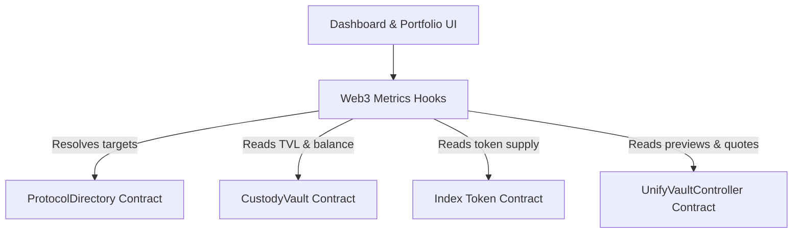

# UnifyVault Dashboard & Portfolio Documentation

This document describes the design, data flow, hooks, refresh strategy, and security guidelines for **Frontend Module 5 – Dashboard & Portfolio**.

---

## 1. Architecture & On-Chain Data Flow

The dashboard and portfolio segments are built with zero mocked values, pulling 100% of their values dynamically from on-chain RPC reads via dynamic coordinator address resolutions.

### Protocol Metrics Resolution Chain

1. Resolve the `DepositManager` address from the registry.
2. Query `UnifyVaultController.vault()` to resolve the deployed `CustodyVault` contract address.
3. Query `UnifyVaultController.token()` to resolve the yielding share token (`UVBTCETH`) address.
4. Multicall `totalSupply()` on the share token, and `totalAssets(asset)` on the custody vault for each supported asset.
5. Multicall `getDepositQuote` for each asset with 1 unit of volume to retrieve the `normalizedPrice` scaled in USD.

---

## 2. Reusable Web3 Custom Hooks

### `useVaultMetrics`

Fetches protocol-wide aggregates like Total Value Locked (TVL) in USD, Vault limit utilization progress, standard parameter fee structures, and token pricing benchmarks.

- **File**: [`apps/web/hooks/useVaultMetrics.ts`](file:///Users/apple/Documents/UnifyVault-UV/apps/web/hooks/useVaultMetrics.ts)

### `usePortfolio`

Fetches user-specific indexes like share holdings, corresponding underlying collateral balances in their wallet, and estimated withdrawable collateral values in USD via `previewRedeem`.

- **File**: [`apps/web/hooks/usePortfolio.ts`](file:///Users/apple/Documents/UnifyVault-UV/apps/web/hooks/usePortfolio.ts)

---

## 3. Security Considerations & Omissions

1. **No APY Estimations**: The smart contracts do not store historical interest yield data or APY variables natively. Calculating yield/performance projections client-side can be misleading. To remain 100% compliant with the audited protocol, APY displays have been intentionally omitted.
2. **Dynamic Price Feeds**: Pricing variables are retrieved dynamically on-chain using the `normalizedPrice` returned from `getDepositQuote` for each asset. No external API queries or frontend price mocks are utilized.
3. **Fail-Fast Addressing**: All addresses are checked dynamically. If the connected wallet changes or resolves to an unsupported network, read actions are disabled immediately.
4. **Transaction Synchronization**: Both hooks expose `refetch` actions that are called reactively following successful transactions to prevent displaying stale states.
