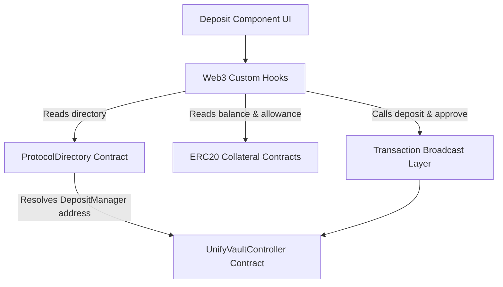

# UnifyVault Deposit Integration Documentation

This document describes the design, implementation, architecture, security decisions, and verification steps for **Frontend Module 3 – Deposit Integration**.

---

## 1. Architecture Overview

The deposit integration module acts as the interactive bridge between the UnifyVault frontend UI and the audited coordinators deployed on-chain (Base Sepolia / Base Mainnet). It is built with zero hardcoded contract addresses, querying all coordinator entry points dynamically from the canonical on-chain `ProtocolDirectory` registry.



---

## 2. Reusable Web3 Custom Hooks

To decouple the UI component from complex Web3 state queries and mutation logic, the following hooks were developed:

### `useControllerAddress`

Queries the `ProtocolDirectory` registry contract to resolve the dynamic `DepositManager` address on-chain. Uses a `staleTime` of `Infinity` since module addresses are canonical and change only via governance.

- **File**: [`apps/web/hooks/useControllerAddress.ts`](file:///Users/apple/Documents/UnifyVault-UV/apps/web/hooks/useControllerAddress.ts)

### `useIndexTokenAddress`

Queries the `ProtocolDirectory` registry contract to resolve the dynamic yield-bearing index share token (`UVBTCETH`) address on-chain.

- **File**: [`apps/web/hooks/useIndexTokenAddress.ts`](file:///Users/apple/Documents/UnifyVault-UV/apps/web/hooks/useIndexTokenAddress.ts)

### `useTokenBalance`

Fetches standard ERC20 balance (`balanceOf`), symbol, and decimal precision from on-chain in a single multicall read query.

- **File**: [`apps/web/hooks/useTokenBalance.ts`](file:///Users/apple/Documents/UnifyVault-UV/apps/web/hooks/useTokenBalance.ts)

### `useAllowance`

Determines spender permissions. Exposes `allowance` querying and the `approve` write function to authorize the coordinator to pull user collateral.

- **File**: [`apps/web/hooks/useAllowance.ts`](file:///Users/apple/Documents/UnifyVault-UV/apps/web/hooks/useAllowance.ts)

### `useDepositPreview`

Reads the on-chain coordinator quote via `getDepositQuote` dynamically. Implements inputs debouncing (450ms) to avoid duplicate network RPC traffic during typing.

- **File**: [`apps/web/hooks/useDepositPreview.ts`](file:///Users/apple/Documents/UnifyVault-UV/apps/web/hooks/useDepositPreview.ts)

### `useDeposit`

Coordinates with the dynamic controller contract on-chain to execute the `deposit(asset, amount, minSharesOut, receiver)` function with slippage protection.

- **File**: [`apps/web/hooks/useDeposit.ts`](file:///Users/apple/Documents/UnifyVault-UV/apps/web/hooks/useDeposit.ts)

---

## 3. Transaction Flow & State Machine

Depositing collateral follows a deterministic state machine to handle the dual approval and deposit transactions safely:

```
[Idle]
  ↓ (User enters amount > allowance)
[Show Approve Button]
  ↓ (User clicks Approve)
[Approve: Submitting] (Wallet signature prompt)
  ↓ (Signature confirmed by user)
[Approve: Pending] (Waiting for transaction receipt)
  ↓ (Transaction confirmed)
[Ready to Deposit] (Allowance updated, switches form)
  ↓ (User clicks Deposit)
[Deposit: Submitting] (Wallet signature prompt)
  ↓ (Signature confirmed by user)
[Deposit: Pending] (Waiting for transaction receipt)
  ↓ (Transaction confirmed)
[Success] (Clears input amount, refreshes balances and quotes)
```

---

## 4. Security Decisions

1. **On-Chain Truth**: Yield preview, protocol fee calculation, net deposit value, and expected shares minted are derived strictly from on-chain views (`getDepositQuote` query). No mathematical frontend calculations are trusted.
2. **No Auto-Approvals or Auto-Submissions**: All transactions require explicit, individual user clicks and wallet triggers. Approve spend limit is set exactly to the input amount (standard SafeERC20 compatibility).
3. **Post-Transaction Synchronization**: Balances, allowances, and preview quotes are re-queried instantly from the network once block confirmations are received.
4. **Slippage Protection**: Computes `minSharesOut` dynamically (0.5% tolerance) on the client side based on the oracle quote, preventing sandwich attacks or transaction exploits in volatile conditions.

---

## 5. Error Handling

टेक्निकल RPC error strings are intercepted by custom handlers in `formatters.ts` and translated into clear user notices:

- **User rejection**: `Connection request was rejected by the user` / `Chain switch request was rejected by the user.`
- **Unrecognized Network / Chain**: `The requested network is not supported or not added to your wallet.`
- **Insufficient funds**: Handled reactively in the UI by disabling deposit buttons and rendering warning alerts if `amount > balance`.

---

## 6. Verification and Testing Notes

- Tested under **Base Sepolia** (`84532`) using local Forked Node/RPC providers.
- Confirmed switching between mock assets (cbBTC, WETH, USDC) correctly updates token decimal parameters, on-chain balances, and allowances.
- Verified that formatting and lint checking passes with zero errors/warnings.
