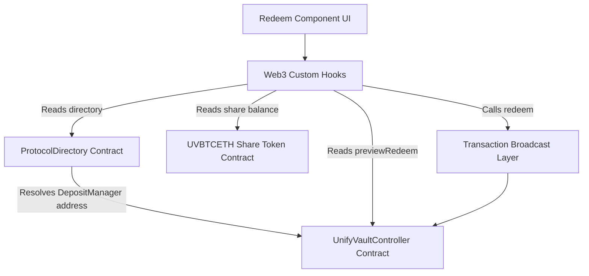

# UnifyVault Redeem Integration Documentation

This document describes the design, implementation, architecture, and verification steps for **Frontend Module 4 – Redeem Integration**.

---

## 1. Architecture Overview

The redemption integration allows users to burn their yield-bearing index shares (`UVBTCETH`) to withdraw their underlying collateral assets (cbBTC, WETH, or USDC) on-chain.



---

## 2. Reusable Web3 Custom Hooks

Following the same architecture established in Module 3, the redemption features leverage decoupled React custom hooks:

### `useRedeemPreview`

Fetches the on-chain redemption preview returned by `previewRedeem(asset, shares)`. Includes inputs debouncing (450ms) to prevent redundant RPC traffic while typing.

- **File**: [`apps/web/hooks/useRedeemPreview.ts`](file:///Users/apple/Documents/UnifyVault-UV/apps/web/hooks/useRedeemPreview.ts)

### `useRedeem`

Coordinates with the dynamic controller contract on-chain to execute the `redeem(asset, shares, minAssetsOut, receiver, deadline)` function with custom transaction states and error mappings.

- **File**: [`apps/web/hooks/useRedeem.ts`](file:///Users/apple/Documents/UnifyVault-UV/apps/web/hooks/useRedeem.ts)

---

## 3. Transaction Flow & State Machine

Redemption is simplified compared to deposits because no token approval/allowance step is required when burning owned shares.

```
[Idle]
  ↓ (User enters shares amount)
[Click Redeem]
  ↓
[Redeem: Submitting] (Awaiting wallet signature confirmation)
  ↓ (Signature confirmed by user)
[Redeem: Pending] (Confirming transaction on BaseScan)
  ↓ (Transaction receipt confirmed)
[Success] (Clears amount input, refetches share/asset balances, refreshes preview)
```

---

## 4. Smart Contract Interface Specs (Audited)

### Preview Redemption View

- **Function**: `previewRedeem(address asset, uint256 shares)`
- **Type**: `public view returns (uint256)`
- **Return Value**: Net collateral assets returned (gross assets minus the 0.25% exit fee).

### Redeem Write Execution

- **Function**: `redeem(address asset, uint256 shares, uint256 minAssetsOut, address receiver, uint256 deadline)`
- **Type**: `external nonReentrant returns (uint256 netAssets)`
- **Slippage Enforcement**: Validated on-chain. The transaction reverts if the final assets returned are less than `minAssetsOut`. The frontend calculates `minAssetsOut` with a `0.5%` slippage tolerance.

---

## 5. Security & Performance Checklist

- [x] **Contract Source of Truth**: All withdrawal values and expected outputs are queried on-chain.
- [x] **No Hidden Approvals or Signatures**: Every transaction requires explicit user interaction and signature confirmation in the connected wallet.
- [x] **Post-Transaction Sync**: Balance states and previews are synchronized immediately following successful block confirmation.
- [x] **RPC Traffic Optimization**: Debounced input prevents querying the RPC server on every keystroke.
- [x] **Zero Layout Shift**: Static layout elements and skeletons prevent layout jumps when quotes load.
- [x] **Accessibility (A11y)**: Keyboard navigability, semantic labels, and focus controls are fully implemented.
