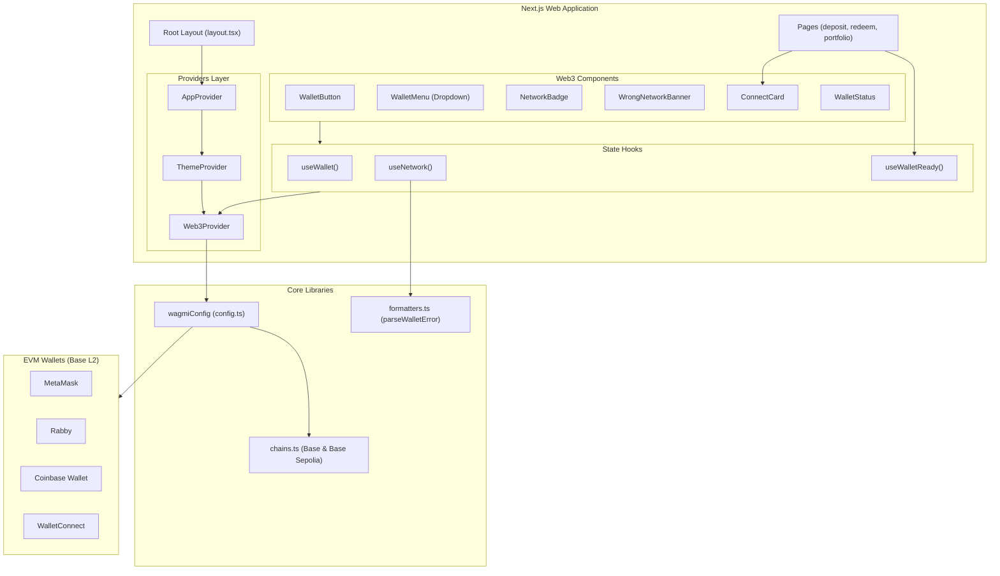
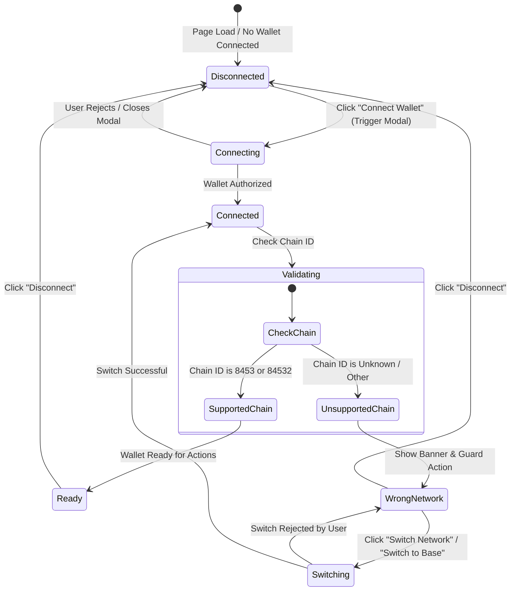

# UnifyVault Wallet Integration (Module 2)

This document provides a comprehensive overview of the **Wallet Integration** layer for the UnifyVault frontend. It outlines the architecture, components, hooks, error handling practices, security decisions, and connection state machines designed to establish a secure and highly responsive wallet layer.

---

## 1. Architecture Overview

The wallet integration layer sits directly between the UnifyVault core frontend interfaces (pages, layout structures) and the EVM consensus network (Base L2). It is constructed entirely on top of **Wagmi v2**, **Viem**, and **RainbowKit v2**, utilizing React hooks to expose strongly-typed connection states.



---

## 2. Supported Wallets & Chains

### Supported Wallets

We explicitly configure connectors for the following wallets:

- **MetaMask**: The industry-standard browser extension and mobile wallet.
- **Rabby**: A security-focused power-user wallet for EVM chains.
- **Coinbase Wallet**: Coinbase's native wallet offering smart wallet support on Base.
- **WalletConnect**: The standard protocol for linking mobile wallets via QR codes.

### Supported Chains

All network configurations are loaded from client-side environment configurations (`apps/web/lib/config/env.ts`):

- **Base Mainnet** (Chain ID: `8453`)
- **Base Sepolia** (Chain ID: `84532`)

We enforce validation using a custom `isSupported` flag in hooks. Any other chain is classified as an **Unknown Chain**.

---

## 3. Connection State Machine & Flows

The wallet layer establishes a strict connection and network validation lifecycle:



### State Definitions

1. **Disconnected**: No wallet is connected. The interface displays a premium `<ConnectCard>` inside operational pages and a `<WalletButton>` in the header prompting user connection.
2. **Connecting**: The wallet provider modal is active, waiting for authorization.
3. **Connected**: The wallet is successfully authenticated, and account address/avatar are resolved.
4. **Network Validation**: The system verifies if the current network matches Base Mainnet or Base Sepolia.
5. **WrongNetwork**: Active if validation fails. The page displays the inline `<WrongNetworkBanner>` and the `<WalletButton>` transforms into a warning trigger that directs chain switching.
6. **Ready**: The wallet is connected and validated on a supported chain. Action forms (deposit, redemption) can be unblocked safely.

---

## 4. Reusable Custom Hooks

All hooks are strongly typed, avoiding any usage of `any` types.

### `useWallet()`

Returns the core state of the connected account.

```typescript
export interface UseWalletResult {
  address: `0x${string}` | undefined;
  isConnected: boolean;
  isConnecting: boolean;
  isReconnecting: boolean;
  connectorName: string;
  connector: Connector | undefined;
  connect: (() => void) | undefined;
  disconnect: () => void;
}
```

### `useNetwork()`

Exposes the active network state, supported chain lists, and wallet network switching requests.

```typescript
export interface UseNetworkResult {
  chain: Chain | undefined;
  chainId: number | undefined;
  isSupported: boolean;
  supportedChains: readonly Chain[];
  switchChain: (targetChainId: number) => void;
  switchChainPending: boolean;
  switchChainError: Error | null;
  errorMessage: string | null; // Friendly translated wallet error
}
```

### `useWalletReady()`

Exposes simple indicators used by validation guards to control UI states.

```typescript
export interface UseWalletReadyResult {
  isReady: boolean;
  isConnected: boolean;
  isSupported: boolean;
}
```

---

## 5. Reusable Components

All Web3 components are optimized, use lazy-rendering where applicable (via Radix UI dropdown menus), and implement focus indicators/ARIA labels for accessibility.

| Component Name           | Visual Features & Accessibility                                                                                                                                           | Reusability                                         |
| :----------------------- | :------------------------------------------------------------------------------------------------------------------------------------------------------------------------ | :-------------------------------------------------- |
| **`WalletButton`**       | Displays "Connect Wallet" with Lucide icon. Resolves ENS name/avatar. Displays network status. Highlights wrong chain warning and Switch button. Focus states handled.    | Used as header actions and inside container panels. |
| **`WalletMenu`**         | Dropdown overlay that lists connected status, shortened address, copy action, explorer link, chain list switching, and disconnect action. Supports lazy-rendering.        | Embedded directly into active triggers.             |
| **`WalletStatus`**       | Small inline dot indicator showing connection status and connector name (e.g. MetaMask).                                                                                  | Ideal for footer and sidebar status indicators.     |
| **`NetworkBadge`**       | Green/emerald pill for supported network (Base/Sepolia). Red/destructive pill for unsupported chains (e.g., "Unsupported (Mainnet)").                                     | Can be displayed anywhere next to address fields.   |
| **`WrongNetworkBanner`** | Absolute top-level banner highlighting wrong network state, displaying friendly error reason, and offering "Switch to Base Mainnet" and "Switch to Base Sepolia" actions. | Rendered in main App layout.                        |
| **`ConnectCard`**        | Premium glassmorphism container card explaining wallet requirements, displaying a wallet icon, and hosting the action trigger.                                            | Rendered inline inside unauthorized route pages.    |

---

## 6. Error Handling Strategy

Raw RPC errors are confusing and insecure to expose to users. We route all wallet errors through a custom `parseWalletError` formatter that maps EIP-1193 status codes and RPC response substrings to clean, actionable user feedback:

- **User Rejection (4001 / "rejected")**: Returns `"Connection request was rejected by the user."` or `"Chain switch request was rejected by the user."`
- **Wallet Locked (-32603 / "locked")**: Returns `"Your wallet appears to be locked. Please unlock it and try again."`
- **Wallet Unavailable**: Returns `"No compatible wallet extension was detected. Please install a supported Web3 wallet."`
- **RPC Unavailable (Network / Fetch error)**: Returns `"RPC server is currently unreachable. Please check your network connection and try again."`
- **Fallback**: Returns `"An unexpected wallet error occurred. Please try again."`

---

## 7. Security Decisions

In compliance with decentralized app development practices, the following security constraints are enforced at all times:

1. **Explicit User Intent**: Auto-connecting to unapproved wallets is prohibited. Wallet connections are initiated purely on user click events.
2. **Explicit Chain Switching**: The system does not automatically switch networks on behalf of the user. Instead, wrong network states show alerts and offer manual trigger buttons.
3. **No Automated Actions**: Signing messages, authorizing permissions, and sending transactions must always be requested through standard wallet prompts that are explicitly triggered.
4. **Environment Driven**: No chain IDs, RPC URLs, or block explorers are hardcoded. Everything is read directly from environment variables managed by Next.js and compiled into `wagmiConfig`.
