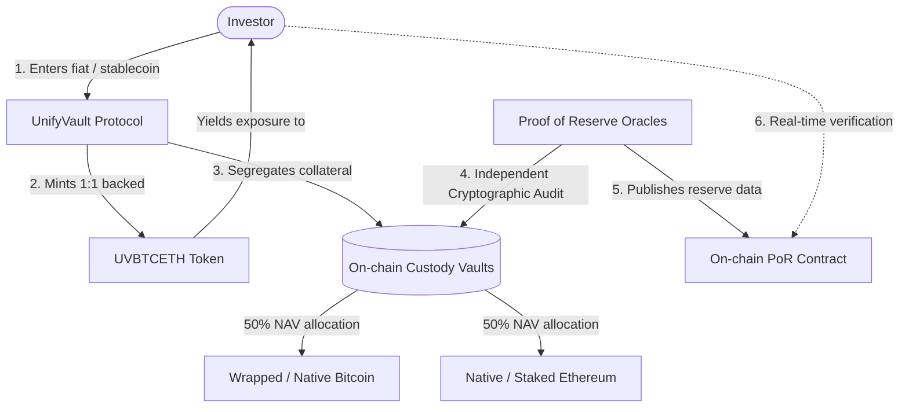

# UnifyVault: The Crypto Index Infrastructure Protocol

## Protocol Vision & Architecture Paper

**Version 1.0** — _July 2026_

---

## 1. Executive Summary

UnifyVault is an open-source, non-custodial index protocol designed to democratize and simplify digital asset investing. By abstracting the complexities of Web3 infrastructure—such as decentralized exchanges, gas tokens, bridging, and multi-network navigation—UnifyVault enables access to diversified crypto index baskets with the simplicity of traditional payment networks.

The flagship product of the protocol is **UVBTCETH**, a digital index asset representing a static, 1-to-1 backed weight of **50% Bitcoin (BTC) and 50% Ethereum (ETH)**.

Designed for long-term wealth preservation and capital appreciation, UnifyVault rejects speculative tokenomics. The protocol focuses on building robust, transparent, and resilient financial infrastructure to onboard the next generation of digital asset investors, starting with the Indian ecosystem.



---

## 2. The Problem Statement

Despite digital assets achieving institutional legitimacy globally, the retail user journey remains fractured, insecure, and highly complex. This is particularly evident in emerging markets such as India, where user experience and security barriers prevent widespread adoption.

### Key Barriers for Modern Investors

- **Multi-Exchange Fragmentation:** Users must navigate multiple centralized exchanges (CEXs) to build a basic portfolio, exposing themselves to counterparty risk, varying fee structures, and withdrawal limits.
- **USDT/Stablecoin Dependency:** Retail investors are forced to understand stablecoin mechanics, peg risks, and conversion rates before they can purchase their first digital asset.
- **Wallet & Key Management Complexity:** Self-custody requires managing seed phrases, hardware wallets, and complex user interfaces. A single input error can result in permanent loss of funds.
- **Trading Pair Confusion:** Traditional exchanges require users to navigate confusing order books and trading pairs (e.g., BTC/USDT, ETH/INR) rather than presenting investments in direct fiat values.
- **Network & Chain Confusion:** Users must identify whether an asset is on Ethereum Mainnet, Arbitrum, Optimism, or Base. Choosing the wrong network leads to transaction failures or lost assets.
- **Steep Learning Curve:** The transition from traditional finance (UPI, mutual funds) to decentralized finance requires understanding gas limits, slippage, liquidity pools, and smart contract execution.
- **Lack of Transparency:** Many centralized platforms operate fractional reserves, leading to unexpected insolvencies. Users have no cryptographically verifiable way to prove their assets are fully backed.
- **Friction-Filled Onboarding:** The time-to-investment for typical decentralized products is measured in hours or days due to multiple steps involving bridging, KYC, fiat on-ramps, and token swaps.

---

## 3. The Proposed Solution

UnifyVault eliminates these friction points by providing a secure, index-based tokenization protocol that sits between the investor and the underlying networks.

| Friction Category        | Legacy Investment Journey                                                                                    | UnifyVault Journey                                                                             |
| :----------------------- | :----------------------------------------------------------------------------------------------------------- | :--------------------------------------------------------------------------------------------- |
| **Fiat Onboarding**      | Bank Transfer $\rightarrow$ Centralized Exchange $\rightarrow$ Buy USDT $\rightarrow$ Swap for Target Asset. | Direct fiat/stablecoin integration with single-transaction index execution.                    |
| **Asset Selection**      | Researching hundreds of speculative tokens, managing rebalancing, facing high volatility.                    | Diversified, blue-chip index assets (starting with BTC + ETH) representing market-cap leaders. |
| **Network & Gas Fees**   | Navigating L1/L2 networks, acquiring gas tokens (ETH, MATIC), managing RPCs.                                 | Native deployment on Base (L2) with micro-cent transaction costs, abstracted from the user.    |
| **Transparency & Audit** | Trusting exchange balance sheets and quarterly auditing reports.                                             | Continuous, on-chain **Proof of Reserve** verified cryptographically in real-time.             |
| **Custody & Ownership**  | Assets held in centralized pools prone to liquidity freezes and internal leverage.                           | Self-custodial smart contracts ensuring the user maintains control of their assets.            |

### Core Functional Pillars

1.  **Simplicity (UPI-Like Usability):** Investing in a diversified portfolio of digital assets should not require technical literacy. The UnifyVault interface abstracts the underlying blockchain logic to make investment as simple as a standard bank transfer or UPI payment.
2.  **Institutional-Grade Security:** Asset custody is governed by non-custodial smart contracts, audited regularly, and deployed on secure, decentralized networks.
3.  **Real-Time Transparency:** By integrating on-chain proof of reserve, users can verify that every index token in circulation is backed 1-to-1 by matching reserve assets in vault storage.
4.  **Accessible Asset Indexing:** Users gain fractional exposure to the two largest digital assets without managing individual positions, minimizing transaction fees and portfolio tracking errors.

---

## 4. The Flagship Product: UVBTCETH (50% BTC + 50% ETH)

The initial index product launched under the protocol is **UVBTCETH**, designed to capture the structural core of the digital asset economy.

### Portfolio Composition

| Asset              | Weight | Role in Index             | Exposure Characteristics                                       |
| :----------------- | :----- | :------------------------ | :------------------------------------------------------------- |
| **Bitcoin (BTC)**  | 50.0%  | Macro Store of Value      | Digital Gold, Institutional Inflows, Sovereign Asset Class     |
| **Ethereum (ETH)** | 50.0%  | Smart Contract Base Layer | Yield Generation (Staking), Developer Network Effects, Utility |

### Why Bitcoin + Ethereum?

1.  **Dominant Market Share:** Together, Bitcoin and Ethereum command over 70% of the total cryptocurrency market capitalization. Investing in these two assets captures the beta of the entire crypto asset class while filtering out high-risk, speculative long-tail tokens.
2.  **Unmatched Liquidity:** BTC and ETH possess the deepest liquidity pools in both traditional (ETFs) and decentralized markets. This ensures minimal slippage during index creation (minting) and redemption (burning).
3.  **Regulatory & Institutional Clarity:** BTC and ETH are the only digital assets with active Spot ETFs approved in major global jurisdictions (such as the US SEC), establishing them as mature, institutional-grade assets.
4.  **Decentralized Security:** Bitcoin's Proof-of-Work and Ethereum's Proof-of-Stake represent the most cryptographically secure and decentralized network security models in existence.
5.  **Simplicity for New Entrants:** For users entering the digital asset market, understanding the value propositions of "Digital Gold" (Bitcoin) and "Digital Web Infrastructure" (Ethereum) is far more intuitive than evaluating highly volatile DeFi, Layer-1, or AI utility tokens.

---

## 5. Technology & Architecture Decisions

### Why Base?

UnifyVault is deployed natively on **Base**, the Ethereum Layer-2 network developed by Coinbase. The selection of Base is driven by the following criteria:

- **Ethereum Security Guarantee:** As an Optimistic Rollup, Base posts its transaction data to Ethereum L1, inheriting Ethereum's institutional-grade security model.
- **Sub-Cent Transaction Fees:** Base reduces execution gas costs by up to 99% compared to Ethereum Mainnet, making index rebalancing, minting, and burning highly cost-effective for retail users.
- **High Throughput & Speed:** Block times of under two seconds allow for instant order execution and near-real-time index price updates.
- **Ecosystem Interoperability (EVM):** Base is fully compatible with the Ethereum Virtual Machine, allowing UnifyVault to leverage existing decentralized exchanges (Uniswap, Aerodrome) and custody solutions.
- **Coinbase Ecosystem Integration:** Base is strategically positioned to bridge Coinbase's user base and fiat-to-crypto on-ramps, aligning with UnifyVault’s goal of making crypto access simple and low-friction.

### Why Dynamic Supply (Mint and Burn)?

Unlike standard tokens with a fixed maximum supply, UnifyVault index assets use a **Dynamic Supply Mechanics** model based on continuous minting and burning.

```
[User Capital Deposit]   ==>  [Vault Purchases Underlying Assets]  ==>  [Index Token Minted to User]
[Index Token Redemption] ==>  [Vault Liquidates Underlying Assets] ==>  [Capital Returned to User]
```

#### The Limits of Fixed Supply for Indices

If an index token had a fixed supply, its price on secondary markets would be dictated solely by demand for the index token itself, rather than the value of the underlying assets. This mismatch creates severe premium/discount discrepancies (tracking errors).

#### The Mint/Burn Advantage

- **Zero Tracking Error:** When a user deposits funds to mint `UVBTCETH`, the protocol accepts the collateral, routes 50% to purchase BTC and 50% to purchase ETH, and locks them in custody. The protocol then mints the exact equivalent value in `UVBTCETH`.
- **Arbitrage-Free Redemption:** When a user redeems (burns) their `UVBTCETH`, the smart contracts unlock the underlying BTC and ETH, return the proceeds to the user, and permanently destroy the index token.
- **Scalability:** The supply scales organically with investor demand. Whether the protocol has $10,000 or $10,000,000,000 in Assets Under Management (AUM), the index token value remains mathematically pegged to the Net Asset Value (NAV) of the underlying reserve assets.

### On-Chain Proof of Reserve (PoR)

Centralized investment options often obscure their underlying assets, raising insolvency and manipulation concerns. UnifyVault addresses this through a native **Proof of Reserve** standard.

> [!IMPORTANT]
> **The UnifyVault Solvency Equation:**
> $$\text{Total Outstanding } UVBTCETH \times \text{NAV} \le \text{Total Cryptographically Verified Collateral in Vaults}$$

- **Continuous Cryptographic Verification:** On-chain contracts leverage decentralized oracle networks (such as Chainlink) to verify and feed custody balances directly onto Base.
- **Public Verification:** Anyone can query the smart contracts at any time to verify that the value of physical/wrapped assets held in the vault matches the value of circulating index tokens.
- **Trust-Minimization:** The system does not rely on static monthly audits. The code acts as the ultimate auditor, ensuring that the protocol cannot create uncollateralized index tokens.

---

## 6. Core Principles

UnifyVault is guided by seven fundamental principles that govern our architecture, upgrades, and operational roadmap:

- **Transparency:** All protocol fees, asset holdings, code updates, and treasury operations are recorded on-chain. There are no hidden charges, spreads, or proprietary trading desks.
- **Security First:** Smart contracts are built using industry-standard libraries, undergo rigorous multi-firm auditing, and utilize timelocks and multi-sig guards to protect collateral pools.
- **Simplicity:** We design for the non-technical user. If a feature or product cannot be understood by a first-time investor within three minutes, it is redesigned or removed.
- **Accessibility:** Financial inclusion means reducing minimum investment barriers. UnifyVault allows micro-investing, making blue-chip index assets accessible to retail savers of all economic levels.
- **Decentralization:** Over time, protocol governance, oracle validation, and parameter tuning will transition to a decentralized framework to ensure the infrastructure remains a neutral public good.
- **User Ownership:** UnifyVault is non-custodial. Users maintain control over their keys, can redeem their underlying assets directly from the smart contract, and are never locked into the platform.
- **Open Infrastructure:** The protocol is open-source. Other fintech applications, wallets, and neo-banks can integrate UnifyVault's index tokens into their platforms, accelerating financial innovation.

---

## 7. Founder Philosophy

> "We are not building another crypto coin. We are building financial infrastructure."

The digital asset industry is flooded with speculative tokens created to generate short-term hype, enrich insiders, and capture transient retail interest. These models are unsustainable and draw focus away from the true innovation of blockchain technology: the creation of permissionless, transparent, and efficient financial rails.

UnifyVault is not a speculative project. We do not issue volatile governance tokens to fund marketing campaigns, nor do we promise risk-free yields.

We view blockchain as a technological upgrade to the legacy banking infrastructure. Our philosophy is rooted in building the pipes, vaults, and indices that make wealth generation secure, passive, and automated. By combining the safety of blue-chip crypto assets with the convenience of modern payment interfaces, we are building infrastructure that outlasts market cycles.

---

## 8. Long-Term Vision (Future Horizons)

While the flagship **UVBTCETH** index addresses the immediate need for a simple, blue-chip index, the UnifyVault protocol is architected to support a broad suite of index and asset baskets as the ecosystem matures.

These potential future offerings represent strategic areas of exploration rather than binding commitments:

```
                  ┌─────────────── UnifyVault Protocol ───────────────┐
                  │                                                   │
        ┌─────────┴─────────┐                               ┌─────────┴─────────┐
        │    Flagship       │                               │   Future Index    │
        │   Blue-Chip       │                               │    Exploration    │
        └─────────┬─────────┘                               └─────────┬─────────┘
                  │                                                   │
                  ▼                                    ┌──────────────┼──────────────┐
              UVBTCETH                                 ▼              ▼              ▼
           (50% BTC/ETH)                            UVTOP10         UVGOLD         UVRWA
                                                 (Top 10 Assets) (Tokenized Gold) (Real World)
```

- **UVTOP10 (Diversified Market Cap Index):** A dynamic, market-cap-weighted index containing the top 10 digital assets by valuation, automatically rebalanced monthly to capture structural shifts in the market.
- **UVGOLD (Inflation-Shield Index):** A hybrid token pairing tokenized Physical Gold (e.g., PAXG) with Bitcoin and Ethereum to create a balanced, inflation-hedging digital portfolio.
- **UVAI (Artificial Intelligence Infrastructure Index):** A curated basket of tokens supporting decentralized compute, storage, and AI agents, allowing thematic investing in Web3 AI technologies.
- **UVRWA (Real World Asset Index):** A secure index providing combined exposure to tokenized government bonds, treasury bills, and high-yield real-world assets, offering lower-volatility yields on-chain.

---

## 9. Disclaimer and Risk Factors

> [!WARNING]
> Digital asset investing involves high market volatility and risk of capital loss. UnifyVault index assets represent exposure to underlying cryptocurrency assets (Bitcoin and Ethereum).

- **No Profit Guarantees:** Past performance of Bitcoin, Ethereum, or any digital index does not guarantee future returns. The protocol does not offer guaranteed yields, interest payments, or capital preservation.
- **Smart Contract Risk:** Despite security audits, interaction with smart contracts carries risk of bugs, exploits, or systemic failures.
- **Regulatory Environment:** The regulatory landscape surrounding digital assets and L2 protocols is evolving. Changes in government policy or tax regulations in India or globally may impact the availability, operation, or liquidity of the protocol.
- **De-peg and Oracle Risk:** The value of index tokens relies on the accuracy of on-chain price feeds. Oracle failure or extreme network congestion could result in temporary execution delays or pricing errors.
