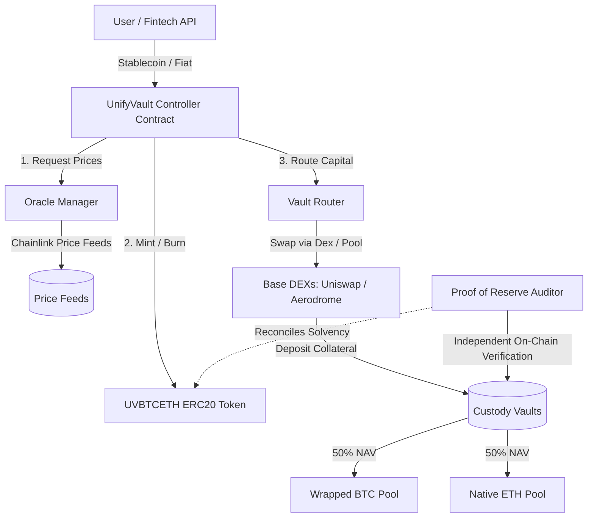

# UnifyVault Protocol Whitepaper

## A Decentralized, Verifiable Crypto Index Infrastructure on Base

**Version 1.0** — _July 2026_

---

## 1. Executive Summary

Digital assets have evolved into a distinct macro-economic asset class. However, the onboarding paths and infrastructure required to invest in these assets remain prohibitively complex, highly fragmented, and risky for mainstream retail investors.

**UnifyVault** is an open-source, non-custodial index protocol built on the Base Layer-2 network. Its mission is to make digital asset investing as simple and seamless as making a UPI payment in India. By abstracting the execution layer—including decentralized trading pairs, wallet operations, and bridging protocols—UnifyVault provides exposure to diversified digital asset indices through single-transaction execution.

The flagship token of the protocol is **UVBTCETH**, a dynamic-supply ERC-20 token representing a 50% Bitcoin and 50% Ethereum weighted portfolio. The protocol maintains a strict 1-to-1 reserve backing model, audited continuously and cryptographically on-chain through decentralized Proof of Reserve (PoR) networks. UnifyVault is designed not as a speculative token, but as resilient financial infrastructure built to bring transparency, ease of access, and self-custody to the next billion wealth creators.

---

## 2. The Market Problem

The current digital asset ecosystem forces retail investors to navigate a gauntlet of technical and security hurdles before establishing a basic diversified portfolio.

```
                                  [Investor]
                                      │
             ┌────────────────────────┼────────────────────────┐
             ▼                        ▼                        ▼
     [Exchange Complexities]   [Technical Friction]    [Transparency Risks]
     • Multiple KYC checks     • Gas token management  • Fractional reserves
     • Trading pair pricing    • Network bridging      • Opaque balance sheets
     • Liquidity lockups       • Seed phrase custody   • Regulatory uncertainty
```

### 2.1. Fragmentation and Usability Barriers

- **USDT and Fiat Dependency:** Retail users must first convert native fiat (e.g., INR) to intermediate stablecoins (USDT/USDC) through secondary peer-to-peer markets or exchanges, incurring slippage and conversion fees.
- **Trading Pair Inefficiency:** Investors are forced to place manual limit or market orders on complex trading pairs (e.g., BTC/USDT) rather than transacting directly in currency values.
- **Wallet and Seed Phrase Management:** Self-custody requires users to manage key phrases, secure hardware wallets, and check transaction payloads. A single mistake during this process can lead to permanent loss of capital.
- **Network Congestion and Chain Confusion:** Users must identify whether assets are hosted on Ethereum Mainnet, Base, or other Layer-2 networks. Routing assets over incorrect chains often results in unrecoverable asset loss.
- **Steep Learning Curve:** Mainstream users are accustomed to simple automated mutual funds or payment networks (like UPI in India). The high cognitive load of gas fee calculations, slippage tolerances, and decentralized exchange interfaces deters potential capital.

### 2.2. Transparency and Counterparty Counter-risks

- **Fractional Reserves:** Centralized exchanges operate opaque internal ledgers. Historically, this has allowed platforms to run fractional reserve models, lending out user assets or taking speculative directional bets, leading to sudden insolvencies.
- **Delayed Audit Cycles:** Traditional financial checks are periodic and retroactive. These static, trust-based certifications fail to provide real-time assurance of security.

---

## 3. The Proposed Solution

UnifyVault replaces centralized intermediaries and complex execution procedures with a self-custodial, automated smart contract wrapper.

```
[Retail / Fintech Frontends]  ──(Simple API / Web App)──>  [UnifyVault Protocol]
                                                                  │
                                                      ┌───────────┴───────────┐
                                                      ▼                       ▼
                                                [Smart Mint]            [On-Chain PoR]
                                              Auto-swaps capital      1:1 asset reserve
                                              into index baskets      verified continuously
```

### 3.1. Core Architectural Pillars

- **Zero-Friction Access:** Integrating localized fiat-to-index pathways abstracts the transaction routing. Users input their fiat amount, and the protocol automatically handles conversion, routing, and index issuance.
- **Direct Basket Exposure:** The protocol automates the purchase of underlying components. Purchasing a single index token yields proportional ownership of the underlying assets.
- **Self-Custodial Architecture:** Users retain ownership of their index assets through standard ERC-20 tokens. The protocol cannot restrict withdrawals, freeze assets, or deploy customer assets for internal leverage.
- **Cryptographic Verification:** Every outstanding unit of index supply is backed by audited, on-chain reserves. The protocol continuously broadcasts custody proof to prevent fractional reserves.

---

## 4. Protocol Architecture

The UnifyVault protocol utilizes a layered modular architecture on the Base network to separate user execution, routing, asset custody, and price validation.



### 4.1. Protocol Layers

1.  **Interaction Layer:** The consumer or fintech API sends deposit or withdrawal payloads to the Core Controller.
2.  **Controller Layer (`UnifyVaultController.sol`):** Manages the logic for calculating Net Asset Value (NAV), minting index tokens, and destroying index tokens upon redemption.
3.  **Oracle Layer (`OracleManager.sol`):** Aggregates decentralized price feeds from Chainlink or Redstone, providing real-time pricing data for the index constituents (BTC and ETH).
4.  **Routing Layer (`VaultRouter.sol`):** Automatically routes stablecoins or raw deposits through liquidity pools (such as Uniswap V3 or Aerodrome) on Base to convert them into index assets.
5.  **Custody Layer (`CustodyVault.sol`):** Holds the underlying portfolio assets. It allows deposits and withdrawals only via authorization from the Core Controller.

### 4.2. Smart Contract Interactions

#### Deposit and Mint Lifecycle

1. The user calls `deposit(amount)` on the Core Controller, supplying stablecoin or equivalent asset value.
2. The Controller queries `OracleManager.sol` to fetch current BTC and ETH prices.
3. The Controller calculates the current Net Asset Value (NAV) of the index token.
4. The Controller transfers deposit assets to `VaultRouter.sol` with allocation instructions (e.g., 50% BTC, 50% ETH).
5. The Router executes swaps on external DEXs and sends the resulting BTC and ETH to `CustodyVault.sol`.
6. The Controller mints the equivalent amount of `UVBTCETH` to the user's wallet.

#### Redemption and Burn Lifecycle

1. The user calls `redeem(indexTokenAmount)` on the Core Controller.
2. The Controller requests prices from the Oracle Manager and calculates the redemption value.
3. The Controller calls the token contract to burn the user's `UVBTCETH` tokens.
4. The Controller commands `CustodyVault.sol` to release the proportional amount of underlying BTC and ETH.
5. The underlying assets are converted to the user's desired asset (e.g., USDC) or returned directly to their address.

---

## 5. The UVBTCETH Index

The initial product, **UVBTCETH**, consists of two dominant digital assets:

$$\text{UVBTCETH Basket} = 50\% \text{ Bitcoin (BTC)} + 50\% \text{ Ethereum (ETH)}$$

```
                   ┌───────────────────────────────────┐
                   │       UVBTCETH Index (100%)       │
                   └─────────────────┬─────────────────┘
                                     │
                    ┌────────────────┴────────────────┐
                    ▼                                 ▼
         Bitcoin (BTC) - 50%                Ethereum (ETH) - 50%
         • Macro Store of Value             • Smart Contract Infrastructure
         • Global Institutional Asset       • Native Yield Generation (Staking)
```

### 5.1. Rationale for Asset Composition

1.  **Systemic Stability:** Bitcoin and Ethereum represent the bedrock of the decentralized web, accounting for over 70% of the entire digital asset market cap.
2.  **Liquidity Depth:** Deep order books on Base and Layer-1 networks ensure index minting and burning incur minimal slippage, preventing value decay during creation and redemption events.
3.  **Regulatory Maturity:** BTC and ETH are globally recognized as non-security digital commodities, establishing a stable regulatory profile.
4.  **Equal Weighting (50/50):** A static 50/50 weighting balances Bitcoin’s store-of-value features with Ethereum’s utility and ecosystem growth. It simplifies rebalancing transactions and reduces network execution costs.

---

## 6. Dynamic Mint/Burn Model

To ensure the index price tracks the underlying assets, UnifyVault rejects fixed-supply token models. Instead, it utilizes an open-ended creation/redemption mechanism.

```
       MINT FLOW (Capital Inflow)                BURN FLOW (Redemption Outflow)

  ┌───────────────────────────────────┐     ┌───────────────────────────────────┐
  │         User deposits USD         │     │     User deposits UVBTCETH        │
  └─────────────────┬─────────────────┘     └─────────────────┬─────────────────┘
                    │                                         │
                    ▼                                         ▼
  ┌───────────────────────────────────┐     ┌───────────────────────────────────┐
  │ Protocol swaps 50% BTC / 50% ETH  │     │ Protocol liquidates BTC and ETH   │
  └─────────────────┬─────────────────┘     └─────────────────┬─────────────────┘
                    │                                         │
                    ▼                                         ▼
  ┌───────────────────────────────────┐     ┌───────────────────────────────────┐
  │ Mints new UVBTCETH (Supply Grows) │     │ Burns token (Supply Decreases)    │
  └───────────────────────────────────┘     └───────────────────────────────────┘
```

### 6.1. Mechanics

- **Creation (Mint):** When capital enters the protocol, new `UVBTCETH` tokens are minted. This minting only occurs when corresponding collateral has been locked in the custody vault.
- **Redemption (Burn):** When users redeem their holdings, the protocol burns the `UVBTCETH` tokens, unlocks the underlying assets, and returns their value to the user.
- **Elimination of Price Premium/Discount:** In fixed-supply models, market demand can cause the token price to drift from its Net Asset Value (NAV). The dynamic mint/burn model ensures that arbitrageurs can resolve price discrepancies, keeping the market price of `UVBTCETH` pegged to its underlying NAV.

---

## 7. NAV Calculation

The Net Asset Value (NAV) of the `UVBTCETH` token is calculated dynamically using real-time price feeds.

### 7.1. Mathematical Formula

Let $S_t$ be the total circulating supply of `UVBTCETH` at block time $t$.
Let $A_{\text{BTC},t}$ and $A_{\text{ETH},t}$ represent the total units of underlying Bitcoin and Ethereum held in the vault at block time $t$.
Let $P_{\text{BTC},t}$ and $P_{\text{ETH},t}$ represent the USD prices of Bitcoin and Ethereum sourced from the decentralized oracle networks at block time $t$.

The Total NAV of the vault at time $t$ is calculated as:

$$\text{NAV}_{\text{Total},t} = (A_{\text{BTC},t} \times P_{\text{BTC},t}) + (A_{\text{ETH},t} \times P_{\text{ETH},t})$$

The fair value of a single `UVBTCETH` token ($P_{\text{Token},t}$) is:

$$P_{\text{Token},t} = \frac{\text{NAV}_{\text{Total},t}}{S_t}$$

### 7.2. Deposit and Mint Quantity Calculation

When a user deposits collateral value $C$ (after subtracting a protocol mint fee $F_{\text{mint}}$), the net deposit value $D$ is:

$$D = C \times (1 - F_{\text{mint}})$$

The quantity of index tokens minted ($M$) to the user is:

$$M = \frac{D}{P_{\text{Token},t}}$$

---

### 7.3. Practical Execution Example

#### Initial State

- Circulating Supply ($S_t$): $1,000,000\text{ UVBTCETH}$
- Vault Assets ($A_i$): $10\text{ BTC}$ and $150\text{ ETH}$
- Oracle Prices ($P_i$): $P_{\text{BTC}} = \$60,000.00$, $P_{\text{ETH}} = \$3,000.00$

$$\text{NAV}_{\text{Total}} = (10 \times 60,000) + (150 \times 3,000) = 600,000 + 450,000 = \$1,050,000.00$$

$$P_{\text{Token}} = \frac{\$1,050,000.00}{1,000,000} = \$1.05\text{ per UVBTCETH}$$

#### Action: User Deposits \$10,000.00 USDC

- Protocol Mint Fee ($F_{\text{mint}}$): $0.2\%$
- Net Deposit ($D$): $\$10,000.00 \times (1 - 0.002) = \$9,980.00$
- Tokens Minted ($M$): $\frac{\$9,980.00}{\$1.05} = 9,504.7619\text{ UVBTCETH}$

#### Asset Purchases & Allocation

The protocol routes \$9,980.00 into the underlying assets:

1.  **\$4,990.00** allocated to purchase Bitcoin: $\frac{\$4,990.00}{\$60,000.00} = 0.083167\text{ BTC}$
2.  **\$4,990.00** allocated to purchase Ethereum: $\frac{\$4,990.00}{\$3,000.00} = 1.663333\text{ ETH}$

#### Post-Transaction Verification

- New Circulating Supply ($S_{t+1}$): $1,009,504.7619\text{ UVBTCETH}$
- New Vault Assets: $10.083167\text{ BTC}$ and $151.663333\text{ ETH}$

$$\text{NAV}_{\text{Total}, t+1} = (10.083167 \times 60,000) + (151.663333 \times 3,000) = 604,990 + 454,990 = \$1,059,980.00$$

$$P_{\text{Token}, t+1} = \frac{\$1,059,980.00}{1,009,504.7619} = \$1.05\text{ per UVBTCETH}$$

The Net Asset Value per token remains exactly $\$1.05$, validating that creation events do not dilute existing holders.

---

## 8. Proof of Reserve (PoR)

To solve the solvency concerns associated with centralized asset management, UnifyVault implements an automated on-chain **Proof of Reserve** validation system.

```
┌────────────────────────┐       Queries       ┌────────────────────────┐
│  Decentralized Oracle  ├────────────────────>│    Custody Vaults      │
│  Network (Chainlink)   │                     │    (BTC & ETH Reserves)│
└───────────┬────────────┘                     └────────────────────────┘
            │
    Publishes Proof
            │
            ▼
┌────────────────────────┐     Verifies 1:1    ┌────────────────────────┐
│   Proof of Reserve     ├────────────────────>│  UVBTCETH Token        │
│   Smart Contract       │     Solvency Eq.    │  Circulating Supply    │
└────────────────────────┘                     └────────────────────────┘
```

### 8.1. Proof of Reserve Specifications

- **Oracle Verification:** Chainlink Proof of Reserve feeds query custody vault addresses (including native L1 deposits and wrapped L2 representations) and pushes balance data directly to Base.
- **Balance Reconciliation:** The `ProofOfReserve.sol` smart contract compares the verified value of vault assets against the outstanding token supply of `UVBTCETH`.
- **Automated Guardrails:** If the reserves drop below the liabilities (outstanding token supply), the protocol automatically halts minting and triggers protection measures to preserve user capital.
- **Public Visibility:** Reserve metrics, transaction records, and contract calls are publicly viewable on-chain via block explorers (e.g., BaseScan) and the UnifyVault user interface.

---

## 9. Security Model

UnifyVault is designed with a defense-in-depth security model to safeguard protocol assets against external attacks, smart contract vulnerabilities, and key compromise.

| Security Component            | Implementation details                                                  | Purpose                                                       |
| :---------------------------- | :---------------------------------------------------------------------- | :------------------------------------------------------------ |
| **OpenZeppelin Libraries**    | Industry-standard ERC-20, SafeERC20, and utility libraries.             | Prevents common token implementation errors.                  |
| **Multi-Signature Vaults**    | Multi-signature architecture for owner and operational addresses.       | Prevents single-point-of-failure key compromises.             |
| **Time-Delayed Executions**   | Minimum 48-hour timelock on upgrades and structural changes.            | Allows users time to audit changes and exit if they disagree. |
| **Decentralized Oracles**     | Multi-source price aggregation via Chainlink.                           | Prevents flash loan manipulation and oracle exploits.         |
| **Reentrancy Protection**     | ReentrancyGuard modifiers applied to mint, burn, and routing functions. | Blocks recursive execution exploits.                          |
| **Pausable Controls**         | Circuit breakers controlled by the Multisig/DAO.                        | Allows freezing of minting/burning in emergency scenarios.    |
| **Role-Based Access Control** | Explicit administrative roles via `AccessControl.sol`.                  | Limits privileges of operational accounts.                    |

---

## 10. Governance

The governance model of UnifyVault transitions through three distinct phases to balance security, development velocity, and decentralization.

```
       PHASE 1                      PHASE 2                      PHASE 3
 ┌─────────────────┐          ┌─────────────────┐          ┌─────────────────┐
 │ Founder Multisig│  ─────>  │Community Control│  ─────>  │    Full DAO     │
 │ Rapid iteration │          │Snapshot voting  │          │On-chain governance│
 └─────────────────┘          └─────────────────┘          └─────────────────┘
```

1.  **Phase 1: Founder Multisig (Bootstrap Phase):** During the initial launch, structural parameters and emergency controls are managed by a multi-signature wallet. This ensures high responsiveness to early deployment issues.
2.  **Phase 2: Community Control (Transition Phase):** The protocol integrates off-chain voting frameworks (e.g., Snapshot). Users vote on risk parameters, asset weighting, and fee routes, which are executed by the multisig.
3.  **Phase 3: Full DAO (Decentralization Phase):** Once the smart contracts are mature and battle-tested, governance transitions to an on-chain DAO. Ownership of the core protocol contracts is transferred to governance contracts, allowing proposals to be executed programmatically.

---

## 11. Revenue Model

UnifyVault is structured as transparent infrastructure. It rejects hidden spreads or proprietary market-making models, generating revenue solely from explicit, on-chain fee parameters.

```
                         Gross Deposit (100%)
                                 │
                 ┌───────────────┴───────────────┐
                 ▼                               ▼
         Protocol Fee (0.2%)            Net Capital Allocation (99.8%)
         • Sent to Treasury             • Swapped to 50% BTC / 50% ETH
         • Funds operational costs      • Held in Custody Vaults
```

- **Minting (Creation) Fee:** A flat fee (initially set to $0.2\%$) is charged upon index token creation. This fee covers gas optimization costs and funds protocol development.
- **Redemption (Burn) Fee:** A flat fee (initially set to $0.3\%$) is charged when users redeem their holdings for underlying assets or stablecoins.
- **Management Fee:** Set to $0\%$ at launch. Any future management fee requires community consent and must be coded directly into the on-chain registry.
- **Treasury Integrity:** All fees are routed directly to the public treasury contract. The protocol maintains no secret mint functions or developer backdoors.

---

## 12. Tokenomics Specifications

The physical characteristics and tokenomics parameters of the `UVBTCETH` index token are hardcoded into the contract implementations:

- **Ticker:** `UVBTCETH`
- **Name:** UnifyVault BTC-ETH Index
- **Decimals:** `18`
- **Circulating Supply:** Dynamic (Mint and Burn based on capital inflows/outflows)
- **Target Allocation:** $50\%\text{ Bitcoin (BTC)} + 50\%\text{ Ethereum (ETH)}$
- **Primary Collateral Denomination:** USDC / Stablecoin equivalent
- **Oracle Network:** Chainlink Decentralized Oracle Network
- **Initial Mint Fee:** $0.20\%$
- **Initial Burn Fee:** $0.30\%$
- **Contract Infrastructure:** OpenZeppelin Upgradable Contracts on Base

---

## 13. Roadmap

```
Phase 1 ──> Phase 2 ──> Phase 3 ──> Phase 4 ──> Phase 5 ──> Phase 6
Smart       Web         Analytics   Mobile      UPI         Additional
Contracts   Interface   Dashboard   App         Onramp      Indices
```

### Phase 1: Smart Contract Deployments (Current Phase)

- Deploy core controller, routing, and vault contracts on Base.
- Integrate Chainlink price oracles.
- Complete third-party security audits.

### Phase 2: Web App Interface

- Launch non-custodial user interface for minting and burning `UVBTCETH` directly.
- Support major Web3 wallet integrations (Coinbase Wallet, Metamask, Rabby).

### Phase 3: Analytics Dashboard

- Deploy a real-time analytics portal tracking TVL (Total Value Locked), historical NAV, mint/burn volumes, and Proof of Reserve solvency ratios.

### Phase 4: Mobile Application

- Develop a simplified mobile interface with social login integrations (Web3Auth/Account Abstraction) to eliminate seed phrase complexity for non-technical users.

### Phase 5: UPI Onramp Integration (Subject to Legal & Regulatory Compliance)

- Partner with compliant fiat gateways to allow users in India to mint index tokens directly using Unified Payments Interface (UPI) rails.

### Phase 6: Multi-Index Expansion

- Deploy new dynamic indices matching verified market demand, including top 10 market-cap baskets, sector indices, and real-world asset (RWA) portfolios.

---

## 14. Risk Disclosures

Investing in digital assets involves high risk. Investors should review these risk factors before interacting with the UnifyVault protocol:

- **Market Risk:** The price of `UVBTCETH` depends directly on the market prices of Bitcoin and Ethereum. If the value of BTC and ETH falls, the value of the index token falls proportionally. Investors may lose their entire principal investment due to market volatility.
- **Smart Contract Exploits:** While smart contracts are audited and verified, software remains susceptible to bugs, logical exploits, or integration issues.
- **Oracle Failure:** The protocol relies on Chainlink price feeds to calculate NAV. If an oracle network suffers an outage, experiences data corruption, or is manipulated, the index token may be mispriced.
- **Regulatory Changes:** Blockchain and digital asset regulation in India and globally is subject to rapid shifts. Future policy restrictions, tax implementations, or compliance requirements may impact the protocol's operations or availability.
- **Liquidity Risk:** In periods of extreme market stress, liquidity pools for underlying assets (BTC/ETH) may contract. This could lead to slippage during index minting or redemption processes.

---

## 15. Future Product Horizons

The UnifyVault protocol is designed to support a wide range of asset index structures. Future products may include:

- **UVTOP10:** A dynamically rebalanced index containing the top 10 digital assets by market cap, helping investors capture broader market growth.
- **UVAI:** A decentralized infrastructure index covering decentralized AI networks, cloud compute, and storage tokens.
- **UVGOLD:** A stable index tracking physical gold tokens combined with BTC and ETH to create an inflation-hedging digital portfolio.
- **UVRWA:** An index tracking tokenized real-world assets, such as tokenized US Treasury bills and commercial paper, providing low-volatility yield options.

> [!NOTE]
> These index products represent future possibilities under consideration and do not constitute binding development commitments or current product offerings.
