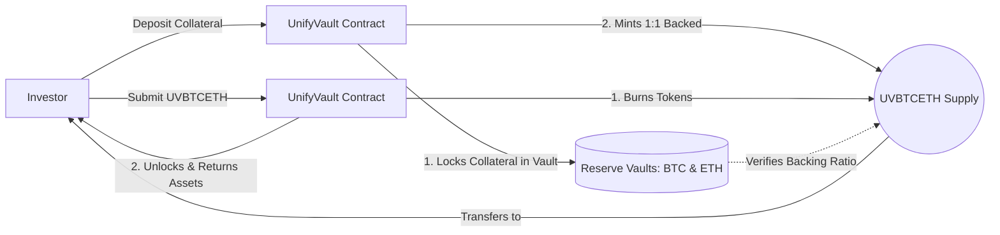
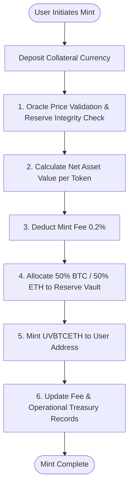
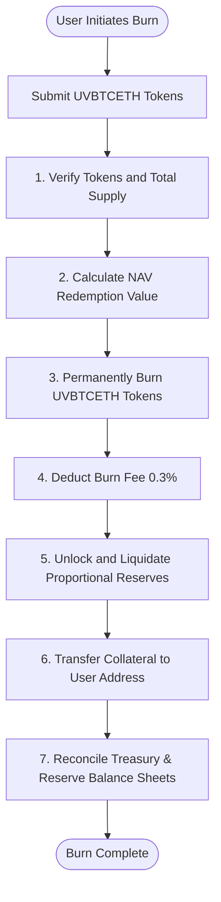
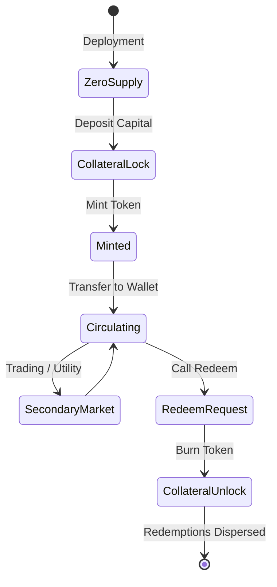

# UnifyVault Protocol Tokenomics

## Economic Design and Capital Lifecycle Specification

**Version 1.0** — _July 2026_

---

## 1. Introduction

Traditional decentralized finance (DeFi) is largely dominated by fixed-supply utility or governance tokens. These tokens are highly susceptible to speculative volatility, dilution, and liquidity manipulation due to their lack of direct asset backing.

**UnifyVault** introduces a protocol-based tokenomics model built around a **Dynamic Supply Mechanism**. Under this architecture, the token supply is directly tied to the total value of assets held in reserve. UnifyVault index tokens represent fractional ownership of the underlying assets.

Unlike fixed-supply cryptocurrencies, UnifyVault tokens are minted only when collateral is locked in our smart contracts and are permanently destroyed when that collateral is redeemed. This ensures that every unit of circulating supply is backed 1-to-1 by digital assets, shielding investors from inflation and index dilution.

---

## 2. Token Information Specification

The mechanical parameters of the primary UnifyVault index token are defined below:

| Parameter                  | Specification                | Details                                            |
| :------------------------- | :--------------------------- | :------------------------------------------------- |
| **Protocol Name**          | UnifyVault                   | Decentralized Index Infrastructure Protocol        |
| **Token Name**             | UnifyVault BTC-ETH Index     | Flagship Portfolio Asset                           |
| **Token Symbol**           | `UVBTCETH`                   | Primary Native Index Ticker                        |
| **Blockchain**             | Base                         | Ethereum Layer-2 Rollup (Coinbase Ecosystem)       |
| **Token Standard**         | ERC-20                       | Globally Interoperable Smart Contract Standard     |
| **Decimals**               | 18                           | Standard subdivision for fractional ownership      |
| **Supply Model**           | Dynamic (Elastic)            | Controlled by creation and redemption transactions |
| **Mint Mechanism**         | On-Demand Collateral Lock    | New tokens minted upon verified reserve deposit    |
| **Burn Mechanism**         | On-Demand Collateral Release | Tokens permanently destroyed upon asset redemption |
| **Custody Model**          | Non-Custodial Vault          | Assets secured directly by smart contracts         |
| **Price Validation**       | Decentralized Oracles        | aggregate feeds sourced from Chainlink Network     |
| **Primary Reserve Target** | 50% BTC / 50% ETH            | Static equal weighting of market-cap leaders       |

---

## 3. The Dynamic Supply Model

The circulating supply of `UVBTCETH` is elastic, expanding and contracting in response to investor deposits and withdrawals.



### 3.1. Supply Dynamics

- **Cold Start ($S_0 = 0$):** At deployment, zero `UVBTCETH` tokens exist. The token supply remains at zero until the first deposit transaction is validated.
- **Expansion (Minting):** When an investor deposits collateral assets (e.g., USDC), the protocol swaps the deposit into the index assets (50% BTC, 50% ETH), locks them in the custody vault, and mints new `UVBTCETH` tokens to the investor's address.
- **Contraction (Burning):** When an investor redeems their `UVBTCETH` tokens, the protocol burns the tokens, unlocks the corresponding BTC and ETH from the vault, and transfers the proceeds back to the investor.
- **Arbitrage Alignment:** Secondary market prices of `UVBTCETH` are kept aligned with the underlying asset value by arbitrageurs. If the token price on secondary markets drops below its net asset value, arbitrageurs can purchase the discounted tokens, redeem them from the protocol for the underlying assets, and capture the difference. This process reduces token supply and stabilizes the price.

---

## 4. The Mint Process

The minting process converts capital into index exposure through a series of automated smart contract checks.



### 4.1. Step-by-Step Mint Lifecycle

1.  **Deposit Initiation:** The user specifies their investment amount in a supported collateral currency (e.g., USDC) and approves the UnifyVault controller contract.
2.  **Oracle and Reserve Validation:** The controller contract queries the oracle layer to verify asset pricing and runs validation checks to ensure the custody vault's reserves match the current token supply.
3.  **NAV Calculation:** The contract calculates the token's current Net Asset Value (NAV) using price feeds from Chainlink oracles.
4.  **Fee Deduction:** The protocol deducts a flat mint fee (initially set to $0.2\%$). These funds are routed to the Fee Treasury.
5.  **Asset Allocation & Swap Execution:** The remaining deposit value is split equally (50/50) and routed through decentralized exchanges on Base to purchase BTC and ETH. The purchased assets are then locked in the custody vault.
6.  **Token Issuance:** The controller mints the corresponding amount of `UVBTCETH` tokens and transfers them to the user's wallet.

---

## 5. The Burn Process

Redemptions release underlying vault assets to the user while maintaining the protocol's backing requirements.



### 5.1. Step-by-Step Burn Lifecycle

1.  **Redemption Request:** The user submits a transaction to burn their `UVBTCETH` tokens.
2.  **Solvency & Supply Auditing:** The controller validates the user's balance and verifies the protocol's total supply.
3.  **NAV Calculation:** The contract calculates the redemption value based on real-time asset pricing.
4.  **Token Burning:** The contract permanently destroys the submitted `UVBTCETH` tokens, reducing the circulating supply.
5.  **Fee Deduction:** A flat burn fee (initially set to $0.3\%$) is deducted and routed to the Fee Treasury.
6.  **Asset Liquidation & Transfer:** The protocol releases the corresponding BTC and ETH from the vault, converts them back to the user's target collateral currency, and transfers the funds to the user's wallet.

---

## 6. Treasury Design

To ensure financial stability and security, UnifyVault splits its funds into four separate treasuries:

```
                            ┌────────────────────────┐
                            │   UnifyVault Treasury  │
                            └───────────┬────────────┘
                                        │
             ┌──────────────────┬───────┴──────────┬──────────────────┐
             ▼                  ▼                  ▼                  ▼
     [Reserve Treasury] [Fee Treasury]  [Operational Treasury] [Protocol Treasury]
     • 100% Index assets• Collects mint/  • Funds network costs  • Emergency backup
     • Locked collateral  burn fees       • Auditing expenses    • Long-term safety
```

### 6.1. Treasury Classification

1.  **Reserve Treasury (The Vaults):** Contains 100% of the underlying index collateral (Wrapped BTC and Native/Staked ETH). These assets are held in non-custodial smart contracts and cannot be accessed for operational costs or marketing.
2.  **Fee Treasury:** Collects fees generated from minting and burning. These funds are publicly tracked on-chain.
3.  **Operational Treasury:** Receives allocations from the Fee Treasury to cover ongoing operational costs, including network gas fees, server hosting, and smart contract maintenance.
4.  **Protocol Treasury:** Serves as a financial buffer to protect the protocol against extreme market volatility, contract integration errors, or oracle failures.

---

## 7. The Fee Model

UnifyVault is funded solely by clear, on-chain fees. The protocol does not generate revenue from hidden spreads or proprietary trading.

### 7.1. Fee Structure

- **Mint Fee:** Set to $0.20\%$ of the deposited capital.
- **Burn Fee:** Set to $0.30\%$ of the redeemed asset value.
- **Management Fee:** Set to $0.00\%$ at launch.

```
                           Capital Inflow / Outflow
                                      │
           ┌──────────────────────────┴──────────────────────────┐
           ▼                                                     ▼
     Mint Fee (0.20%)                                      Burn Fee (0.30%)
           │                                                     │
           └──────────────────────────┬──────────────────────────┘
                                      ▼
                                Fee Treasury
                                      │
                     ┌────────────────┴────────────────┐
                     ▼                                 ▼
         Operational Treasury (70%)        Protocol Reserve Treasury (30%)
```

### 7.2. Fee Governance and Parameters

Fee parameters are managed by the protocol's multisig and will eventually transition to community DAO governance. Smart contract limits prevent the mint and burn fees from exceeding a maximum cap of $1.00\%$, protecting users from unexpected fee hikes.

---

## 8. Net Asset Value (NAV) Model

The Net Asset Value (NAV) model calculates the value of the index token based on the pricing of its underlying assets, ensuring the token is priced fairly.

### 8.1. Mathematical Formulations

Let $S_t$ be the total circulating supply of `UVBTCETH` at block $t$.
Let $A_{\text{BTC},t}$ and $A_{\text{ETH},t}$ be the amount of BTC and ETH held in the vault at block $t$.
Let $P_{\text{BTC},t}$ and $P_{\text{ETH},t}$ be the USD prices of BTC and ETH from Chainlink oracles at block $t$.

The Net Asset Value of the vault ($\text{NAV}_{\text{Total},t}$) is:

$$\text{NAV}_{\text{Total},t} = (A_{\text{BTC},t} \times P_{\text{BTC},t}) + (A_{\text{ETH},t} \times P_{\text{ETH},t})$$

The fair value of a single `UVBTCETH` token ($P_{\text{Token},t}$) is:

$$P_{\text{Token},t} = \frac{\text{NAV}_{\text{Total},t}}{S_t}$$

For deposits of value $C$ subject to mint fee $F_{\text{mint}}$, the net deposit value $D$ is:

$$D = C \times (1 - F_{\text{mint}})$$

The quantity of index tokens minted ($M$) is:

$$M = \frac{D}{P_{\text{Token},t}}$$

---

### 8.2. Worked Examples

#### Example A: Protocol Cold Start ($S_0 = 0$)

The protocol initializes with a base exchange rate of $\$1.00$ per `UVBTCETH`.

- **Deposit:** A user deposits $\$50,000.00$ USDC.
- **Mint Fee:** $0.20\% \rightarrow \$100.00$ USDC routed to the Fee Treasury.
- **Net Deposit ($D$):** $\$49,900.00$ USDC.
- **Tokens Minted ($M$):** $\frac{\$49,900.00}{\$1.00} = 49,900.00\text{ UVBTCETH}$.
- **Asset Purchases:** The protocol swaps $\$24,950.00$ into BTC and $\$24,950.00$ into ETH.
  - Oracle Prices: $P_{\text{BTC}} = \$50,000.00$, $P_{\text{ETH}} = \$2,500.00$.
  - BTC Acquired: $\frac{\$24,950.00}{\$50,000.00} = 0.499\text{ BTC}$.
  - ETH Acquired: $\frac{\$24,950.00}{\$2,500.00} = 9.98\text{ ETH}$.
- **Post-Mint Verification:**
  $$\text{NAV}_{\text{Total}} = (0.499 \times 50,000) + (9.98 \times 2,500) = \$49,900.00$$
  $$P_{\text{Token}} = \frac{\$49,900.00}{49,900.00} = \$1.00\text{ per UVBTCETH}$$

---

#### Example B: Asset Price Appreciation and Subsequent Deposit

The prices of BTC and ETH appreciate by 20%:

- **New Prices:** $P_{\text{BTC}} = \$60,000.00$, $P_{\text{ETH}} = \$3,000.00$.
- **Vault Assets:** $0.499\text{ BTC}$ and $9.98\text{ ETH}$.
- **Circulating Supply:** $49,900.00\text{ UVBTCETH}$.

$$\text{NAV}_{\text{Total}} = (0.499 \times 60,000) + (9.98 \times 3,000) = 29,940 + 29,940 = \$59,880.00$$

$$P_{\text{Token}} = \frac{\$59,880.00}{49,900.00} = \$1.20\text{ per UVBTCETH}$$

The token value increases from $\$1.00$ to $\$1.20$, matching the 20% growth of the underlying assets.

- **Subsequent Deposit:** A second user deposits $\$10,000.00$ USDC.
- **Mint Fee:** $0.20\% \rightarrow \$20.00$ USDC.
- **Net Deposit ($D$):** $\$9,980.00$ USDC.
- **Tokens Minted ($M$):** $\frac{\$9,980.00}{\$1.20} = 8,316.6667\text{ UVBTCETH}$.
- **Asset Purchases:** The protocol allocates $\$4,990.00$ to BTC and $\$4,990.00$ to ETH.
  - BTC Acquired: $\frac{\$4,990.00}{\$60,000.00} = 0.083167\text{ BTC}$.
  - ETH Acquired: $\frac{\$4,990.00}{\$3,000.00} = 1.663333\text{ ETH}$.
- **Updated Vault Balance:** $0.582167\text{ BTC}$ and $11.643333\text{ ETH}$.
- **Updated Circulating Supply:** $58,216.6667\text{ UVBTCETH}$.
- **Updated NAV Re-calculation:**
  $$\text{NAV}_{\text{Total}} = (0.582167 \times 60,000) + (11.643333 \times 3,000) = 34,930 + 34,930 = \$69,860.00$$
  $$P_{\text{Token}} = \frac{\$69,860.00}{58,216.6667} = \$1.20\text{ per UVBTCETH}$$

The Net Asset Value remains $\$1.20$, demonstrating that mint events do not dilute existing holders.

---

## 9. Reserve Model & Proof of Reserve (PoR)

UnifyVault uses an on-chain **Proof of Reserve** system to verify that the protocol's liabilities are fully backed by physical assets.

- **On-Chain Oracle Validation:** Third-party price and balance feeds verify vault balances and broadcast this data to the protocol's smart contracts.
- **Real-Time Backing Checks:** The protocol compares the value of assets in its vaults against the circulating token supply. If the reserve ratio falls below 100%, minting is paused to protect user capital.
- **Public Verification:** All vault addresses and transaction data are public, allowing anyone to verify the protocol's backing status on-chain.

---

## 10. Token Lifecycle

The lifecycle of the `UVBTCETH` token spans from initial creation to permanent burn:



1.  **Mint:** Tokens are created and transferred to users after collateral is deposited and validated.
2.  **Hold & Transfer:** Users can hold tokens in self-custody wallets or transfer them across EVM-compatible networks.
3.  **Redeem & Burn:** Users can submit tokens back to the smart contracts, which burn the tokens and release the underlying collateral.

---

## 11. Sustainable Revenue Model

UnifyVault generates revenue solely from explicit, transaction-based fees, ensuring long-term sustainability without relying on speculative strategies.

- **Mint Fees:** A flat $0.20\%$ fee is collected during token creation.
- **Burn Fees:** A flat $0.30\%$ fee is collected during token redemption.
- **Treasury Sustainability:** Collected fees are routed to the Fee Treasury to fund development, gas costs, and regular smart contract audits.

---

## 12. Governance Controls

Protocol operations are secured by governance controls that transition toward decentralization over time.

- **Emergency Controls:** A multi-signature contract can pause minting and burning in the event of smart contract exploits or extreme market events.
- **Fee Adjustments:** Governance can adjust mint and burn fees within a hardcoded cap of $1.00\%$ to maintain protocol sustainability.
- **Roadmap Evolution:** Governance powers will transition from the core team's multi-signature wallet to community DAO voting as the protocol matures.

---

## 13. Risk Factors

Investors should evaluate the following risk factors before interacting with the protocol:

- **Market Volatility:** The value of `UVBTCETH` is tied directly to the prices of Bitcoin and Ethereum. Significant market drops will reduce the value of the index token.
- **Slippage Risk:** Large minting or burning transactions can cause price slippage during asset swaps on decentralized exchanges.
- **Oracle Dependency:** The protocol relies on third-party price feeds. Oracle failures or feed corruption can disrupt token pricing and mint/burn processes.
- **Regulatory Risk:** Changes in regulatory policies regarding decentralized finance and digital assets may impact protocol operations.

---

## 14. Future Expansion Paths

The UnifyVault architecture is designed to support a wide range of future index products as market demand evolves:

- **UVTOP10:** A dynamically rebalanced index containing the top 10 digital assets by market cap, helping investors capture broader market growth.
- **UVAI:** A decentralized infrastructure index covering decentralized AI networks, cloud compute, and storage tokens.
- **UVGOLD:** A stable index tracking physical gold tokens combined with BTC and ETH to create an inflation-hedging digital portfolio.
- **UVRWA:** An index tracking tokenized real-world assets, such as tokenized US Treasury bills and commercial paper, providing low-volatility yield options.

> [!NOTE]
> These index products represent future possibilities under consideration and do not constitute binding development commitments or current product offerings.
