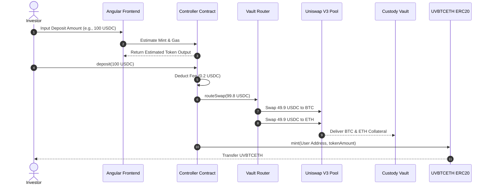
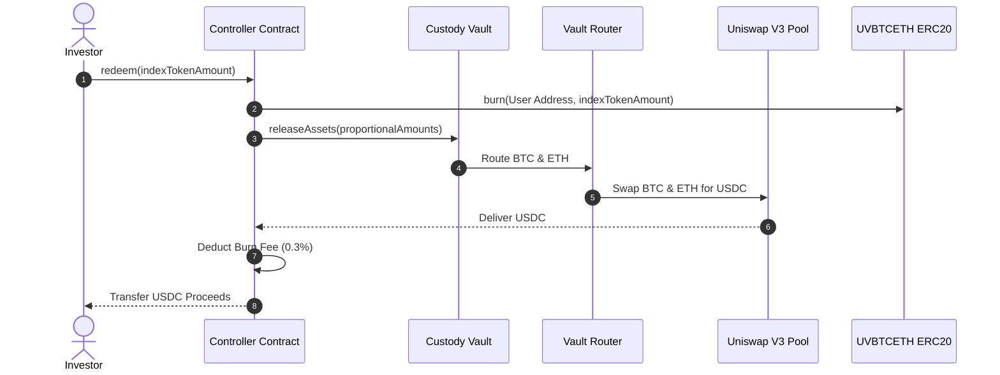
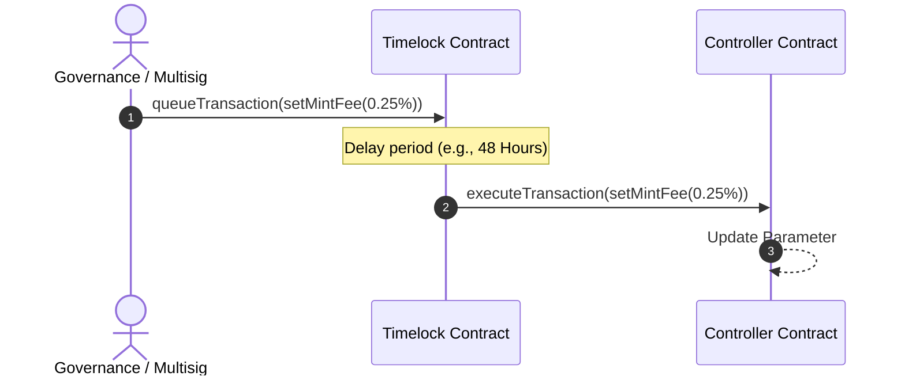
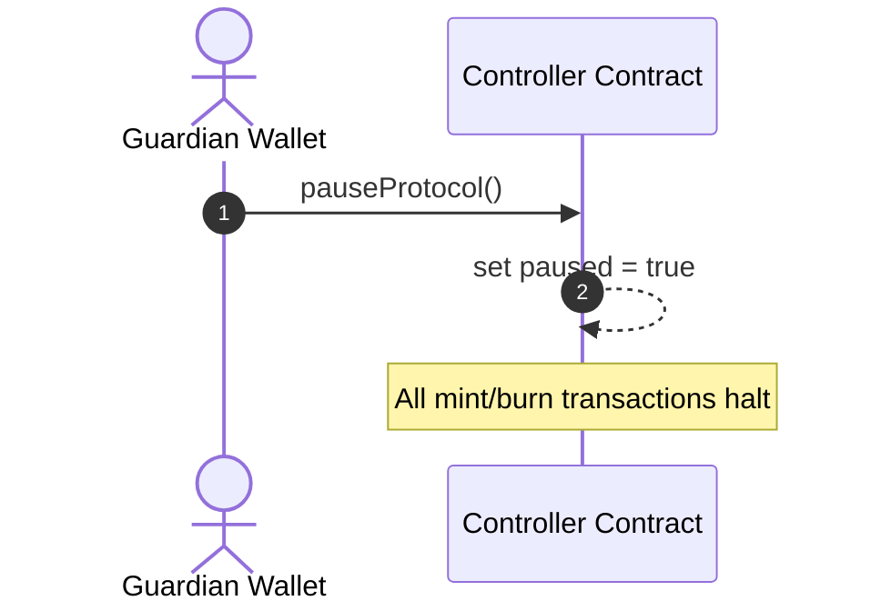

# UnifyVault Protocol Architecture Specification

## System Architecture and Engineering Blueprint

**Version 1.0** — _July 2026_

---

## 1. High-Level Architecture

UnifyVault is structured as a multi-layered, modular Web3 application deployed on the **Base** Layer-2 blockchain. The design prioritizes non-custodial asset management, real-time cryptographic auditability, and gas optimization.

```
+-----------------------------------------------------------------+
|                         User Layer                              |
|                Web App / Mobile App / Partner APIs              |
+-------------------------------┬---------------------------------+
                                │
                                ▼
+-----------------------------------------------------------------+
|                       Frontend Gateway                          |
|         Angular UI / Wallet Integrations (Coinbase SDK)         |
+-------------------------------┬---------------------------------+
                                │
                                ▼
+-----------------------------------------------------------------+
|                        Backend Layer                            |
|        NestJS API / Redis Caching / BullMQ Transaction Workers  |
+-------------------┬───────────┴───────────┬─────────────────────+
                    │                       │
                    ▼                       ▼
+-----------------------+       +---------------------------------+
|   PostgreSQL Database |       |        Smart Contract Layer     |
|   Audits / State Sync |       |        UnifyVaultController.sol |
+-----------------------+       +-----------┬───────────┬─────────+
                                            │           │
                     ┌──────────────────────┘           └──────┐
                     ▼                                         ▼
+---------------------------------------+       +---------------------------------+
|            Oracle Layer               |       |         Treasury Layer          |
|    OracleManager / Chainlink feeds    |       |   Reserve / Fee / Op / Protocol |
+---------------------------------------+       +---------------------------------+
```

### 1.1. Architectural Layers

1.  **User Interface Layer (Frontend):** A non-custodial single-page application (SPA) built with Angular. It connects to users' wallets (e.g., Coinbase Wallet, Metamask) via standard providers (Wagmi/Viem). It interacts directly with the smart contract layer for write actions (minting/burning) and with the backend API gateway for read-heavy operations (portfolio tracking, historical chart generation).
2.  **API & Worker Layer (Backend):** Built using NestJS. It acts as an indexed cache of on-chain state, provides API endpoints for external fintech integrations, and schedules asynchronous background tasks (like gas monitoring and oracle synchronization) using Redis and BullMQ.
3.  **Database Layer (Persistence):** PostgreSQL stores off-chain metrics, including audit logs, user sessions, index allocation charts, historical NAV tracking, and transaction status logs.
4.  **Smart Contract Layer (Execution):** Deployed on Base. It governs the lifecycle of the `UVBTCETH` index token, holds underlying reserves, performs swaps on decentralized exchanges, and applies fees.
5.  **Oracle Layer (Pricing):** Standardizes real-time price feeds for Bitcoin and Ethereum using Chainlink data feeds.
6.  **Treasury Layer (Custody):** A series of segregated vaults and multi-signature accounts that separate customer collateral from protocol operational revenue.

---

## 2. Component Architecture

```
                                    ┌──────────────────────┐
                                    │      Client App      │
                                    └──────────┬───────────┘
                                               │
                                               ▼
                                    ┌──────────────────────┐
                                    │     API Gateway      │
                                    └──────────┬───────────┘
                                               │
               ┌───────────────────────────────┼───────────────────────────────┐
               ▼                               ▼                               ▼
    ┌──────────────────────┐        ┌──────────────────────┐        ┌──────────────────────┐
    │     Auth Service     │        │    Index Service     │        │    Oracle Service    │
    └──────────────────────┘        └──────────────────────┘        └──────────────────────┘
               │                               │                               │
               └───────────────────────────────┼───────────────────────────────┘
                                               │
                                               ▼
                                    ┌──────────────────────┐
                                    │    Wallet Service    │
                                    └──────────┬───────────┘
                                               │
                                               ▼
                                    ┌──────────────────────┐
                                    │   Treasury Module    │
                                    └──────────┬───────────┘
                                               │
                                               ▼
                                    ┌──────────────────────┐
                                    │   Smart Contracts    │
                                    └──────────────────────┘
```

- **API Gateway:** Routes incoming client HTTP/WebSocket requests, applies rate limiting, and normalizes responses.
- **Authentication Service:** Manages user sessions using cryptographic signature verification (EIP-4361: Sign-In with Ethereum) instead of traditional usernames and passwords.
- **Wallet Service:** Manages administrative wallets and tracks system gas balances.
- **Index Service:** Monitors smart contract events to track total supply, mint/burn transactions, and Net Asset Value (NAV) histories.
- **Oracle Service:** Polls on-chain price feeds and caches asset valuations in Redis to reduce API latency.
- **Treasury Module:** Reconciles internal ledger balances with on-chain reserves to verify protocol solvency.
- **Monitoring and Alerting:** Collects system metrics using Prometheus and Grafana, sending automated alerts to administrators in the event of transaction failures, high gas costs, or price discrepancies.

---

## 3. Smart Contract Architecture

UnifyVault utilizes a modular smart contract system built with the OpenZeppelin upgradeable contracts framework.

```
                         ┌─────────────────────────────┐
                         │   Proxy Admin / Owner       │
                         └──────────────┬──────────────┘
                                        │
                                        ▼
                         ┌─────────────────────────────┐
                         │  UnifyVaultController (UUPS)│
                         └──────────────┬──────────────┘
                                        │
             ┌──────────────────────────┼──────────────────────────┐
             ▼                          ▼                          ▼
┌─────────────────────────┐┌─────────────────────────┐┌─────────────────────────┐
│     UVBTCETH ERC20      ││   VaultRouter.sol       ││   OracleManager.sol     │
│   Mint / Burn Logic   ││   Swap & Allocation     ││   Aggregator Interface  │
└─────────────────────────┘└────────────┬────────────┘└─────────────────────────┘
                                        │
                                        ▼
                           ┌─────────────────────────┐
                           │   CustodyVault.sol      │
                           │   Reserves: BTC/ETH     │
                           └─────────────────────────┘
```

### 3.1. Smart Contract Inventory

1.  **`UnifyVaultController.sol` (UUPS Proxy):** The entry point for creation and redemption transactions. It calculates Net Asset Value (NAV), handles minting fees, and controls the minting and burning of index tokens.
2.  **`UVBTCETH.sol` (ERC-20):** An ERC-20 token that represents shares in the index. It implements access controls that allow only the Controller contract to mint or burn tokens.
3.  **`VaultRouter.sol`:** Handles token swaps by routing deposits through decentralized exchanges (like Uniswap V3 or Aerodrome) on the Base network to purchase index assets.
4.  **`CustodyVault.sol`:** Holds the underlying index assets (such as Wrapped BTC and native/staked ETH) and restricts withdrawals to authorized routing contracts.
5.  **`OracleManager.sol`:** Interfaces with Chainlink price feeds, validates pricing latency, and returns asset prices to the Controller.

---

## 4. Backend Architecture

The backend is built with NestJS and utilizes a message-driven queue architecture to process blockchain transactions reliably.

```
 ┌──────────────┐      ┌──────────────┐      ┌──────────────┐      ┌──────────────┐
 │ NestJS REST  │ ──>  │ BullMQ Queue │ ──>  │ Queue Worker │ ──>  │ Base L2 Sync │
 │ API Gateway  │      │  (Redis)     │      │ (Blockchain) │      │  Processor   │
 └──────────────┘      └──────────────┘      └──────────────┘      └──────────────┘
```

### 4.1. Core System Processes

- **API Framework (NestJS):** Provides REST API endpoints for user dashboards, historical price charts, and administrative tasks.
- **Message Broker (Redis & BullMQ):** Handles transaction processing, task retries, and blockchain event logging.
- **Database (PostgreSQL):** Stores transaction histories, daily NAV snapshots, and audit logs.
- **Workers & Sync Engine:** Monitors the Base blockchain for smart contract events (e.g., `Mint`, `Burn`, `Transfer`) and updates the PostgreSQL database in real time.
- **Notification Engine:** Sends webhook notifications to external partners when transactions are completed.

---

## 5. Frontend Architecture

The frontend is built using Angular (V17+), utilizing a modular architecture to separate core application logic from UI components.

```
                           ┌─────────────────────────┐
                           │      Angular Core       │
                           │   (AppRouting / State)  │
                           └────────────┬────────────┘
                                        │
             ┌──────────────────────────┼──────────────────────────┐
             ▼                          ▼                          ▼
┌─────────────────────────┐┌─────────────────────────┐┌─────────────────────────┐
│     Wallet Module       ││   Dashboard Module      ││     History Module      │
│  Coinbase / WalletConn  ││  NAV / Balances / PoR  ││  Transactions / Audits │
└─────────────────────────┘└─────────────────────────┘└─────────────────────────┘
```

### 5.1. UI Modules

- **Wallet Module:** Handles wallet connection states using Coinbase SDK and WalletConnect.
- **Dashboard Module:** Displays portfolio value, index allocations, historical charts, and Proof of Reserve solvency ratios.
- **Transaction Module:** Guides users through the minting and burning processes, showing real-time gas estimates and transaction progress.
- **History Module:** Displays a history of the user's past deposits, withdrawals, and transfers.

---

## 6. Database Architecture

The PostgreSQL database schemas are designed to ensure transactional integrity and support audit requirements.

```
  ┌──────────────┐          ┌──────────────┐          ┌──────────────┐
  │    users     │ 1      * │   wallets    │ 1      * │ transactions │
  │ (User data)  ├─────────>│ (Addresses)  ├─────────>│ (On-chain tx)│
  └──────────────┘          └──────────────┘          └──────────────┘
                                                             │ *
                                                             │
                                                             │ 1
                                                      ┌──────▼───────┐
                                                      │   indexes    │
                                                      │ (Allocations)│
                                                      └──────────────┘
```

### 6.1. Table Schemas

#### 6.1.1. `users` Table

```sql
CREATE TABLE users (
    id UUID PRIMARY KEY DEFAULT gen_random_uuid(),
    email VARCHAR(255) UNIQUE NULL,
    created_at TIMESTAMP WITH TIME ZONE DEFAULT CURRENT_TIMESTAMP,
    updated_at TIMESTAMP WITH TIME ZONE DEFAULT CURRENT_TIMESTAMP
);
```

#### 6.1.2. `wallets` Table

```sql
CREATE TABLE wallets (
    id UUID PRIMARY KEY DEFAULT gen_random_uuid(),
    user_id UUID REFERENCES users(id) ON DELETE CASCADE,
    address VARCHAR(42) NOT NULL UNIQUE,
    chain_id INTEGER NOT NULL DEFAULT 8453, -- Base Mainnet
    created_at TIMESTAMP WITH TIME ZONE DEFAULT CURRENT_TIMESTAMP
);
CREATE INDEX idx_wallets_address ON wallets(address);
```

#### 6.1.3. `indexes` Table

```sql
CREATE TABLE indexes (
    id UUID PRIMARY KEY DEFAULT gen_random_uuid(),
    symbol VARCHAR(16) UNIQUE NOT NULL,
    name VARCHAR(128) NOT NULL,
    contract_address VARCHAR(42) UNIQUE NOT NULL,
    target_allocations JSONB NOT NULL, -- e.g., {"wBTC": 0.5, "wETH": 0.5}
    is_active BOOLEAN NOT NULL DEFAULT TRUE,
    created_at TIMESTAMP WITH TIME ZONE DEFAULT CURRENT_TIMESTAMP
);
```

#### 6.1.4. `transactions` Table

```sql
CREATE TABLE transactions (
    id UUID PRIMARY KEY DEFAULT gen_random_uuid(),
    wallet_id UUID NOT NULL REFERENCES wallets(id),
    index_id UUID NOT NULL REFERENCES indexes(id),
    tx_type VARCHAR(16) NOT NULL CHECK (tx_type IN ('MINT', 'BURN', 'TRANSFER')),
    amount NUMERIC(36, 18) NOT NULL,
    tx_hash VARCHAR(66) NOT NULL UNIQUE,
    block_number INTEGER NOT NULL,
    status VARCHAR(16) NOT NULL CHECK (status IN ('PENDING', 'SUCCESS', 'FAILED')),
    created_at TIMESTAMP WITH TIME ZONE DEFAULT CURRENT_TIMESTAMP
);
CREATE INDEX idx_transactions_hash ON transactions(tx_hash);
```

#### 6.1.5. `treasury_logs` Table

```sql
CREATE TABLE treasury_logs (
    id UUID PRIMARY KEY DEFAULT gen_random_uuid(),
    treasury_type VARCHAR(16) NOT NULL CHECK (treasury_type IN ('RESERVE', 'PROTOCOL', 'OPERATIONAL', 'FEE')),
    asset_address VARCHAR(42) NOT NULL,
    balance_change NUMERIC(36, 18) NOT NULL,
    tx_hash VARCHAR(66) NOT NULL,
    reason VARCHAR(255) NOT NULL,
    created_at TIMESTAMP WITH TIME ZONE DEFAULT CURRENT_TIMESTAMP
);
```

#### 6.1.6. `nav_snapshots` Table

```sql
CREATE TABLE nav_snapshots (
    id UUID PRIMARY KEY DEFAULT gen_random_uuid(),
    index_id UUID NOT NULL REFERENCES indexes(id),
    total_nav NUMERIC(36, 18) NOT NULL,
    circulating_supply NUMERIC(36, 18) NOT NULL,
    price_per_token NUMERIC(36, 18) NOT NULL,
    snapshot_time TIMESTAMP WITH TIME ZONE NOT NULL
);
CREATE INDEX idx_nav_snapshot_time ON nav_snapshots(snapshot_time);
```

#### 6.1.7. `oracle_prices` Table

```sql
CREATE TABLE oracle_prices (
    id UUID PRIMARY KEY DEFAULT gen_random_uuid(),
    asset_symbol VARCHAR(8) NOT NULL,
    price_usd NUMERIC(36, 18) NOT NULL,
    source VARCHAR(64) NOT NULL,
    timestamp TIMESTAMP WITH TIME ZONE NOT NULL
);
CREATE INDEX idx_oracle_prices_lookup ON oracle_prices(asset_symbol, timestamp DESC);
```

---

## 7. Oracle Architecture

The `OracleManager` contract acts as an interface to on-chain price feeds.

```
  [Chainlink Aggregators] ──> [OracleManager Contract] ──> [UnifyVaultController]
                                      │
                         Validation & Fallback checks:
                         • Latency (Heartbeat limit)
                         • Zero Price protection
                         • Fallback Oracles
```

- **Constituent Price Feeds:** Sourced from Chainlink on Base (BTC/USD and ETH/USD).
- **Real-time Validation:** Price feeds verify that prices are greater than zero and that updates occur within Chainlink's heartbeat limit (e.g., 20 minutes) to prevent stale data.
- **Fallback Oracles:** If primary price feeds become stale or fail, the contract can fall back to alternative sources (such as Redstone) to ensure continuous pricing.
- **Circuit Breakers:** If both primary and fallback oracles fail, the controller pauses minting and burning transactions to protect user funds.

---

## 8. Treasury Architecture

The protocol uses segregated smart contracts to manage reserves and fees:

```
               USER DEPOSIT
                    │
                    ▼
       ┌────────────────────────┐
       │   UnifyVault Core      │
       └────────────┬───────────┘
                    │
         ┌──────────┴──────────┐
         ▼                     ▼
┌─────────────────┐   ┌─────────────────┐
│ Custody Vault   │   │  Fee Treasury   │
│ (100% Reserves) │   │ (Mint/Burn Fees)│
└─────────────────┘   └────────┬────────┘
                               │
                    ┌──────────┴──────────┐
                    ▼                     ▼
         ┌─────────────────┐   ┌─────────────────┐
         │ Operational     │   │ Protocol        │
         │ Treasury (70%)  │   │ Treasury (30%)  │
         └─────────────────┘   └─────────────────┘
```

- **Custody Vault (Reserve Treasury):** Holds the underlying assets (BTC and ETH) that back the `UVBTCETH` index. It interacts only with the controller contract for deposits and redemptions.
- **Fee Treasury:** Collects fees generated from minting ($0.2\%$) and burning ($0.3\%$).
- **Operational Treasury:** Receives 70% of collected fees to cover ongoing system expenses like gas costs and hosting.
- **Protocol Treasury:** Receives 30% of collected fees to maintain emergency reserves.

---

## 9. Protocol Flow Diagrams

### 9.1. Mint Lifecycle



### 9.2. Burn Lifecycle



### 9.3. Governance Update Flow



### 9.4. Emergency Pause Flow



---

## 10. Security Architecture

UnifyVault implements a multi-tiered security model to protect user assets and protocol parameters.

```
                         ┌─────────────────────────────┐
                         │      Emergency Guardian     │
                         └──────────────┬──────────────┘
                                        │ (Instant Pause)
                                        ▼
                         ┌─────────────────────────────┐
                         │   Controller (PausedState)  │
                         └──────────────▲──────────────┘
                                        │ (48-Hr Timelock Execute)
                         ┌──────────────┴──────────────┐
                         │      Protocol Governance    │
                         └─────────────────────────────┘
```

- **Emergency Pause:** The system includes a circuit breaker that allows authorized guardian addresses to halt minting and burning transactions immediately in the event of an exploit.
- **Role-Based Access Control:** Protocol functions are protected by role-based permissions (`AccessControl.sol`), separating operational tasks (like rebalancing) from governance tasks (like modifying fees).
- **Time-Locked Actions:** Critical parameter updates and upgrades are subject to a minimum 48-hour timelock, giving users notice before changes take effect.
- **Multi-Signature Administration:** All administrative roles are assigned to multi-signature wallets to prevent single-point-of-failure compromises.

---

## 11. Monitoring Architecture

A monitoring stack collects metrics across all parts of the protocol to ensure reliable operation.

- **On-Chain Health Checks:** Monitors contract balances, tracking discrepancies between circulating token supply and underlying vault reserves.
- **Oracle Performance:** Tracks price feeds to verify update frequency and flag stale data before it is used for calculations.
- **Backend & Infrastructure:** Standard tools monitor API latency, database connection health, and worker queue backlogs.
- **Gas Monitoring:** Tracks gas usage on the Base network to optimize transaction routing and fee models.
- **Alerting System:** Automated systems send alerts to developers and operations teams via PagerDuty or Slack in the event of system failures or anomalies.

---

## 12. Deployment Architecture

Deployments are managed using GitHub Actions to maintain consistent environments across development, staging, and production.

```
[GitHub Repo] ──> [GitHub Actions CI] ──> [Build & Test Runner]
                                                   │
                                      ┌────────────┴────────────┐
                                      ▼                         ▼
                              [Base Contract Deploy]     [Docker App Build]
                              (Hardhat / Foundry)        (AWS / GCP Deploy)
```

- **Smart Contracts:** Deployed using Foundry. Automated scripts run validation checks to ensure contracts are initialized correctly.
- **Web Applications:** Containerized using Docker. Code is hosted on secure web hosting platforms (like AWS or GCP) with automated SSL certificate management.
- **Continuous Integration (CI):** GitHub Actions run test suites, check linter rules, and run static code analyzers on every code change.
- **Secret Management:** Sensitive credentials, database keys, and private keys are stored in secure key management vaults (e.g., AWS Secrets Manager) and are never checked into git repositories.

---

## 13. Scalability

UnifyVault's architecture is designed to support future expansion and integration:

- **Multi-Index Integration:** The controller contract can support additional index assets by registering new indexes in the index registry without modifying the core code.
- **API Integrations:** Provides REST APIs to allow fintech platforms and neo-banks to build custom investment services on top of the protocol.
- **Mobile Clients:** The backend APIs can support native mobile clients (iOS and Android) using account abstraction and social logins.

---

## 14. Future Expansion Horizons

The system is designed to allow new index products to be registered without requiring updates to the core smart contract code.

```
                          ┌────────────────────────┐
                          │   Controller Registry  │
                          └───────────┬────────────┘
                                      │
             ┌────────────────────────┼────────────────────────┐
             ▼                        ▼                        ▼
       ┌───────────┐            ┌───────────┐            ┌───────────┐
       │ UVBTCETH  │            │  UVTOP10  │            │  UVGOLD   │
       │ (Active)  │            │ (Pending) │            │ (Pending) │
       └───────────┘            └───────────┘            └───────────┘
```

- **Dynamic Basket Support:** New index configurations (e.g., `UVTOP10`, `UVGOLD`, `UVAI`, `UVRWA`) can be registered in the controller by defining their weights and target assets, leveraging the existing routing and custody code.
- **Interoperable Custody:** The custody vault code supports wrapped versions of alternative assets (like PAXG or stablecoins), allowing the protocol to expand into asset classes beyond BTC and ETH.
