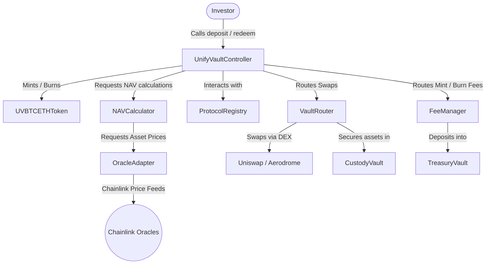
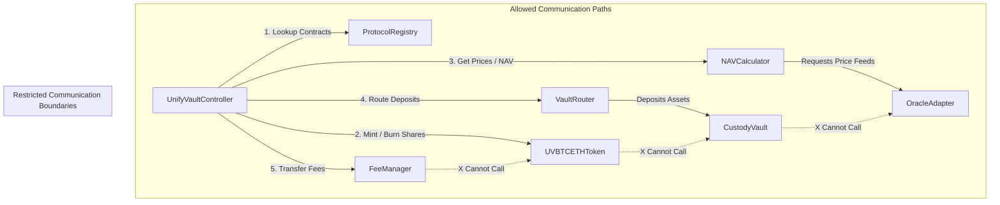
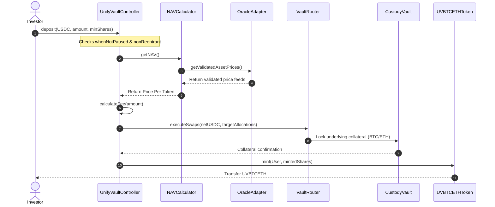
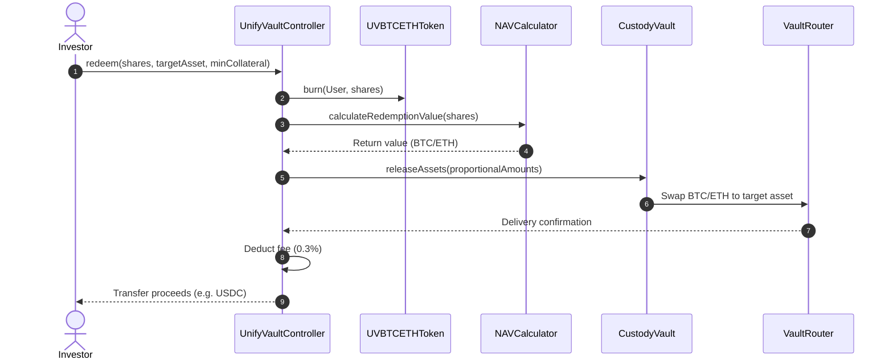

# UnifyVault Smart Contract Engineering Specification

## Technical Specification and Smart Contract Blueprint

**Version 1.0** — _July 2026_

---

## 1. Smart Contract Overview

The UnifyVault protocol manages decentralized asset baskets using a modular smart contract architecture. By separating token logic, portfolio execution, oracle indexing, fee routing, and administrative access controls, the system reduces attack vectors and supports future upgrades.



### 1.1. Core Communication Architecture

- **Controller Coordination:** `UnifyVaultController` is the central coordination contract. It holds system configuration parameters and manages mint and burn workflows.
- **Registry Pattern:** Core contracts verify the addresses of their peer contracts through a central `ProtocolRegistry`. This avoids hardcoding contract dependencies.
- **Isolation of Custody:** The `CustodyVault` does not contain logic for token swaps, oracle validation, or fee calculations. It functions strictly as an asset vault, releasing assets only when authorized by the `UnifyVaultController`.

---

## 2. Contract List & System Responsibilities

| Contract / Interface       | Type                 | Responsibility                                                                                                                     |
| :------------------------- | :------------------- | :--------------------------------------------------------------------------------------------------------------------------------- |
| **`UnifyVaultController`** | UUPS Proxy           | The primary user entry point. Handles deposit and redemption routing, calls NAV calculations, and coordinates mint/burn execution. |
| **`UVBTCETHToken`**        | ERC-20 (Upgradeable) | The index token. Implements standard ERC-20 transfer logic. Restricts minting and burning roles to the Controller.                 |
| **`CustodyVault`**         | UUPS Proxy           | Custodies the underlying index collateral (wBTC, wETH). Restricts incoming and outgoing asset transfers to authorized controllers. |
| **`ProtocolRegistry`**     | Immutable            | Stores and returns the current addresses of core protocol contracts. Provides a single registry source for address lookups.        |
| **`NAVCalculator`**        | Stateless Library    | Calculates the total net asset value of custody vaults and determines the exchange rate per index token.                           |
| **`FeeManager`**           | Upgradeable          | Calculates and routes fees generated from minting and burning.                                                                     |
| **`OracleAdapter`**        | UUPS Proxy           | Interfaces with Chainlink price feeds, validates pricing latency, and returns asset prices to the Controller.                      |
| **`AccessController`**     | Upgradeable          | Manages role-based access control (RBAC) permissions across all protocol contracts.                                                |

---

## 3. Contract Dependencies & Inter-Communications

The diagram below defines the allowed transaction paths and execution boundaries between protocol contracts.



### 3.1. Integration Rules

- **Token Isolation:** The `UVBTCETHToken` contract cannot interact with `CustodyVault` or `OracleAdapter`. It acts strictly as an asset-backed share tracker.
- **Stateless Operations:** `NAVCalculator` functions as a stateless utility. It reads values from the `OracleAdapter` and `CustodyVault` but does not alter the storage state of any contract.

---

## 4. Storage Layout and State Variables

To ensure compatibility with UUPS upgrade proxies, all upgradeable contracts pack their variables into standardized storage blocks and include storage gaps to prevent collisions during upgrades.

### 4.1. `UnifyVaultController` Storage

```solidity
struct IndexConfig {
  bool isActive;
  uint24 mintFeeBps; // e.g., 20 = 0.20%
  uint24 burnFeeBps; // e.g., 30 = 0.30%
  uint24 maxFeeBps; // Hard cap (e.g., 100 = 1.00%)
  address registry; // ProtocolRegistry address
}
```

| Variable Name          | Type          | Storage Slot | Purpose                                                              |
| :--------------------- | :------------ | :----------- | :------------------------------------------------------------------- |
| **`indexConfig`**      | `IndexConfig` | Slot 0       | Holds active configurations, fee parameters, and registry addresses. |
| **`paused`**           | `bool`        | Slot 1       | Circuit breaker flag that pauses minting and burning transactions.   |
| **`reentrancyStatus`** | `uint256`     | Slot 2       | Reentrancy guard status flag (e.g., 1 = active, 2 = inactive).       |
| **`__gap`**            | `uint256[47]` | Slots 3-49   | Reserve storage space to prevent collisions in future upgrades.      |

### 4.2. `OracleAdapter` Storage

```solidity
struct OracleFeedConfig {
  address feedAddress; // Chainlink aggregator address
  uint32 heartbeat; // Max price age (e.g., 86400 seconds)
  bool isFallbackActive; // Fallback oracle status flag
  address fallbackFeed; // Fallback oracle feed address
}
```

| Variable Name | Type                                   | Storage Slot | Purpose                                                            |
| :------------ | :------------------------------------- | :----------- | :----------------------------------------------------------------- |
| **`feeds`**   | `mapping(address => OracleFeedConfig)` | Slot 0       | Maps asset addresses (wBTC/wETH) to pricing configuration options. |
| **`__gap`**   | `uint256[49]`                          | Slots 1-50   | Reserve storage space for future updates.                          |

---

## 5. Events

The protocol emits events to support off-chain indexing, analytics interfaces, and user transaction tracking.

```solidity
// Minting Events
event MintExecuted(
  address indexed investor,
  uint256 collateralDeposited,
  uint256 indexTokensMinted,
  uint256 mintFeeCollected
);

// Burning Events
event BurnExecuted(
  address indexed investor,
  uint256 indexTokensBurned,
  uint256 collateralReturned,
  uint256 burnFeeCollected
);

// Administrative Events
event ProtocolPaused(address indexed actor, string reason);
event ProtocolUnpaused(address indexed actor);
event GovernanceConfigUpdated(bytes32 indexed configKey, address indexed newTarget);
event OraclePriceSynchronized(address indexed asset, uint256 price, uint256 timestamp);
```

---

## 6. Custom Errors

UnifyVault uses custom errors to improve gas efficiency and provide detailed feedback in the event of transaction failures.

```solidity
// UnifyVaultController Errors
error ProtocolStatePaused();
error SlippageLimitExceeded(uint256 expected, uint256 actual);
error InvalidCollateralToken(address token);
error MathCalculationOverflow();

// CustodyVault Errors
error UnauthorizedControllerCaller(address caller);
error InsufficientReserves(address asset, uint256 requested, uint256 actual);
error TransferExecutionFailed(address asset, address recipient, uint256 amount);

// OracleAdapter Errors
error OraclePriceStale(address asset, uint256 priceAge, uint256 limit);
error OraclePriceNegative(address asset, int256 price);
error HeartbeatIntervalOutofBounds();
```

---

## 7. Modifiers

Access modifiers secure contract entry points and enforce execution states:

- **`whenNotPaused`:** Reverts with `ProtocolStatePaused()` if the circuit breaker pause flag is set to true.
- **`nonReentrant`:** Reentrancy guard that prevents nested calls to transaction entry points.
- **`onlyRegistryRole(bytes32 role)`:** Restricts access to callers registered under a specified role in the `ProtocolRegistry` contract.
- **`onlyMultisig`:** Restricts access to the protocol's multi-signature admin wallet.

---

## 8. Public & External Functions

### 8.1. `UnifyVaultController.sol` Interfaces

#### `deposit`

```solidity
function deposit(
    address collateralAsset,
    uint256 depositAmount,
    uint256 minTokensToMint
) external payable whenNotPaused nonReentrant returns (uint256 tokensMinted)
```

- **Purpose:** Accepts user deposits, calculates Net Asset Value (NAV), executes swaps, and mints corresponding index tokens.
- **Parameters:**
  - `collateralAsset`: The address of the incoming asset (e.g., USDC).
  - `depositAmount`: The quantity of the asset being deposited.
  - `minTokensToMint`: Minimum tokens expected from the mint, serving as a slippage guard.
- **Returns:** `tokensMinted` (the quantity of index tokens created and sent to the user).
- **Events Emitted:** `MintExecuted`, `Transfer`.
- **Exceptions:** `ProtocolStatePaused`, `SlippageLimitExceeded`, `InvalidCollateralToken`.

#### `redeem`

```solidity
function redeem(
    uint256 indexTokenAmount,
    address targetAsset,
    uint256 minCollateralToReceive
) external whenNotPaused nonReentrant returns (uint256 collateralReturned)
```

- **Purpose:** Redeems user index tokens, burns them, unlocks the corresponding vault collateral, and routes the proceeds to the user.
- **Parameters:**
  - `indexTokenAmount`: The quantity of `UVBTCETH` tokens to redeem.
  - `targetAsset`: The address of the asset to receive (e.g., USDC).
  - `minCollateralToReceive`: Minimum assets expected from the redemption, serving as a slippage guard.
- **Returns:** `collateralReturned` (the quantity of target assets transferred back to the user).
- **Events Emitted:** `BurnExecuted`, `Transfer`.
- **Exceptions:** `ProtocolStatePaused`, `SlippageLimitExceeded`, `InsufficientReserves`.

---

## 9. Internal Helper Functions

Internal helper functions optimize code reuse and reduce contract deployment sizes:

- **`_calculateFee(uint256 amount, uint24 feeBps)`:** Internal calculation helper. Calculates fees using `SafeCast` configurations to prevent math errors.
- **`_rebalanceIndex(address asset, uint256 targetWeight)`:** Internal rebalancing script. Triggers asset trades when portfolio drift exceeds threshold limits.

---

## 10. Access Control & Permission Matrix

Permissions are managed by `AccessController.sol` and enforced using standard role assignments:

| Role                     | Guardian Wallet |    Core Multisig    | On-chain DAO |
| :----------------------- | :-------------: | :-----------------: | :----------: |
| **`pause()`**            |       YES       |         YES         |     YES      |
| **`unpause()`**          |       NO        |         YES         |     YES      |
| **`setFees()`**          |       NO        |         YES         |     YES      |
| **`upgradeContract()`**  |       NO        | YES (with timelock) |     YES      |
| **`reallocateAssets()`** |       NO        |         YES         |     YES      |
| **`emergencyRescue()`**  |       NO        |         YES         |     YES      |

---

## 11. Mint Transaction Flow Diagram

The sequence diagram below maps the execution flow of a mint transaction across the protocol contracts:



---

## 12. Burn Transaction Flow Diagram

The sequence diagram below maps the execution flow of a redemption transaction across the protocol contracts:



---

## 13. Oracle Integration and Security Parameters

To secure the protocol against oracle manipulation, the `OracleAdapter` implements strict price verification logic.

```
          CHAINLINK ORACLE FEED
                   │
                   ▼
       [OracleAdapter Contract]
                   │
    Validate pricing parameters:
    ├─> Heartbeat Check (Age < Max Age Limit)
    ├─> Min/Max Bound Check (Non-zero, positive price)
    └─> Deviance Threshold Check (Comparison with backup feeds)
                   │
                   ├── Stale or Invalid ──> Switch to Backup Oracle
                   │
                   └── Valid ─────────────> Return prices to Controller
```

### 13.1. Pricing Validation Rules

- **Staleness Guard:** The oracle feed returns the price and update timestamp. If the price age exceeds the heartbeat threshold (e.g., 24 hours for BTC/USD), the feed is marked stale.
- **Out-of-Bounds Guards:** The adapter reverts if the oracle returns a price of zero or a negative value.
- **Fallback Resolution:** If the primary Chainlink feed is stale or offline, the adapter queries a secondary fallback aggregator (e.g., Redstone). If the fallback feed is also stale or offline, all pricing calls revert, pausing minting and burning transactions.

---

## 14. Fee Collection Architecture

Fees are handled directly by the smart contracts to ensure transparency:

- **Mint Fee:** $0.20\%$ is deducted from the deposit amount during creation transactions.
- **Burn Fee:** $0.30\%$ is deducted from the redemption proceeds during redemption transactions.
- **Operational Allocations:** Collected fees are routed to the Fee Treasury contract, which automatically distributes funds to the Operational and Protocol Treasuries.
- **Parameter Limits:** Contract-level assertions limit the maximum possible fee to $1.00\%$ to protect users.

---

## 15. Emergency Systems & Circuit Breakers

The protocol includes circuit breakers to pause operations in the event of smart contract exploits or extreme market events:

- **Pausability:** Governance and guardian wallets can trigger an emergency pause immediately, halting all minting and burning transactions.
- **Recovery Access:** A pause halts user deposits and redemptions but does not lock protocol funds. Under emergency scenarios, multi-signature accounts can access recovery functions to rescue stuck tokens or modify parameters.
- **Administrative Separation:** Guardian wallets are restricted to pausing operations and cannot withdraw funds or change protocol fees.

---

## 16. Upgrade Strategy

UnifyVault is upgradeable using the **UUPS (Universal Upgradeable Proxy Standard - ERC-1822)** pattern. This model optimizes gas efficiency and reduces storage collision risks compared to transparent proxy designs.

```
                  ┌───────────────────────────────┐
                  │          Proxy Admin          │
                  └───────────────┬───────────────┘
                                  │ Directs upgrade calls
                                  ▼
   ┌─────────────────────────────────────────────────────────────┐
   │                     ERC-1967 Proxy Contract                 │
   │               Delegates calls to Implementation             │
   └──────────────────────────────┬──────────────────────────────┘
                                  │
                  ┌───────────────┴───────────────┐
                  ▼                               ▼
    [Implementation V1 (Active)]     [Implementation V2 (Upgraded)]
```

- **Upgrade Controller:** Upgrade authority is held by the core multi-signature contract. Upgrades are subject to a minimum 48-hour timelock to give users notice before changes take effect.
- **Auditing Strategy:** Upgrades must undergo independent security audits before implementation.
- **Storage Integrity:** Contract versions are checked using OpenZeppelin's upgradeable library scripts to prevent storage layout errors.

---

## 17. Vulnerability Mitigations

UnifyVault implements architectural mitigations against common smart contract vulnerabilities:

- **Reentrancy Attacks:** Evaluates external transfers after internal state changes (using the checks-effects-interactions pattern) and secures entry points with reentrancy guards.
- **Flash Loan & Oracle Manipulation:** Price calculations are based on historical index prices and weighted aggregations, rather than real-time spot prices from individual liquidity pools.
- **Slippage & Front-Running:** Users specify minimum return parameters (`minTokensToMint` and `minCollateralToReceive`) to prevent transaction front-running.
- **Access Control Vulnerabilities:** Implements explicit, role-based access controls to prevent administrative privilege escalation.

---

## 18. Gas Optimization Specifications

Contract implementations adhere to the following gas optimization rules:

- **Storage Packing:** Groups related variables (such as booleans, addresses, and small integers) into single 256-bit storage slots.
- **Immutable Variables:** Configures constant values (such as registries and nonces) as constants or immutable variables to save gas.
- **Custom Errors:** Replaces verbose revert strings with custom errors, reducing deployment size and execution costs.
- **Unchecked Arithmetic:** Uses `unchecked` math blocks for simple increments (like loop counters) where overflow risks are mathematically impossible.

---

## 19. Testing Requirements & Coverage Targets

Every contract must undergo testing before mainnet deployment, with a target of **100% test coverage**.

- **Unit Tests:** Verifies individual functions, access controls, and custom error triggers.
- **Integration Tests:** Simulates transaction workflows, including deposit, swap routing, fee routing, and redemption.
- **Fuzz Testing:** Uses randomized inputs to verify boundary conditions, integer limits, and fee conversions.
- **Invariant Testing:** Verifies core protocol invariants (e.g., that circulating token supply is always fully backed by vault reserves).
- **Fork Testing:** Runs test cases on a local fork of the Base mainnet to verify integration with external DEX routing and Chainlink price feeds.

---

## 20. Auditor Review Checklist

This checklist serves as a reference for protocol security reviews:

- [ ] **Storage Layout:** Verified that storage offsets and gaps are configured correctly for UUPS upgrades.
- [ ] **Permissions:** Verified that administrative functions (such as pausing and fee changes) are restricted to authorized roles.
- [ ] **Math & Limits:** Verified that pricing math, fee calculations, and asset weights are safe from rounding errors and overflow risks.
- [ ] **Oracle Security:** Verified that pricing functions check for stale feeds, negative values, and heartbeat latency.
- [ ] **Asset Custody:** Verified that the custody vault releases assets only to verified controllers.
- [ ] **Pausability:** Verified that triggering the pause circuit breaker successfully halts mint and burn entry points.
- [ ] **Reentrancy:** Verified that all transaction functions are protected against recursive execution exploits.
- [ ] **Upgrade Safety:** Verified that upgrade processes require approval from multi-signature/governance accounts and are subject to timelocks.
