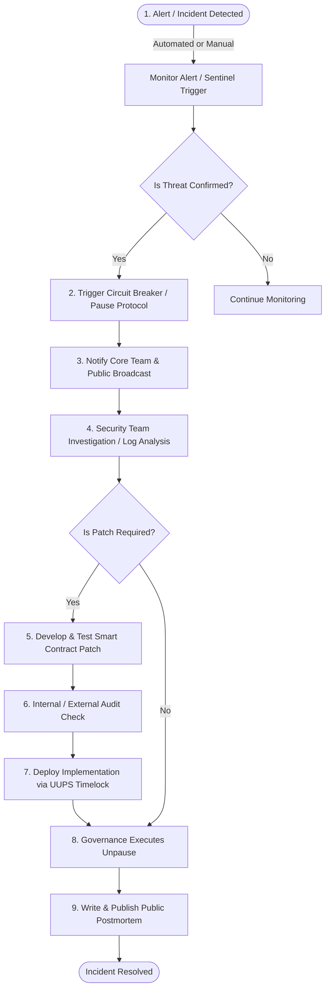

# UnifyVault Security Architecture Manual

## Protocol Security, Threat Modeling, and Incident Response Specification

**Version 1.0** — _July 2026_

---

## 1. Security Philosophy

The security design of the UnifyVault Protocol is guided by five core principles:

- **Security First:** Security considerations override rapid development milestones and features.
- **Least Privilege:** Core contracts, administrators, and automated backend services are granted only the minimum access levels required to perform their functions.
- **Defense in Depth:** The protocol implements multiple layers of defense. If one layer fails (e.g., an oracle feed drops offline), fallback layers (such as backup oracles and pausing mechanisms) are triggered automatically.
- **Fail-Secure:** In the event of system failures, smart contract errors, or key compromises, the protocol defaults to a locked state that preserves user funds.
- **Auditable Transparency:** All configuration parameters, transaction histories, wallet allocations, and treasury actions are recorded on-chain, enabling continuous auditing by the community.

---

## 2. Threat Modeling and Risk Scoring

The protocol's threat landscape spans smart contract execution, pricing data, frontend interfaces, and administrative controls.

### 2.1. Threat Matrix

| Threat ID | Threat Category            | Threat Actor & Capabilities                                                              | Likelihood |  Impact  | Risk Rating |
| :-------- | :------------------------- | :--------------------------------------------------------------------------------------- | :--------: | :------: | :---------: |
| **T-01**  | **Oracle Manipulation**    | Flash loan attacks targeting spot prices to inflate NAV calculations.                    |   Medium   | Critical |  **High**   |
| **T-02**  | **Contract Vulnerability** | Reentrancy or mathematical overflow exploits targeting collateral funds.                 |    Low     | Critical |  **High**   |
| **T-03**  | **Key Compromise**         | Unauthorized access to administrative roles, allowing contracts to be updated or paused. |    Low     | Critical |  **High**   |
| **T-04**  | **Frontend Phishing**      | DNS hijacking or malicious JavaScript injection to capture user approvals.               |   Medium   |   High   | **Medium**  |
| **T-05**  | **Supply Chain Defect**    | Vulnerable npm dependencies or malicious updates in web frameworks.                      |   Medium   |  Medium  | **Medium**  |
| **T-06**  | **DEX Liquidity Attack**   | Large-scale liquidations of underlying assets on Base L2, causing slippage.              |    High    |  Medium  | **Medium**  |

---

## 3. Smart Contract Vulnerability Mitigations

UnifyVault implements mitigations for common smart contract exploits:

```
    ATTACK VECTOR                        MITIGATION ARCHITECTURE
┌─────────────────────────┐        ┌───────────────────────────────────┐
│ Reentrancy Exploits     ├───────>│ Checks-Effects-Interactions &     │
│                         │        │ OpenZeppelin ReentrancyGuard      │
└─────────────────────────┘        └───────────────────────────────────┘
┌─────────────────────────┐        ┌───────────────────────────────────┐
│ Flash Loan NAV Attacks  ├───────>│ NAV calculation based on Chainlink│
│                         │        │ Oracles rather than DEX pool spot │
└─────────────────────────┘        └───────────────────────────────────┘
┌─────────────────────────┐        ┌───────────────────────────────────┐
│ Front-Running Swaps     ├───────>│ User-defined slippage controls    │
│                         │        │ (minTokensToMint / minCollateral) │
└─────────────────────────┘        └───────────────────────────────────┘
```

- **Reentrancy:** State variables are updated before external transfers are executed (Checks-Effects-Interactions pattern). Modifiers (`nonReentrant`) secure all deposit and withdrawal pathways.
- **Math Safety:** Code compiles using Solidity version 0.8.20+, which implements native compiler checks for arithmetic overflow and underflow.
- **Slippage Protections:** Users specify minimum execution outcomes (`minTokensToMint` and `minCollateralToReceive`) to prevent sandwich attacks.
- **Token Interface Safety:** Smart contracts use OpenZeppelin's `SafeERC20` wrapper library to handle non-standard ERC-20 token transfer behaviors.
- **Storage Integrity:** UUPS proxy contracts use explicit storage namespaces to prevent layout collisions during upgrades.

---

## 4. Oracle Security Standards

The pricing engine is secured against manipulation and data staleness:

- **Data Aggregation:** Prices are fetched from decentralized Chainlink aggregators on Base rather than direct decentralized exchange pools.
- **Staleness Checks:** Price feeds verify that prices were updated within the feed's heartbeat interval (e.g., 20 minutes for ETH/USD).
- **Price Validation:** Out-of-bounds prices (negative or zero values) are rejected.
- **Fallback Feeds:** If the primary feed is stale or offline, the system falls back to secondary networks (such as Redstone).
- **Circuit Breakers:** If both primary and secondary price feeds fail, the system pauses minting and burning transactions automatically to protect user funds.

---

## 5. Treasury Security Specification

Treasury assets are managed across segregated accounts:

```
  ┌─────────────────────────────────────────────────────────────────┐
  │                        User Deposits                            │
  └──────────────────────────────┬──────────────────────────────────┘
                                 │
                                 ▼
  ┌─────────────────────────────────────────────────────────────────┐
  │                    Custody Vaults (Non-Custodial)               │
  │     • Holds 100% of underlying BTC and ETH collateral          │
  │     • Controlled strictly by on-chain controller contracts       │
  └──────────────────────────────┬──────────────────────────────────┘
                                 │ Directs Protocol Fees
                                 ▼
  ┌─────────────────────────────────────────────────────────────────┐
  │                      Fee Distribution Manager                   │
  └──────────────────────────────┬──────────────────────────────────┘
                                 │
                 ┌───────────────┴───────────────┐
                 ▼                               ▼
  ┌─────────────────────────────┐ ┌─────────────────────────────┐
  │ Operational Treasury (70%)  │ │  Protocol Treasury (30%)    │
  │ • Managed by 3-of-5 Multisig│ │ • Managed by 4-of-7 Multisig│
  │ • Funds gas & hosting       │ │ • Timelock Emergency Buffer │
  └─────────────────────────────┘ └─────────────────────────────┘
```

- **Custody Separation:** Customer collateral is stored in a dedicated `CustodyVault` contract that does not interact with operational accounts.
- **Multi-Signature Controls:** Operational and Protocol treasuries are secured by Gnosis Safe multi-signature wallets.
- **Hardware Wallet Enforcements:** Private keys for the multi-signature participants are stored on physical hardware wallets (e.g., Ledger or Trezor).
- **Treasury Monitoring:** Automation engines (such as OpenZeppelin Defender) monitor treasury balances and trigger alerts in the event of unauthorized transfers.

---

## 6. Governance Security

To prevent administrative exploits, governance powers are limited:

- **Timelocked Execution:** Upgrades and changes to critical parameters are queued in a timelock contract for a minimum of 48 hours before execution.
- **Access Control Roles:** Administrative roles are divided (e.g., separating roles that can adjust fees from roles that can upgrade contracts).
- **Pause Limitations:** Guardian addresses can trigger an emergency pause immediately but do not have permissions to execute upgrades, adjust fees, or withdraw treasury funds.

---

## 7. Access Control Framework

Contract parameters are secured by explicit administrative roles managed by `AccessController.sol`:

| Role Name                | Scope of Permission                        | Assigned Actor      | Modifies Storage |
| :----------------------- | :----------------------------------------- | :------------------ | :--------------: |
| **`DEFAULT_ADMIN_ROLE`** | Can grant or revoke all operational roles. | Governance Multisig |       YES        |
| **`GUARDIAN_ROLE`**      | Can pause minting and burning.             | Guardian Wallet     |       YES        |
| **`UNPAUSER_ROLE`**      | Can unpause the protocol.                  | Governance Multisig |       YES        |
| **`ORACLE_OPERATOR`**    | Can configure fallback price feeds.        | Oracle multisig     |       YES        |
| **`FEE_CONFIGURATOR`**   | Can adjust mint and burn fees.             | Core Team Multisig  |       YES        |
| **`REBALANCER_ROLE`**    | Can trigger index rebalancing.             | Automated worker    |       YES        |

---

## 8. Emergency Response Plan

If an exploit or anomaly is detected, the operations team follows a structured response workflow.



### 8.1. Incident Response Playbook

#### Phase 1: Detection

Automated monitoring engines (such as OpenZeppelin Defender Sentinels) monitor all contract events. If an event fails verification (e.g., an unauthorized withdrawal is detected), an alert is triggered.

#### Phase 2: Containment

1.  An operator calls the `pause()` function on `UnifyVaultController`.
2.  The frontend displays a notice informing users that transactions are temporarily suspended.

#### Phase 3: Investigation

1.  Security engineers isolate the exploit transaction and reproduce it on a local fork of the network.
2.  The team audits the state of the database and treasury accounts to determine the scope of any lost assets.

#### Phase 4: Resolution & Recovery

1.  Engineers develop a patch and run validation tests.
2.  If the patch involves a contract upgrade, the new implementation is queued in the timelock.
3.  Following the timelock period, the upgrade is executed, and governance unpauses the contracts.

---

## 9. Real-Time Monitoring Stack

The protocol implements a dual on-chain and off-chain monitoring stack:

- **Solvency Sentinel:** Compares outstanding `UVBTCETH` supply against the value of assets in the vault, triggering alerts if backing ratios fall.
- **Oracle Monitor:** Compares Chainlink price updates with backup feeds and flags delays or deviation discrepancies.
- **Administrative Alerts:** Sends alerts to Slack and PagerDuty in the event of administrative role changes or configuration updates.
- **Gas Monitor:** Tracks system wallet balances to ensure automated scripts maintain enough gas to run rebalancing transactions.

---

## 10. Infrastructure Security

Backend and host systems are secured to prevent unauthorized access:

- **Secrets Management:** Sensitive keys and API endpoints are loaded at runtime from secure key vaults (e.g., AWS Secrets Manager) and are not stored in code repositories.
- **Database Access:** PostgreSQL databases are hosted in isolated virtual networks (VPCs) and reject incoming connections from public networks.
- **API Security:** Backend services implement rate limiting, input sanitization, and automated request filtering to protect against DDoS attacks.
- **Container Security:** Deployments use minimal Docker base images, which are scanned for vulnerabilities before release.

---

## 11. Core Wallet Security

Private keys for administrative wallets are managed using multi-signature configurations:

- **Multi-Signature Thresholds:** Crucial operations (such as contract upgrades) require approval from a 4-of-7 multi-signature contract.
- **Signing Requirements:** Transactions must be signed using physical hardware wallets.
- **Verification Protocols:** Multisig participants must verify transaction details (including destination addresses and function payloads) on their hardware screens before signing.

---

## 12. Secure Development Lifecycle

We implement security checks throughout the development process:

```
[Write Code] ──> [Foundry Local Tests] ──> [Slither / Mythril Check] ──> [PR to Main] ──> [CI Test Runs] ──> [Merge]
```

- **Static Code Analysis:** Every pull request is analyzed using Slither and Mythril to scan for vulnerabilities like reentrancy and unhandled return values.
- **Fuzz Testing:** Foundry runs tests with randomized inputs to verify boundary conditions and check for mathematical rounding errors.
- **Invariant Verification:** Automated test suites assert that core protocol rules (such as 1-to-1 asset backing) are maintained under all conditions.

---

## 13. Audit Strategy

Contracts must undergo formal security reviews before deployment:

- **Pre-Audit Review:** The development team completes internal code reviews and runs static analysis checks.
- **External Audit:** Third-party security firms audit the smart contracts and publish a public report.
- **Remediation Phase:** The team patches any findings identified in the audit report.
- **Verification:** The auditing firm verifies the fixes before final contract deployment.
- **Bug Bounty Program:** The protocol runs a public bug bounty program (e.g., on Immunefi) to incentivize security researchers to find and report vulnerabilities.

---

## 14. Disaster Recovery Procedures

The protocol maintains recovery procedures for system failure scenarios:

### 14.1. Lost Keys

If a multisig key is lost, the remaining signers execute a key rotation transaction to replace the lost key, maintaining the required signing threshold.

### 14.2. Oracle Failures

If the primary oracle goes offline, the adapter falls back to secondary feeds. If all pricing feeds fail, the system pauses transactions automatically. Once price feeds stabilize, governance unpauses the contracts.

### 14.3. Database Corruption

If the database becomes corrupted, the sync engine is redeployed. It scans past blocks on the Base blockchain to reconstruct the transaction history and restore database integrity.

---

## 15. Regulatory Compliance Framework (Future Hooks)

UnifyVault is designed to adapt to future regulatory compliance requirements:

- **Modular Identity Verification:** The core controller includes hooks that can interface with future identity registries (e.g., Coinbase Verifications) to support AML/KYC checks if required by local regulations.
- **Audit Logging:** The database maintains immutable records of user signatures and transactions to support financial reporting requirements.

---

## 16. Pre-Launch Security Checklist

Before deploying contracts to the mainnet, the team must complete the following checklist:

- [ ] **Smart Contracts:** Zero compiler warnings and 100% test coverage.
- [ ] **Static Analysis:** Slither and Mythril run with zero high-severity findings.
- [ ] **External Audit:** Independent security audit completed and findings resolved.
- [ ] **Multi-Signature Wallets:** Gnosis Safe contracts deployed with hardware keys.
- [ ] **Oracle Configuration:** Heartbeat parameters and fallback targets validated.
- [ ] **Monitoring Sentinel:** OpenZeppelin Defender Sentinels active on target contracts.
- [ ] **Disaster Playbook:** Incident response workflows and recovery processes tested.

---

## 17. Security Roadmap

The security architecture evolves over the protocol's lifecycle:

### Phase 1 (V1 Launch)

- Deploy UUPS upgradeable contracts on Base L2.
- Secure administration roles using multi-signature hardware wallets.
- Integrate Chainlink price feeds and implement fallback oracles.

### Phase 2 (V2 Expansion)

- Implement Snapshot voting with multi-signature execution.
- Establish a public bug bounty program (e.g., Immunefi).
- Add automated rebalancing scripts to manage index asset drift.

### Phase 3 (V3 Governance)

- Transition protocol control to an on-chain DAO.
- Deploy account abstraction to simplify wallet management for users.
