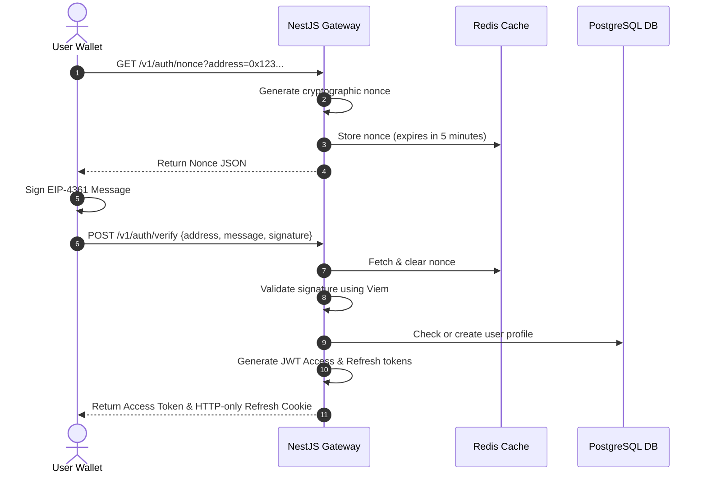

# UnifyVault Backend API Specification

## REST and WebSocket API Blueprint

**Version 1.0** — _July 2026_

---

## 1. API Overview

The UnifyVault backend is a high-performance REST and WebSocket API built with NestJS. It acts as the interface layer between frontends, integration partners, and on-chain contract events on the **Base** network.

```
       Base URL: https://api.unifyvault.com/v1
```

### 1.1. Core API Standards

- **Protocol:** REST over HTTPS, with WebSocket gateways for real-time updates.
- **Payload Format:** JSON (`Content-Type: application/json`).
- **Property Naming:** CamelCase for JSON variables, kebab-case for URL paths.
- **Idempotency:** Write endpoints (like mint requests) support idempotency using the `Idempotency-Key` header.
- **Pagination:** Requests for lists use standard query parameters: `page` (default: 1) and `limit` (default: 20, max: 100).
- **Rate Limits:** Standard limits are applied using IP and wallet address tracking:
  - Public Endpoints: 100 requests per minute.
  - Authenticated Endpoints: 600 requests per minute.
  - Response Headers:
    ```http
    X-RateLimit-Limit: 600
    X-RateLimit-Remaining: 599
    X-RateLimit-Reset: 1774348800
    ```

---

## 2. Authentication Flow

UnifyVault uses **Sign-In with Ethereum (SIWE / EIP-4361)** for wallet authentication, returning JWT access tokens and HTTP-only refresh cookies.



### 2.1. Authentication Endpoints

#### `GET /v1/auth/nonce`

- **Purpose:** Fetches a secure cryptographic nonce to sign for SIWE validation.
- **Query Parameters:** `address` (valid 42-character Ethereum address).
- **Response (200 OK):**
  ```json
  {
    "nonce": "L9z8Yt2nQk9xW1m",
    "address": "0x9E219800d922E21B97779b5c3e6B01509930f78B",
    "expiresAt": "2026-07-16T15:05:00.000Z"
  }
  ```

#### `POST /v1/auth/verify`

- **Purpose:** Validates the cryptographic signature and issues access tokens.
- **Request Body:**
  ```json
  {
    "address": "0x9E219800d922E21B97779b5c3e6B01509930f78B",
    "message": "api.unifyvault.com wants you to sign in with your Ethereum account...\nNonce: L9z8Yt2nQk9xW1m",
    "signature": "0x78ab91..."
  }
  ```
- **Response (200 OK):**
  ```json
  {
    "accessToken": "eyJhbGciOi...",
    "expiresIn": 900,
    "tokenType": "Bearer",
    "user": {
      "id": "5f9b4f74-32e6-42bb-85bb-12c8b74a2618",
      "address": "0x9E219800d922E21B97779b5c3e6B01509930f78B"
    }
  }
  ```

---

## 3. User APIs

Authorized users can manage their preferences, settings, and active session histories.

- `GET /v1/users/profile`: Returns basic profile details and settings.
- `PATCH /v1/users/settings`: Updates notification preferences and active settings.
- `GET /v1/users/sessions`: Returns active logins and login locations.

---

## 4. Wallet APIs

Links and manages wallet addresses associated with a user profile.

- `POST /v1/wallets/register`: Links an additional wallet address to the user account by validating a signed message.
- `GET /v1/wallets`: Returns linked wallet addresses and metadata (such as primary network configurations).

---

## 5. Portfolio APIs

Calculates real-time values, asset allocations, and performance metrics for users.

#### `GET /v1/portfolio/summary`

- **Access:** Authenticated (Bearer Token).
- **Response (200 OK):**
  ```json
  {
    "totalBalanceUsd": 12450.75,
    "change24hUsd": 320.5,
    "change24hPercentage": 2.64,
    "assets": [
      {
        "symbol": "UVBTCETH",
        "balance": 10375.625,
        "valueUsd": 12450.75,
        "allocations": {
          "wBTC": 6225.375,
          "wETH": 6225.375
        }
      }
    ]
  }
  ```

---

## 6. Protocol Metrics APIs

Provides public endpoints to monitor the state of the UnifyVault contracts.

#### `GET /v1/protocol/stats`

- **Access:** Public.
- **Response (200 OK):**
  ```json
  {
    "tvlUsd": 42085900.0,
    "circulatingSupply": 35071583.33,
    "indexTokenPriceUsd": 1.2,
    "reserveBackingRatio": 1.0,
    "assets": {
      "wBTC": {
        "amount": 350.715,
        "valueUsd": 21042900.0
      },
      "wETH": {
        "amount": 7014.333,
        "valueUsd": 21042900.0
      }
    }
  }
  ```

---

## 7. Oracle APIs

Provides real-time pricing data and checks feed status.

- `GET /v1/oracles/prices`: Returns active prices for index assets.
- `GET /v1/oracles/status`: Checks latency, staleness, and heartbeat metrics for Chainlink price feeds.

---

## 8. Treasury APIs

Provides public data to support Proof of Reserve monitoring.

#### `GET /v1/treasury/reserves`

- **Access:** Public.
- **Response (200 OK):**
  ```json
  {
    "totalReserveUsd": 42085900.0,
    "verifiedVaults": [
      {
        "asset": "wBTC",
        "contractAddress": "0x2fE89800d922E21B97779b5c3e6B01509930f78B",
        "onChainBalance": 350.715,
        "lastVerifiedBlock": 1844238
      },
      {
        "asset": "wETH",
        "contractAddress": "0x3fE89800d922E21B97779b5c3e6B01509930f78B",
        "onChainBalance": 7014.333,
        "lastVerifiedBlock": 1844238
      }
    ]
  }
  ```

---

## 9. Mint APIs (Creation)

Processes deposit requests and provides pricing quotes for minting index tokens.

#### `POST /v1/mint/quote`

- **Purpose:** Generates a pricing quote for a deposit amount, including gas and mint fee estimates.
- **Request Body:**
  ```json
  {
    "depositAmount": 1000.0,
    "collateralToken": "USDC",
    "slippageBps": 50
  }
  ```
- **Response (200 OK):**
  ```json
  {
    "quoteId": "q_mint_9a12c8e3",
    "expectedTokens": 831.66,
    "mintFee": 2.0,
    "networkFeeEstimateUsd": 0.05,
    "minTokensToMint": 827.5,
    "expiresAt": "2026-07-16T15:01:00.000Z"
  }
  ```

---

## 10. Burn APIs (Redemption)

Processes redemption requests and provides quotes for burning index tokens.

#### `POST /v1/burn/quote`

- **Purpose:** Generates a pricing quote for a redemption amount, including burn fee estimates.
- **Request Body:**
  ```json
  {
    "indexTokenAmount": 500.0,
    "targetToken": "USDC",
    "slippageBps": 50
  }
  ```
- **Response (200 OK):**
  ```json
  {
    "quoteId": "q_burn_b881a2c9",
    "expectedCollateral": 598.5,
    "burnFee": 1.8,
    "minCollateralToReceive": 595.5,
    "expiresAt": "2026-07-16T15:01:00.000Z"
  }
  ```

---

## 11. Transaction History APIs

Provides transaction history records, support for filtering, and explorer integration links.

#### `GET /v1/transactions`

- **Access:** Authenticated.
- **Query Parameters:** `page`, `limit`, `type` (MINT/BURN/TRANSFER), `wallet`.
- **Response (200 OK):**
  ```json
  {
    "data": [
      {
        "id": "tx_2a3f8b9d",
        "type": "MINT",
        "amount": 831.66,
        "txHash": "0x5b3f1245...",
        "blockNumber": 1844200,
        "status": "SUCCESS",
        "createdAt": "2026-07-16T14:30:00.000Z",
        "explorerUrl": "https://basescan.org/tx/0x5b3f1245..."
      }
    ],
    "meta": {
      "currentPage": 1,
      "totalPages": 5,
      "totalItems": 88
    }
  }
  ```

---

## 12. Analytics APIs

Provides daily summaries, Total Value Locked (TVL) metrics, and historical performance tracking.

- `GET /v1/analytics/tvl-history`: Returns daily TVL historical checkpoints.
- `GET /v1/analytics/volume`: Returns daily mint and burn volumes.

---

## 13. Admin Configuration APIs

Provides administrative endpoints to configure system settings and manage features.

- `POST /v1/admin/pause`: Triggers an emergency pause of the controller contracts.
- `PATCH /v1/admin/fees`: Adjusts mint and burn fee parameters within hardcoded contract limits.
- `GET /v1/admin/audit-logs`: Returns administrative audit trails and actions.

---

## 14. Notification APIs

Manages user notification preferences and routes webhook events to external platforms.

- `POST /v1/notifications/webhooks`: Registers webhooks for external integrations.
- `POST /v1/notifications/preferences`: Configures user alert settings.

---

## 15. WebSocket Gateways

The WebSocket gateway is hosted at `wss://api.unifyvault.com/v1/events` and uses JSON payloads to broadcast real-time events.

### 15.1. Client Subscriptions

Clients send subscription payloads to register for specific event topics:

```json
{
  "event": "subscribe",
  "topic": "nav_updates"
}
```

### 15.2. Server Broadcasts

When values change on-chain, the server broadcasts updates to subscribed clients:

```json
{
  "topic": "nav_updates",
  "data": {
    "pricePerToken": 1.2015,
    "circulatingSupply": 35071583.33,
    "timestamp": "2026-07-16T15:00:01.000Z"
  }
}
```

---

## 16. Error Handling Standards

API errors use a standardized schema:

```json
{
  "statusCode": 400,
  "errorCode": "ERR_SLIPPAGE_EXCEEDED",
  "message": "The transaction slippage exceeded the target threshold limit of 0.50%.",
  "timestamp": "2026-07-16T15:00:05.000Z",
  "path": "/v1/mint/execute"
}
```

### 16.1. Error Classification Table

| HTTP Code | Error Code              | Description                                                |
| :-------- | :---------------------- | :--------------------------------------------------------- |
| **400**   | `ERR_INVALID_BODY`      | The request body contains invalid parameters.              |
| **401**   | `ERR_AUTH_EXPIRED`      | The JWT access token is expired or missing.                |
| **403**   | `ERR_ROLE_UNAUTHORIZED` | The authenticated user does not have required permissions. |
| **409**   | `ERR_SLIPPAGE_EXCEEDED` | The transaction outcome exceeded user slippage limits.     |
| **429**   | `ERR_RATE_LIMIT`        | The rate limit threshold has been exceeded.                |
| **503**   | `ERR_ORACLE_STALE`      | Pricing feeds are stale or offline.                        |

---

## 17. API Security

The API layer implements security controls to protect endpoints and prevent abuse:

- **Request Signatures:** Administrative API calls require EIP-191 signatures to verify identity off-chain.
- **SQL Injection Prevention:** Input validations are enforced using TypeORM mapping models.
- **CORS Configuration:** Rejects requests from unauthorized origins.
- **IP Whitelisting:** Restricts administrative endpoints to verified proxy gateways.

---

## 18. Monitoring & Health Checks

System endpoints verify the health of underlying components and dependencies:

- `GET /v1/health/liveness`: Verifies if the backend container is running.
- `GET /v1/health/readiness`: Verifies connection status to PostgreSQL, Redis, and the Base network.

---

## 19. Versioning and Deprecation Policy

- **API Versioning:** Enforced via URL prefixes (e.g., `/v1/`).
- **Deprecation Notification:** When an endpoint is deprecated, response payloads include deprecation headers:
  ```http
  Warning: 299 - "This API endpoint is deprecated and will be removed in v2."
  Sunset: Thu, 31 Dec 2026 23:59:59 GMT
  ```
- **Compatibility:** Minor, non-breaking updates are deployed directly, while breaking changes require a new version path (e.g., `/v2/`).

---

## 20. Integration Roadmap

- **Institutional API Profiles:** Custom API endpoints designed to help banks and investment firms manage large deposits.
- **Partner SDKs:** JavaScript and Python libraries designed to help developers integrate UnifyVault features into their own applications.
- **GraphQL Endpoint:** Planned support for a GraphQL query gateway to optimize data fetching.
