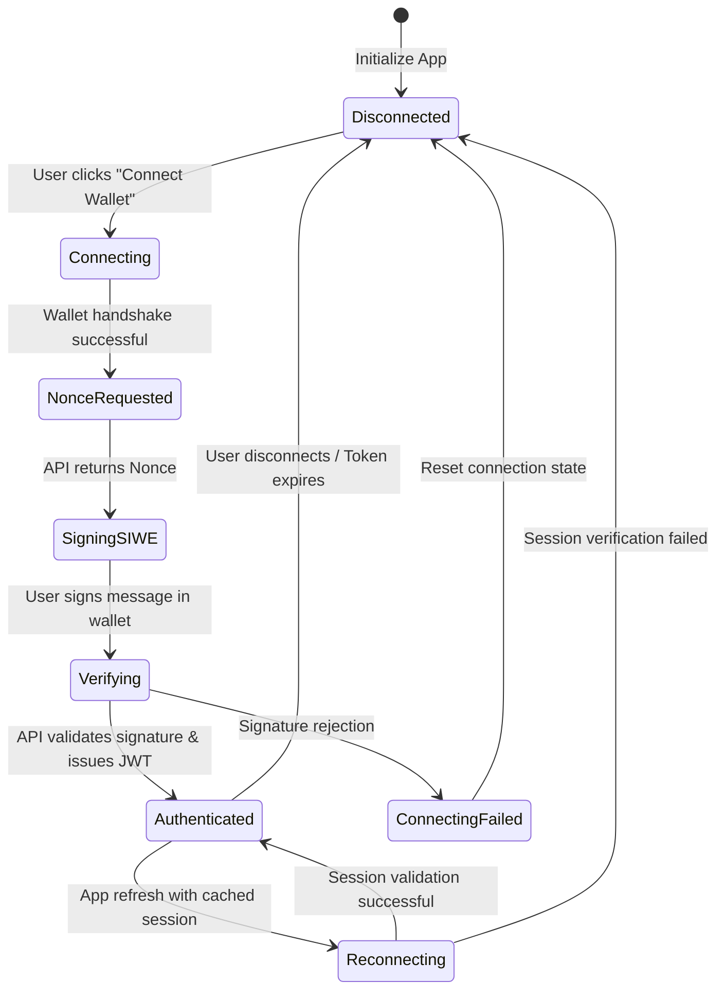

# UnifyVault Frontend Architecture Manual

## User Experience, Interface Modules, and Client State Blueprint

**Version 1.0** — _July 2026_

---

## 1. Design Philosophy

The UnifyVault user interface (UI) is built around five core design principles:

- **Simplicity and Clarity:** Investing in complex digital assets must feel as straightforward as a standard bank transfer or UPI payment.
- **Professional Trust:** The interface uses clean layouts, structured information, and real-time validation checks to establish a secure, institutional-grade experience.
- **Accessibility First:** The application adheres to accessibility standards (such as WCAG 2.1 AA profiles) to ensure all users can navigate the platform.
- **Mobile-First Design:** The application is designed to work across all device sizes, with a focus on mobile layouts.
- **Performance:** Code splitting, lazy loading, and asset optimization are used to minimize load times and improve responsiveness.

---

## 2. Design Language & Visual Tokens

The interface utilizes a clean design language with modern typography and spacing:

- **Typography:** The application uses **Outfit** (for headings) and **Inter** (for body text) via Google Fonts.
- **Spacing:** Follows a standard 4px baseline grid system:
  ```
  4px (xs) | 8px (sm) | 16px (md) | 24px (lg) | 32px (xl) | 64px (2xl)
  ```
- **Grid System:** Uses a responsive Tailwind CSS grid:
  - Mobile: 1 Column.
  - Tablet: 2 Columns.
  - Desktop: 12 Columns.
- **Visual Assets:** Custom graphic assets, banners, and layout backdrops are generated dynamically using our asset creation pipelines. The application uses clean visual styling rather than generic placeholders.
- **Transitions:** Component animations use smooth transitions:
  ```css
  transition: all 0.2s cubic-bezier(0.4, 0, 0.2, 1);
  ```

---

## 3. Application Layout Wireframe

The application layout features a persistent header, responsive sidebar, and a central workspace area.

```
+-----------------------------------------------------------------------------+
| [UV Logo]  [Network Status: Base]                     [0x12ab...34cd] [P]   |
+-----------------------------------------------------------------------------+
|  Sidebar     |  Main Content Pane                                           |
|  =========== |  ==========================================================  |
|  - Dashboard |  Portfolio Summary                                           |
|  - Portfolio |  $12,450.75 USD  (+2.64% 24h)                                |
|  - Reserves  |  [ Chart: NAV Performance Over Time (Apache ECharts) ]       |
|  - Treasury  |                                                              |
|  - Tx History|  Asset Allocations:                                          |
|  - Settings  |  +---------------------------+  +--------------------------+ |
|              |  | Wrapped Bitcoin (wBTC)    |  | Wrapped Ethereum (wETH)  | |
|              |  | 50.0% Allocation         |  | 50.0% Allocation         | |
|              |  | $6,225.37 USD             |  | $6,225.37 USD            | |
|              |  +---------------------------+  +--------------------------+ |
+--------------+--------------------------------------------------------------+
| [ Footer: Status: Connected | TVL: $42,085,900 | Base Block: #1844238 ]     |
+-----------------------------------------------------------------------------+
```

### 3.1. Navigation and Layout Structure

- **Header:** Displays the UnifyVault logo, network indicators, notification badges, and the wallet connection button.
- **Sidebar (Desktop):** Provides navigation links to key sections (Dashboard, Portfolio, Reserves, Treasury, and Settings).
- **Bottom Navigation (Mobile):** Converts the sidebar into a persistent bottom bar for mobile layouts.
- **Main Workspace:** Displays the active feature view.

---

## 4. Routing Structure

The application routing is configured using Angular's router and uses lazy loading for all feature modules:

```typescript
export const routes: Routes = [
  { path: '', loadComponent: () => import('./features/landing/landing.component') },
  {
    path: 'app',
    loadComponent: () => import('./features/app-layout/app-layout.component'),
    canActivate: [walletConnectedGuard],
    children: [
      {
        path: 'dashboard',
        loadComponent: () => import('./features/dashboard/dashboard.component'),
      },
      {
        path: 'portfolio',
        loadComponent: () => import('./features/portfolio/portfolio.component'),
      },
      { path: 'reserves', loadComponent: () => import('./features/reserves/reserves.component') },
      {
        path: 'transactions',
        loadComponent: () => import('./features/transactions/transactions.component'),
      },
      { path: 'settings', loadComponent: () => import('./features/settings/settings.component') },
    ],
  },
  { path: '**', redirectTo: '' },
];
```

---

## 5. Wallet Authentication Flow

The application implements a Sign-In with Ethereum (SIWE) authentication flow using Angular Signals to manage connection states.



---

## 6. Dashboard Modules

The primary Dashboard displays high-level protocol statistics and investment metrics:

- **Portfolio Summary Card:** Displays the user's current index token balance, historical returns, and 24-hour performance metrics.
- **Interactive Mint/Burn Module:** Provides input fields to mint or burn `UVBTCETH` tokens. It shows real-time price quotes, network gas estimates, slippage guards, and validation warnings before transactions are submitted.
- **Protocol Metrics Grid:** Displays key protocol stats including Total Value Locked (TVL), circulating supply, reserve ratio indicators, and active transaction volumes.

---

## 7. Portfolio Dashboard

Provides detailed tracking and performance metrics for the user's holdings:

- **Asset Allocation Chart:** Displays the balance between Bitcoin (50%) and Ethereum (50%) in the user's portfolio.
- **Performance Tracking:** Displays historical performance graphs, purchase histories, and average price metrics.
- **Export Tools:** Allows users to download transaction logs and histories as CSV files.

---

## 8. Proof of Reserve Dashboard

The Proof of Reserve (PoR) dashboard provides real-time verification of protocol backing:

```
               ON-CHAIN CIRCULATING SUPPLY vs CUSTODY RESERVES
+-----------------------------------------------------------------------------+
| Circulating Liabilities: 35,071,583.33 UVBTCETH ($42,085,900.00 USD)        |
| Verified Vault Reserves:   $42,085,900.00 USD (Backing Ratio: 100.00%)      |
+-----------------------------------------------------------------------------+
| Vault Address            | Asset  | Verified Balance    | Price  | Value    |
| 0x2fE89800d922E...f78B   | wBTC   | 350.715 wBTC        | $60k   | $21.04M  |
| 0x3fE89800d922E...f78B   | wETH   | 7,014.333 wETH      | $3k    | $21.04M  |
+-----------------------------------------------------------------------------+
| Last Oracles Update Verification Block: #1844238 (12 seconds ago)           |
+-----------------------------------------------------------------------------+
```

- **Live Backing Ratio:** Displays the protocol's backing ratio (e.g., 100.00% Reserves Backed).
- **Vault Registry:** Lists the public contract addresses of custody vaults, allowing users to verify asset balances directly on block explorers.

---

## 9. Charts Integration (Apache ECharts)

We use Apache ECharts to display interactive financial data:

- **Responsive Scaling:** Charts use resizing observers to adapt to screen size changes.
- **Performance:** Chart rendering uses canvas elements to ensure smooth performance on mobile devices.
- **Theme Integration:** Charts automatically update their color palettes when switching between light and dark modes.

---

## 10. Reusable Components

The application uses modular components to ensure consistency across features:

```
src/app/shared/components/
├── button/              # Custom buttons
├── card/                # Content card layouts
├── wallet-btn/          # Wallet connection handler
├── chart-card/          # ECharts wrapper component
├── badge/               # Status and network badges
├── dialog/              # Modal overlays
├── alert/               # Banner alerts
├── loading-skeleton/    # Content placeholders
└── tooltip/             # Helper tooltips
```

### 10.1. Reusable Component Properties

- **Inputs:** Configuration variables are typed (e.g., configuring buttons using variants like `primary`, `secondary`, or `danger`).
- **Outputs:** Components emit typed event payloads to parent views.
- **Accessibility (ARIA):** Components include ARIA labels to ensure compatibility with screen readers.

---

## 11. State Management with Angular Signals

The frontend manages application state using Angular Signals and RxJS:

```typescript
@Injectable({ providedIn: 'root' })
export class PortfolioStore {
  // Signals State
  private state = signal<PortfolioState>({
    balance: 0,
    assets: [],
    loading: false,
    error: null,
  });

  // Read-only Computed Signals
  readonly balance = computed(() => this.state().balance);
  readonly assets = computed(() => this.state().assets);
  readonly loading = computed(() => this.state().loading);

  // Actions
  async loadPortfolio(walletAddress: string) {
    this.state.update((s) => ({ ...s, loading: true }));
    try {
      const data = await this.api.fetchPortfolio(walletAddress);
      this.state.set({ balance: data.total, assets: data.items, loading: false, error: null });
    } catch (err: any) {
      this.state.update((s) => ({ ...s, loading: false, error: err.message }));
    }
  }
}
```

---

## 12. Themes & Color Tokens

The visual style is defined by variables that adjust based on dark and light mode settings:

| Token Name             | Light Mode Value        | Dark Mode Value         | Purpose                                   |
| :--------------------- | :---------------------- | :---------------------- | :---------------------------------------- |
| `--color-bg-primary`   | `#F9FAFB` (Gray 50)     | `#0B0F19` (Deep Blue)   | Primary app background.                   |
| `--color-bg-card`      | `#FFFFFF`               | `#111827` (Gray 900)    | Card panel backgrounds.                   |
| `--color-text-primary` | `#111827` (Gray 900)    | `#F3F4F6` (Gray 100)    | Primary text labels.                      |
| `--color-accent`       | `#6366F1` (Indigo 500)  | `#818CF8` (Indigo 400)  | Active states and focus rings.            |
| `--color-success`      | `#10B981` (Emerald 500) | `#34D399` (Emerald 400) | Solvency indicators and positive returns. |
| `--color-warning`      | `#F59E0B` (Amber 500)   | `#FBBF24` (Amber 400)   | Stale price alerts and warning banners.   |

---

## 13. Mobile & PWA Specifications

- **Responsive Breakpoints:** Follows standard Tailwind spacing guidelines:
  - Mobile: `< 640px` (displays bottom navigation and stackable inputs).
  - Tablet: `640px` to `1024px` (displays grid configurations).
  - Desktop: `> 1024px` (displays sidebar navigation).
- **PWA Compatibility:** Includes a service worker to cache fonts and static layout assets, improving load times on slow mobile connections.

---

## 14. Performance Optimization

- **Lazy Loading:** Feature routes are lazy loaded to minimize the initial application bundle size.
- **Image Optimization:** Vector graphics (SVG) are used for icons and UI elements to prevent quality loss and reduce file size.
- **Change Detection:** Uses the `OnPush` change detection strategy to minimize UI re-renders and improve performance.

---

## 15. Accessibility (WCAG 2.1 AA)

- **Keyboard Navigation:** All interactive elements support keyboard focus states (`tabindex`).
- **Focus Management:** Open dialog overlays trap focus within the modal container to prevent users from accidentally tab-navigating background content.
- **Screen Readers:** Dynamic charts include text description fallback tags.

---

## 16. Security Standards

- **Content Security Policy (CSP):** Restricts script executions to trusted script hosts, protecting against cross-site scripting (XSS) attacks.
- **Wrong Network Guards:** The interface monitors the connected wallet's network configuration and displays a persistent warning banner if the wallet is not connected to Base Mainnet.

---

## 17. Error & Offline States

When services or connections fail, the interface displays helper dialogs to guide the user:

- **Wrong Network Alert:** Displays an overlay blocking interactions until the user switches their wallet to the Base network.
- **Offline Mode:** Displays a banner alerting the user when their internet connection is lost, disabling transaction submit buttons until connection is restored.
- **Emergency Pause State:** Displays a warning if the protocol's pause circuit breaker is active, informing users that minting and burning transactions are temporarily suspended.

---

## 18. Future UI Expansion

The modular design supports future interface enhancements:

- **Multi-Index Dashboard:** Support for displaying multiple index options (such as `UVTOP10` or `UVGOLD`) within the card selection panels.
- **Institutional Portal:** Advanced dashboard layouts tailored for institutional users, featuring larger deposit options, volume tracking, and compliance interfaces.
