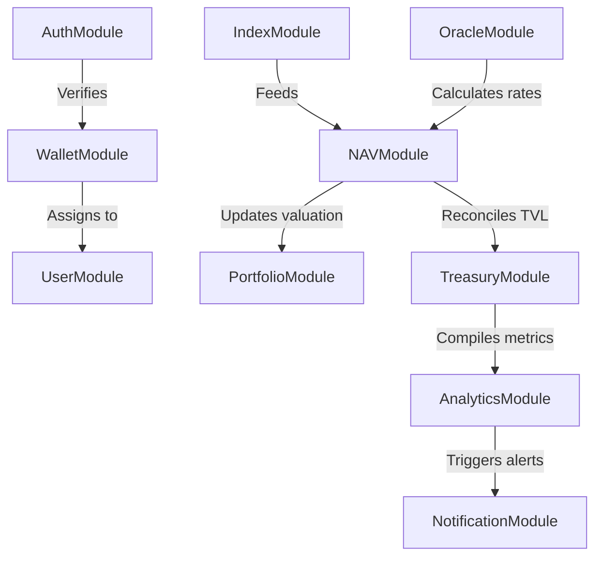

# UnifyVault Backend Architecture Manual

## Distributed System Design, Database Schemas, and Queue Blueprint

**Version 1.0** — _July 2026_

---

## 1. Backend Philosophy

The UnifyVault backend is built on five core architectural principles:

- **Modular Architecture:** The system uses NestJS modules to separate domain logic (such as Authentication, Oracle Pricing, and Treasury Sync). This isolates features and makes maintenance straightforward.
- **Domain-Driven Design (DDD):** Database entities, API endpoints, and background tasks are organized around core domains (e.g., Portfolio, Treasury, and Index).
- **SOLID Principles:** Code is structured to ensure components have a single responsibility, interfaces are segregated, and dependencies are inverted using NestJS's dependency injection container.
- **Hexagonal Architecture:** External integrations (such as the Base blockchain RPC node, Chainlink price oracles, and email services) are isolated behind port interfaces and adapter patterns, making them easy to swap out or test.
- **Observability:** The system implements logging, metrics collections (compatible with Prometheus), and trace monitoring from day one.

---

## 2. Directory Structure

The project directory follows a modular, feature-based structure:

```
src/
├── main.ts                    # Bootstrap entry point
├── app.module.ts              # Root application module
├── config/                    # Global configurations & validation schemas
│   ├── env.config.ts
│   └── env.validation.ts
├── database/                  # Prisma client initialization & database scripts
│   ├── prisma.service.ts
│   └── schema.prisma
├── shared/                    # Shared middleware, guards, interceptors, and filters
│   ├── filters/               # Global exception filters
│   ├── interceptors/          # Cache and performance interceptors
│   ├── guards/                # RolesGuard, JwtGuard
│   └── decorators/            # GetUser, GetWallet decorators
├── queues/                    # BullMQ queue registrations
│   └── queue.module.ts
├── workers/                   # Queue workers and processors
│   ├── oracle-sync.processor.ts
│   └── nav-calc.processor.ts
└── modules/                   # Domain feature modules
    ├── auth/                  # Nonce generation, SIWE, JWT tokens
    ├── user/                  # User details and settings
    ├── wallet/                # Wallet links and network validations
    ├── index/                 # Index configurations & registries
    ├── portfolio/             # Portfolio value caching & summaries
    ├── oracle/                # On-chain price aggregators
    ├── treasury/              # Custody balances & Proof of Reserve audits
    ├── analytics/             # Historical TVL and volume analytics
    └── notifications/         # Webhooks & notification dispatchers
```

---

## 3. Domain Modules & Dependencies

Modules represent isolated feature areas. The diagram below maps how modules depend on each other:



- **`AuthModule`:** Handles SIWE signature verification and JWT sessions. It depends on `WalletModule` to lookup or register addresses.
- **`NAVModule`:** Calculates index pricing by combining index weights from `IndexModule` with asset prices from `OracleModule`.
- **`PortfolioModule`:** Reads the calculated NAV to return holdings valuations for users.
- **`TreasuryModule`:** Monitors custody vault addresses on-chain to verify the protocol's backing status, using pricing data from `NAVModule` to compute total reserve values.

---

## 4. Core Services Specification

### 4.1. `OracleSyncService`

- **Purpose:** Fetches, validates, and stores asset price feeds.
- **Responsibilities:** Reads prices from Chainlink nodes on Base, handles fallback oracle switches, and flags pricing anomalies.
- **Dependencies:** `PrismaService`, `RedisService`.
- **Retry Policy:** Failed requests retry 3 times with exponential backoff before generating system alerts.

### 4.2. `NAVCalculationService`

- **Purpose:** Calculates the Net Asset Value (NAV) of the `UVBTCETH` index.
- **Responsibilities:** Reads underlying vault balances and current asset prices to calculate index value, caching the result in Redis.
- **Dependencies:** `CustodyVaultService`, `OracleSyncService`, `RedisService`.

---

## 5. Database Schema (Prisma)

The Prisma schema defines the PostgreSQL database tables and relationships:

```prisma
datasource db {
  provider = "postgresql"
  url      = env("DATABASE_URL")
}

generator client {
  provider = "prisma-client-js"
}

model User {
  id           String        @id @default(uuid())
  email        String?       @unique
  createdAt    DateTime      @default(now())
  updatedAt    DateTime      @updatedAt
  wallets      Wallet[]
  settings     UserSetting?
  auditLogs    AuditLog[]

  @@map("users")
}

model Wallet {
  id           String        @id @default(uuid())
  userId       String
  user         User          @relation(fields: [userId], references: [id], onDelete: Cascade)
  address      String        @unique
  chainId      Int           @default(8453)
  createdAt    DateTime      @default(now())
  transactions Transaction[]
  mints        MintRequest[]
  burns        BurnRequest[]

  @@map("wallets")
}

model Index {
  id                String             @id @default(uuid())
  symbol            String             @unique
  name              String
  contractAddress   String             @unique
  targetAllocations Json               // e.g., {"wBTC": 0.5, "wETH": 0.5}
  isActive          Boolean            @default(true)
  createdAt         DateTime           @default(now())
  navSnapshots      NavSnapshot[]
  mintRequests      MintRequest[]
  burnRequests      BurnRequest[]
  revenue           ProtocolRevenue[]

  @@map("indexes")
}

model Transaction {
  id          String   @id @default(uuid())
  walletId    String
  wallet      Wallet   @relation(fields: [walletId], references: [id])
  txType      TxType
  amount      Decimal  @db.Decimal(36, 18)
  txHash      String   @unique
  blockNumber Int
  status      TxStatus
  createdAt   DateTime @default(now())

  @@map("transactions")
}

enum TxType {
  MINT
  BURN
  TRANSFER
}

enum TxStatus {
  PENDING
  SUCCESS
  FAILED
}

model NavSnapshot {
  id                String   @id @default(uuid())
  indexId           String
  index             Index    @relation(fields: [indexId], references: [id])
  totalNav          Decimal  @db.Decimal(36, 18)
  circulatingSupply Decimal  @db.Decimal(36, 18)
  pricePerToken     Decimal  @db.Decimal(36, 18)
  snapshotTime      DateTime @default(now())

  @@index([snapshotTime])
  @@map("nav_snapshots")
}

model OraclePrice {
  id          String   @id @default(uuid())
  assetSymbol String
  priceUsd    Decimal  @db.Decimal(36, 18)
  source      String
  timestamp   DateTime @default(now())

  @@index([assetSymbol, timestamp])
  @@map("oracle_prices")
}

model AuditLog {
  id        String   @id @default(uuid())
  userId    String
  user      User     @relation(fields: [userId], references: [id])
  action    String
  ipAddress String
  details   Json
  createdAt DateTime @default(now())

  @@map("audit_logs")
}

model ProtocolRevenue {
  id           String   @id @default(uuid())
  indexId      String
  index        Index    @relation(fields: [indexId], references: [id])
  mintFees     Decimal  @db.Decimal(36, 18)
  burnFees     Decimal  @db.Decimal(36, 18)
  txHash       String   @unique
  snapshotTime DateTime @default(now())

  @@map("protocol_revenue")
}

model MintRequest {
  id              String   @id @default(uuid())
  walletId        String
  wallet          Wallet   @relation(fields: [walletId], references: [id])
  indexId         String
  index           Index    @relation(fields: [indexId], references: [id])
  depositAmount   Decimal  @db.Decimal(36, 18)
  collateralToken String
  mintAmount      Decimal  @db.Decimal(36, 18)
  status          TxStatus
  txHash          String   @unique
  createdAt       DateTime @default(now())

  @@map("mint_requests")
}

model BurnRequest {
  id              String   @id @default(uuid())
  walletId        String
  wallet          Wallet   @relation(fields: [walletId], references: [id])
  indexId         String
  index           Index    @relation(fields: [indexId], references: [id])
  burnAmount      Decimal  @db.Decimal(36, 18)
  returnedAmount  Decimal  @db.Decimal(36, 18)
  status          TxStatus
  txHash          String   @unique
  createdAt       DateTime @default(now())

  @@map("burn_requests")
}

model UserSetting {
  id               String  @id @default(uuid())
  userId           String  @unique
  user             User    @relation(fields: [userId], references: [id], onDelete: Cascade)
  emailAlerts      Boolean @default(true)
  webhookAlerts    Boolean @default(false)
  preferredCurrency String  @default("USD")

  @@map("user_settings")
}
```

---

## 6. Redis Caching & Expiration Strategy

Redis handles short-term sessions, rate limiting, nonces, and pricing caches:

| Caching Space      | Redis Key pattern       | Expiration Policy         | Purpose                               |
| :----------------- | :---------------------- | :------------------------ | :------------------------------------ |
| **SIWE Nonces**    | `auth:nonce:{address}`  | 5 Minutes (Absolute)      | Prevents replay attacks during login. |
| **Oracle Pricing** | `price:latest:{asset}`  | 30 Seconds (Absolute)     | Reduces RPC calls during NAV checks.  |
| **Index NAV**      | `nav:latest:{symbol}`   | 1 Minute (Absolute)       | Caches NAV values for API queries.    |
| **Rate Limiting**  | `ratelimit:{ip}:{path}` | 1 Minute (Sliding window) | Enforces API rate limits.             |
| **JWT Session**    | `session:{userId}`      | 1 Hour (Sliding window)   | Handles active user sessions.         |

---

## 7. Queue System & Processing Engine (BullMQ)

BullMQ processes asynchronous tasks using specialized worker queues:

```
  CLIENT API CALL ──> [Enqueues Task] ──> [Redis Broker] ──> [BullMQ Worker] ──> [Schedules Task / Sync]
```

- **`oracle-sync` Queue:** Polls pricing oracles and updates database records every 60 seconds.
- **`nav-calculator` Queue:** Calculates index NAV valuations after pricing updates are completed.
- **`treasury-sync` Queue:** Monitors on-chain vault balances and checks backing ratios.
- **`notifications` Queue:** Dispatches transactional emails, alerts, and webhooks.

---

## 8. Oracle Pricing Sync Engine

- **Data Ingestion:** Workers query on-chain Chainlink pricing contracts on Base.
- **Price Validation:** The ingestion worker checks that price values are greater than zero and that updates occurred within feed heartbeat limits.
- **Deviation Detection:** If a price deviates by more than 5% compared to previous values, the worker flags the update for verification and logs a system warning.
- **Database Archiving:** Prices are saved to the `oracle_prices` table to support historical performance calculations.

---

## 9. On-Chain Treasury Sync

- **Balance Queries:** The `treasury-sync` worker queries on-chain balances for custody vault addresses every 5 minutes.
- **Solvency Reconciliations:** Compares total reserve values against circulating index supplies to verify protocol solvency.
- **Alert Thresholds:** If the backing ratio drops below 100%, the worker sends high-priority alerts to operational multi-sig accounts.

---

## 10. Analytics Engine

- **Metrics Compilation:** Background workers calculate daily summaries for Total Value Locked (TVL), index supplies, fee revenues, and user growth.
- **Performance Dashboards:** Summary data is cached in Redis to populate frontend dashboard graphs.

---

## 11. Notification Gateways

- **Webhook Dispatches:** Sends transaction completion alerts to external fintech partners, implementing retries (up to 5 attempts) in the event of delivery failures.
- **Transactional Emails:** Sends deposit confirmations and security alerts using services like SendGrid or AWS SES.

---

## 12. System Monitoring and Metrics

- **Prometheus Exporter:** Exposes system metrics (such as API latency and queue size) at `/metrics`.
- **Health Endpoints:** `/health/liveness` and `/health/readiness` check database and connection status for load balancers.
- **Error Logging:** Logs are handled by Winston, sending runtime exceptions to platforms like Sentry.

---

## 13. System Security Standards

- **Authentication:** Access tokens are signed using JWT (HMAC SHA-256) and verified on every request.
- **Input Validation:** Class Validator cleans and validates incoming DTO properties.
- **SQL Injection Prevention:** Prisma ORM uses parameterized queries for all database operations, protecting against SQL injection attacks.
- **CORS Configuration:** Limits API access to authorized frontend origins.

---

## 14. Error Handling & Exception Filters

A global exception filter intercepts runtime errors and normalizes API responses:

- **Standardized Error Payload:** Responses use a consistent schema containing status codes, error codes, and paths.
- **Validation Errors:** Formats class-validator field validations into clear response logs.
- **Database Conflicts:** Maps database errors (such as unique key violations) to standard HTTP conflict codes.

---

## 15. Testing Frameworks & Coverage Targets

- **Unit Testing:** Built with Jest. Verifies DTO mappings, fee calculations, and validation rules.
- **Integration Testing:** Simulates database operations and BullMQ worker runs.
- **Performance Testing:** Uses Autocannon to verify that API endpoints meet performance requirements under load.
- **Coverage Target:** The project requires a minimum of **85% test coverage** before mainnet deployments.

---

## 16. Infrastructure & Deployment Architecture

The application is deployed using containerized services in high-availability environments:

```
                          [Load Balancer]
                                 │
             ┌───────────────────┴───────────────────┐
             ▼                                       ▼
     [NestJS App Node 1]                     [NestJS App Node 2]
             │                                       │
             └───────────────────┬───────────────────┘
                                 │
             ┌───────────────────┼───────────────────┐
             ▼                   ▼                   ▼
      [Prisma DB Link]      [Redis Cache]     [BullMQ Processor]
```

- **Containerization:** Packaged using multi-stage Docker builds.
- **CI/CD Pipeline:** GitHub Actions runs lint checks, executes tests, builds containers, and deploys updates to the hosting environment.
- **Database Migrations:** Prisma migrations run automatically during deployment pipelines.
- **Rollback Strategy:** If a deployment fails health checks, load balancers automatically roll back traffic to the previous version.
