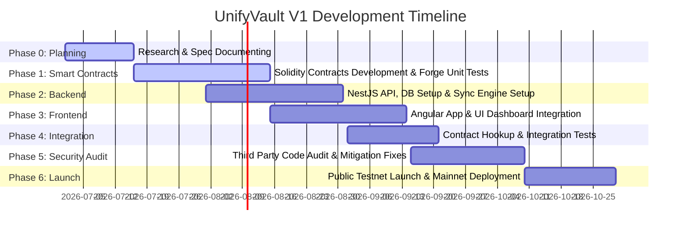

# UnifyVault Project Execution Roadmap

## Internal Development Roadmap and Deployment Plan

**Version 1.0** — _July 2026_

---

## 1. Project Vision

UnifyVault is designed to simplify digital asset investing by abstracting blockchain infrastructure, starting with the Indian market. The protocol's flagship index asset, **UVBTCETH**, provides equal exposure to Bitcoin (50%) and Ethereum (50%) in a single-transaction experience.

Execution quality is critical to our launch. Because we are managing user capital, we prioritize smart contract safety, transparent reserve metrics, and system uptime over rapid feature releases.

---

## 2. Development Philosophy

Our engineering team adheres to six core principles:

- **Documentation-First:** API specifications, system architectures, and smart contract interfaces must be fully documented and reviewed before any code is written.
- **Architecture-First:** Component configurations and module boundaries are defined early to prevent structural issues as the system grows.
- **Security-First:** The protocol is built with multiple fallback layers, strict access controls, and emergency pause circuit breakers.
- **Testing Before Launch:** We mandate automated unit, integration, and invariant tests to verify all system paths before deployment.
- **Open-Source Friendly:** All smart contracts, backend frameworks, and frontend modules are open-source to support community code auditing.
- **Audits Before Mainnet:** Mainnet deployments are blocked until the contracts have completed a formal review by an independent security firm.

---

## 3. Development Phases & Gantt Timeline

The project timeline spans nine development phases:



```
Phase 0      Phase 1      Phase 2      Phase 3      Phase 4      Phase 5      Phase 6
Specs &  ──> Solidity ──> NestJS   ──> Angular  ──> Systems  ──> Code     ──> Testnet &
Planning     Contracts    Backend      Frontend     Integrate    Auditing     Mainnet Launch
```

---

## 4. Milestone Schedule

### Milestone 0: Core Specifications (Phase 0)

- **Objectives:** Finalize project vision, technical architectures, database designs, API paths, and security playbooks.
- **Deliverables:** Completed engineering specs in the `/docs` directory.
- **Dependencies:** None.
- **Estimated Effort:** 2 Weeks.
- **Acceptance Criteria:** Code specs approved by team architects.
- **Risks:** Design oversights that require changes during development. Mitigated by thorough peer reviews.

### Milestone 1: Smart Contracts & Local Tests (Phase 1)

- **Objectives:** Implement core Solidity contracts, index routing configurations, and oracle pricing connections.
- **Deliverables:** Tested Solidity code compiling under Hardhat/Foundry.
- **Dependencies:** Milestone 0.
- **Estimated Effort:** 4 Weeks.
- **Acceptance Criteria:** 100% test coverage across core index and vault modules.

### Milestone 2: NestJS Service Gateway (Phase 2)

- **Objectives:** Set up the database, API endpoints, Redis caching, and BullMQ worker tasks.
- **Deliverables:** Running NestJS server container communicating with PostgreSQL and local Base RPC nodes.
- **Dependencies:** Milestone 1.
- **Estimated Effort:** 4 Weeks.

### Milestone 3: Angular Dashboard UI (Phase 3)

- **Objectives:** Implement layout wireframes, wallet connection integrations, charts, and portfolio tracking.
- **Deliverables:** Containerized Angular client build hosted on development servers.
- **Dependencies:** Milestone 2.
- **Estimated Effort:** 4 Weeks.

### Milestone 4: Mainnet Security Audit (Phase 4-5)

- **Objectives:** Undergo formal third-party code review and patch any discovered vulnerabilities.
- **Deliverables:** Published security audit report confirming zero high-risk findings.
- **Dependencies:** Milestone 3.
- **Estimated Effort:** 3 Weeks.

### Milestone 5: Public Launch (Phase 6)

- **Objectives:** Launch the protocol on the Base mainnet and open access to early users.
- **Dependencies:** Milestone 4.
- **Estimated Effort:** 3 Weeks.

---

## 5. Smart Contract Launch Checklist

### Pre-Implementation

- [ ] Verify that storage variable offsets are configured correctly for UUPS upgrade proxies.
- [ ] Confirm access control roles are mapped in `AccessController.sol`.

### Pre-Deployment

- [ ] Verify compiler optimization flags are enabled.
- [ ] Confirm all environment variables and administrative wallet keys are set.

### Pre-Audit

- [ ] Verify unit test coverage meets the 100% target.
- [ ] Confirm Foundry static analysis checks compile without errors.

---

## 6. Backend Checklist

- [ ] Prisma database schema migrations completed.
- [ ] API endpoints verified using Swagger documentation.
- [ ] SIWE wallet authentication logic tested.
- [ ] Price syncer worker tested with pricing oracles.
- [ ] Queue processors configured with backoff retry limits.
- [ ] Prometheus `/metrics` endpoints and health checks active.

---

## 7. Frontend Checklist

- [ ] Wallet connection integrations (Coinbase SDK / WalletConnect) verified.
- [ ] Responsive layouts tested on mobile, tablet, and desktop viewports.
- [ ] Portfolio charts verified in both light and dark modes.
- [ ] Keyboard navigation and screen reader checks completed.
- [ ] PWA manifest and caching service workers registered.

---

## 8. Testing Matrix

| Category              | Tool / Framework    | Target Coverage | Purpose                                              |
| :-------------------- | :------------------ | :-------------: | :--------------------------------------------------- |
| **Unit Tests**        | Foundry / Jest      |      100%       | Verifies individual functions and error flows.       |
| **Integration Tests** | Hardhat / NestJS    |      > 90%      | Verifies contract calls and database sync processes. |
| **Fuzz Testing**      | Forge Fuzz          |   10,000 runs   | Tests contracts with randomized inputs.              |
| **Invariant Tests**   | Forge Invariants    |    500 runs     | Verifies backing ratios and core system rules.       |
| **Fork Testing**      | Foundry (Base Fork) |       N/A       | Tests integrations with mainnet DEXs and oracles.    |

---

## 9. Security Audit Checklist

- [ ] Complete internal code review and resolve any linter issues.
- [ ] Run static code analysis checks using Slither and Mythril.
- [ ] Resolve any findings identified in the third-party audit report.
- [ ] Set up the public bug bounty program (e.g., Immunefi) to incentivize security researchers.

---

## 10. Mainnet Launch Checklist

- [ ] Initialize Gnosis Safe multisig wallets for administrative roles.
- [ ] Verify oracle heartbeat intervals and configuration settings.
- [ ] Configure automatic database backup tasks (stored in multiple cloud regions).
- [ ] Test the incident response playbook and confirm guardian pause controls.
- [ ] Publish user guides and documentation.

---

## 11. Post-Launch Tasks

- **System Monitoring:** Monitor transaction error rates and gas usage.
- **Weekly Performance Reviews:** Review server performance, database response times, and API load metrics.
- **Governance Preparation:** Plan the transition of administrative roles to community voting.

---

## 12. Future Product Roadmap

The diagram below maps planned future enhancements after the V1 mainnet release:

```
                            [Mainnet Release (V1)]
                                      │
             ┌────────────────────────┼────────────────────────┐
             ▼                        ▼                        ▼
       [UVTOP10 Index]       [Institutional APIs]      [Developer SDKs]
       Diversified basket    Bank-grade transfers      JavaScript/Python SDK
```

- **V2 Indices:** Support for additional index baskets (such as `UVTOP10` and `UVGOLD`) registered directly in the controller registry.
- **Institutional Integrations:** Custom APIs and features designed to help businesses invest large capital.
- **Partner SDKs:** Libraries to help developers build applications on top of the UnifyVault protocol.

---

## 13. Team Structure & Roles

- **CTO & Founder:** Manages product strategy, roadmap planning, and partnership integrations.
- **Protocol Architect:** Oversees smart contract design, system integration, and security reviews.
- **Solidity Engineer:** Writes smart contracts, builds local test scripts, and manages deployments.
- **Backend Engineer:** Manages the NestJS backend, database migrations, and sync worker tasks.
- **Frontend Engineer:** Develops the Angular web application and connects wallet integrations.
- **DevOps Engineer:** Manages container deployments, backup systems, and CI/CD pipelines.

---

## 14. Repository Strategy & Versioning

- **Branching Model:** Follows the GitFlow workflow. Feature branches are merged to `develop` before testing and deployment to `main`.
- **Commit Conventions:** Follows standard guidelines (e.g., `feat: add deposit validations` or `fix: resolve oracle heartbeat check`).
- **Release Versioning:** Uses Semantic Versioning (`vMAJOR.MINOR.PATCH`).
- **Pull Request Template:** Requires all pull requests to pass test validations and lint checks before review.

---

## 15. Risk Mitigation Table

| Risk Category   | Identified Risk                                          |  Impact  | Mitigation Strategy                                                     |
| :-------------- | :------------------------------------------------------- | :------: | :---------------------------------------------------------------------- |
| **Technical**   | Smart contract exploit resulting in loss of user funds.  | Critical | Independent audits, 100% test coverage, and automated circuit breakers. |
| **Business**    | Low user adoption and liquidity in early phases.         |   High   | Partner with fintech gateways to simplify the deposit process.          |
| **Regulatory**  | Regulatory changes impacting decentralized index assets. | Critical | Build compliance hooks into contracts to support future KYC/AML rules.  |
| **Operational** | Price feeds going offline or returning stale data.       |   High   | Configure fallback oracles and automate protocol pausing if feeds fail. |

---

## 16. Definition of Done (DoD)

To ensure code quality, deliverables are only marked complete when they pass the following gates:

- **Documentation:** Specifications are updated and reviewed by the technical team.
- **Smart Contracts:** Contracts compile without warnings, achieve 100% unit test coverage, and pass static analysis checks.
- **Backend:** Code passes linting rules, has unit tests, and database migrations are documented.
- **Frontend:** Design matches wireframes, code passes linting, and accessibility checks (WCAG 2.1 AA) are completed.
- **Deployment:** Container builds compile, deployment scripts run in staging environments, and monitoring metrics are active.
