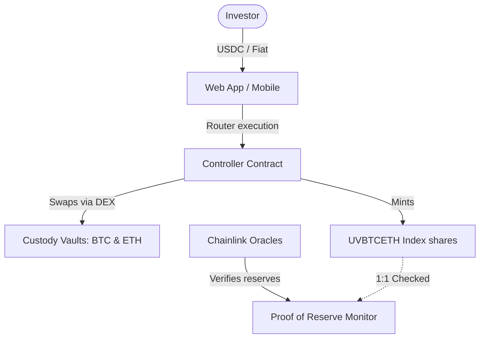

# UnifyVault: Protocol Founder Deck

## The Strategic Vision and Platform Blueprint

**Version 1.0** — _July 2026_

---

## Slide 1: Cover

# UnifyVault

### Crypto Index Infrastructure for the Next Billion Investors

> **Vision:** "Make digital asset investing as simple and transparent as a standard payment network."

---

## Slide 2: Founder Story

Digital assets have achieved global institutional adoption, yet the entry process for retail investors remains complex and confusing.

The idea for UnifyVault was born from a simple observation: **Investing in digital assets should not require technical literacy.**

For family, friends, and everyday savers, the transition from traditional finance to digital assets is filled with friction. They do not want to manage seed phrases, calculate gas limits, or navigate volatile trading pairs. They simply want a secure way to build a diversified long-term portfolio.

UnifyVault abstracts this underlying complexity. We are building a secure index wrapper that allows investors to acquire blue-chip asset exposure (50% BTC + 50% ETH) in a single transaction.

---

## Slide 3: The Problem

The current retail investment journey is fragmented and contains structural points of failure.

```
       USER JOURNEY                        FRICTION POINTS
┌─────────────────────────┐        ┌───────────────────────────────────┐
│ Fiat Onboarding         ├───────>│ Opaque P2P markets, stablecoin    │
│                         │        │ conversion slippage, complex pairs│
└─────────────────────────┘        └───────────────────────────────────┘
┌─────────────────────────┐        ┌───────────────────────────────────┐
│ Portfolio Custody       ├───────>│ Centralized exchange insolvencies │
│                         │        │ and fractional reserve operations │
└─────────────────────────┘        └───────────────────────────────────┘
┌─────────────────────────┐        ┌───────────────────────────────────┐
│ Technical Execution     ├───────>│ Gas fee math, multi-chain bridges,│
│                         │        │ and seed phrase vulnerabilities   │
└─────────────────────────┘        └───────────────────────────────────┘
```

- **USDT/Stablecoin Dependency:** Users must understand stablecoin peg risks and conversion steps before acquiring assets.
- **Centralized Custody Risk:** Centralized platforms often operate fractional reserves. Users have no way to verify that their deposits are fully backed.
- **Technical Cognitive Load:** Navigating Layer-1 gas fees, token bridges, and network configurations creates a high barrier to entry for retail investors.

---

## Slide 4: The Solution

UnifyVault simplifies the investment journey by combining index investing with on-chain Proof of Reserve.

| Feature Component    | Operation                           | Investor Benefit                                |
| :------------------- | :---------------------------------- | :---------------------------------------------- |
| **Simplified Entry** | Direct fiat/stablecoin routing.     | Simple execution in a single transaction.       |
| **Dynamic Indexing** | Mint and burn creation model.       | Eliminates market premiums and tracking errors. |
| **Proof of Reserve** | Continuous on-chain balance checks. | Verification of 1-to-1 asset backing.           |
| **Base Layer-2**     | Native L2 deployment.               | Sub-cent transaction fees and fast execution.   |

---

## Slide 5: Why Now?

We are at the intersection of three key trends:

- **Layer-2 Scalability:** Base has reduced transaction fees by up to 99% compared to Ethereum Mainnet, making micro-investing and index rebalancing cost-effective.
- **Institutional Adoption:** Spot Bitcoin and Ethereum ETFs have established these assets as mature commodities, driving retail interest.
- **Demand for Self-Custody:** Recent centralized exchange failures have increased user demand for transparent, non-custodial investment options.

---

## Slide 6: The Product Experience

UnifyVault is structured as a non-custodial index wrapper:



- **`UVBTCETH` Token:** A dynamic-supply ERC-20 token representing a 50% Bitcoin and 50% Ethereum weighted portfolio.
- **Proof of Reserve Panel:** A public interface that reconciles circulating token supply against verified vault holdings.
- **Fintech Integration APIs:** API endpoints designed to help third-party applications integrate UnifyVault features into their own services.

---

## Slide 7: Technical Stack Rationale

Our technology choices prioritize security, scalability, and ease of integration:

- **Base Network:** Inherits Ethereum's security model with fast block times and low transaction fees.
- **Solidity & OpenZeppelin:** We use audited OpenZeppelin UUPS upgradeable contract libraries to secure protocol code.
- **NestJS & Prisma:** Provides a modular backend that caches on-chain data to reduce API latency.
- **Redis & BullMQ:** Handles queue jobs (such as price syncing and backup checks) in the background.

---

## Slide 8: Sustainable Business Model

UnifyVault does not rely on speculative strategies, generating revenue solely from transparent, on-chain transaction fees:

- **Minting Fee ($0.2\%$):** Charged on token creation to cover gas costs and fund protocol development.
- **Redemption Fee ($0.3\%$):** Charged when users redeem their holdings for underlying assets.
- **Integration APIs:** Planned support for subscription-based institutional APIs and custom indexing features.

```
                    MINTING                                   REDEMPTION
           Gross Deposit (100.0%)                     Redemption Request (100.0%)
                      │                                            │
           ┌──────────┴──────────┐                      ┌──────────┴──────────┐
           ▼                     ▼                      ▼                     ▼
     Mint Fee (0.2%)      Index Asset (99.8%)     Burn Fee (0.3%)       Net Proceeds (99.7%)
   (To Fee Treasury)     (Locked in Custody)    (To Fee Treasury)      (Returned to User)
```

---

## Slide 9: Go-To-Market Strategy

Our growth plan focuses on development communities and integration partnerships:

- **Developer Integrations:** Providing open-source APIs and SDKs to help developers build investment features on top of the protocol.
- **Institutional Partners:** Partnering with neo-banks and payment gateways to simplify the deposit process for retail users.
- **Educational Content:** Publishing clear documentation and tutorials explaining the benefits of index investing.

---

## Slide 10: Competitive Positioning

UnifyVault is designed to combine the simplicity of centralized exchanges with the transparency of DeFi:

| Positioning Metric   | Centralized Exchanges | Traditional Index Funds | Speculative DeFi   | UnifyVault Protocol    |
| :------------------- | :-------------------- | :---------------------- | :----------------- | :--------------------- |
| **Custody Type**     | Custodial             | Third-party Custodian   | Non-custodial      | **Non-custodial**      |
| **Solvency Proof**   | Static / Internal     | Annual Audits           | None               | **On-Chain Real-Time** |
| **Transaction Fees** | Variable (often high) | Management fees         | High L1 Gas        | **Sub-Cent L2 Fees**   |
| **Investment Style** | Active Trading        | Delayed Settlement      | Yield speculation  | **Passive Indexing**   |
| **Ease of Access**   | High                  | Medium                  | Low (Bridge / RPC) | **High (Simple UI)**   |

---

## Slide 11: The Roadmap

The execution path spans development, security review, and mainnet launch:

```
  Phase 0      Phase 1      Phase 2      Phase 3      Phase 4      Phase 5      Phase 6
  Specs &  ──> Solidity ──> NestJS   ──> Angular  ──> Systems  ──> Code     ──> Testnet &
  Planning     Contracts    Backend      Frontend     Integrate    Auditing     Mainnet Launch
```

- **Q1-Q2 2026 (Planning & Contracts):** Finalize engineering specifications and complete core smart contract testing.
- **Q3 2026 (Backend & Frontend):** Build the NestJS API gateway, sync engine, and Angular user interface.
- **Q4 2026 (Audit & Launch):** Complete third-party security audits, deploy to testnets, and launch on Base mainnet.

---

## Slide 12: Founding Team Roles

Our team structure is designed to support development, security, and operations:

- **CTO & Founder:** Leads business strategy and product roadmap planning.
- **Protocol Architect:** Oversees smart contract design and security reviews.
- **Backend Engineer:** Manages the API gateway, database migrations, and sync tasks.
- **Frontend Engineer:** Develops the web application and connected wallet integrations.
- **DevOps Engineer:** Manages container deployments and backup systems.

---

## Slide 13: Risk Analysis and Mitigations

We identify and address potential risks before mainnet launch:

- **Smart Contract Vulnerability:** Mitigated by 100% test coverage, static analysis, and third-party audits.
- **Oracle Failure:** Mitigated by integrating secondary fallback price feeds and automated pause circuit breakers.
- **Regulatory Changes:** Mitigated by designing modular compliance hooks to support future identity registries if required.

---

## Slide 14: Vision 2035 (Aspirational Targets)

Looking ahead, we aim to build UnifyVault into a trusted digital asset indexing platform:

- **Multi-Index Registry:** Support for a variety of index products (including market-cap baskets and real-world asset indexes) managed through a unified interface.
- **Financial Gateways:** Integrations with localized payment networks to allow automated, recurring investments directly from bank accounts.
- **DAO Governance:** Transitioning protocol control to an on-chain DAO once the smart contracts are mature and stable.

_Note: These targets represent future aspirations under consideration and do not constitute binding commitments._

---

## Slide 15: Closing

> "We are not trying to build another cryptocurrency. We are building trusted digital asset infrastructure."

Our goal is to remove technical barriers and establish a transparent, secure investment gateway that enables long-term wealth preservation.

We invite you to join us in building the infrastructure for the next generation of digital asset investing.

**UnifyVault Protocol**  
_Base L2 Index Infrastructure_  
[docs.unifyvault.com](https://docs.unifyvault.com) | contact@unifyvault.com
