# UnifyVault Protocol Liquidity Strategy

## Secondary Market Structure, Liquidity Provision, and Arbitrage Engineering

**Version 1.0** — _July 2026_

---

## 1. Liquidity Philosophy

For a crypto index protocol like UnifyVault, secondary market liquidity is critical to price discovery. If secondary markets lack deep liquidity, large trades will cause price slippage, leading to price volatility.

Unlike fixed-supply assets, the fair value of the `UVBTCETH` token is determined by the Net Asset Value (NAV) of its underlying reserves.

```
  [Market Price > NAV] ──> Buy NAV (Mint)  ──> Sell on DEX  ──> Price converges to NAV
  [Market Price < NAV] ──> Buy on DEX      ──> Redeem (Burn) ──> Price converges to NAV
```

The protocol relies on arbitrageurs to align the secondary market price of `UVBTCETH` with its primary NAV. If the secondary market price drifts from NAV, arbitrageurs can capture risk-free profits by minting or burning tokens, driving the market price back into alignment.

---

## 2. Initial Liquidity Strategy

To ensure price stability at launch, the protocol allocates initial liquidity to key decentralized exchange (DEX) pools:

- **Seed Liquidity:** The Operational Treasury provides **$100,000.00** in USDC to seed the initial DEX pool.
- **Asset Matching:** The protocol mints **$100,000.00** in `UVBTCETH` tokens (backed 1-to-1 by BTC/ETH locked in the custody vault) to match the seed pool assets.
- **Lockup Periods:** Initial liquidity tokens are locked in the treasury multi-signature contract for a minimum of 6 months to prevent sudden liquidity withdrawals.

---

## 3. DEX Strategy (Base L2)

Secondary market liquidity is focused on two primary DEXs on the Base network:

- **Aerodrome (v2):** Aerodrome is Base's native liquidity hub. UnifyVault establishes a concentrated liquidity pool on Aerodrome, utilizing their gauge system to incentivize liquidity providers (LPs).
- **Uniswap (v3):** Uniswap provides concentrated liquidity pools with custom fee tiers (e.g., $0.05\%$ or $0.30\%$), helping to reduce trade slippage.

---

## 4. Trading Pairs Trade-Offs

The protocol evaluates two primary trading pairs for the index token:

| Trading Pair          | Advantages                                                                  | Disadvantages                                                                                                 |  Selection Status  |
| :-------------------- | :-------------------------------------------------------------------------- | :------------------------------------------------------------------------------------------------------------ | :----------------: |
| **`UVBTCETH` / USDC** | Stable denomination; low price volatility; simple for retail users.         | Divergent price movements between the stablecoin and volatile index assets require frequent pool adjustments. |  **Primary Pair**  |
| **`UVBTCETH` / ETH**  | Correlated price movements reduce impermanent loss for liquidity providers. | Exposes users to ETH price movements during swaps.                                                            | **Secondary Pair** |

---

## 5. NAV vs. Market Price Arbitrage Mechanics

The flowcharts below illustrate the arbitrage loops that align the secondary market price with the Net Asset Value (NAV):

```mermaid
graph TD
    subgraph Premium Arbitrage Scenario
        A1[1. Market Price of UVBTCETH > NAV] --> A2[2. Deposit USD to UnifyVault at NAV]
        A2 --> A3[3. Mint UVBTCETH at NAV]
        A3 --> A4[4. Sell UVBTCETH on DEX at Market Price]
        A4 --> A5[5. Pocket profit & drive price down to NAV]
    end

    subgraph Discount Arbitrage Scenario
        B1[1. Market Price of UVBTCETH < NAV] --> B2[2. Buy UVBTCETH on DEX at Discount]
        B2 --> B3[3. Redeem UVBTCETH on UnifyVault at NAV]
        B3 --> B4[4. Burn UVBTCETH and receive USD]
        B4 --> B5[5. Pocket profit & drive price up to NAV]
    end
```



### 5.1. Maximum Price Drift Thresholds

Because the protocol charges a $0.20\%$ mint fee and a $0.30\%$ burn fee, the natural arbitrage band is **$0.50\%$**. If the secondary market price drifts beyond this $0.50\%$ threshold, arbitrage transactions become profitable, driving the price back to parity.

---

## 6. Market Making & LP Incentives

- **Concentrated Liquidity Positions:** The protocol manages concentrated liquidity positions in Uniswap v3 pools, focusing liquidity within a $\pm2\%$ range around the current NAV to reduce slippage for standard trades.
- **Liquidity Gauge Incentives:** The protocol can direct a portion of collected mint and burn fees to fund Aerodrome gauges, encouraging community LPs to provide liquidity.

---

## 7. Liquidity Risk Management

The protocol identifies and plans for secondary market liquidity risks:

| Identified Risk                   | Impact | Risk Mitigation Strategy                                                                              |
| :-------------------------------- | :----- | :---------------------------------------------------------------------------------------------------- |
| **High Slippage on Large Trades** | Medium | Route large trades directly through the primary mint/burn contracts, avoiding secondary DEX slippage. |
| **Impermanent Loss for LPs**      | High   | Encourage LPs to use the correlated `UVBTCETH` / ETH pool to reduce price divergence risks.           |
| **MEV Sandwich Attacks**          | Medium | Configure slip protections on the frontend and advise users to verify slippage limits.                |

---

## 8. Treasury Liquidity Provision Rules

If market liquidity drops, the Operational Treasury can provide liquidity to the pools under the following guidelines:

- **AUM Cap:** A maximum of 10% of operational treasury funds can be allocated to DEX pools.
- **Direction Limits:** Treasury assets can only be added to pools that track key trading pairs (USDC and ETH).
- **Governance Approvals:** Allocations exceeding $50,000.00$ require approval from the core governance multisig.

---

## 9. Real-Time Liquidity Monitoring

The administrative dashboard monitors key liquidity metrics:

- **DEX Pool Depth:** Monitors the total value locked (TVL) in Uniswap and Aerodrome pools.
- **Price Deviation (Premium/Discount):** Tracks the difference between the secondary market price and the primary on-chain NAV.
- **Imbalance Flags:** Triggers alerts if pool balances diverge by more than 70/30, indicating a potential market imbalance.

---

## 10. Emergency Liquidity Runbooks

### Runbook: DEX Pool Exploit

1.  **Detection:** The monitoring system flags an exploit or anomaly in a connected DEX pool.
2.  **Pause:** The Guardian wallet triggers an emergency pause on the `UnifyVaultController`, suspending mint and burn transactions.
3.  **Liquidity Safety:** The treasury multisig withdraws protocol-owned liquidity from the affected DEX pool.
4.  **Verification:** The team audits the state of the pool, applies any necessary contract patches, and redeploys the contracts before unpausing operations.

---

## 11. Future Liquidity Horizons

- **Cross-Chain Pools:** Planned support for bridging `UVBTCETH` to Ethereum L1 or Arbitrum, establishing local liquidity pools to support cross-chain users.
- **Institutional Custody Pools:** Support for institutional OTC desks to facilitate high-volume mint and burn transactions off-chain.
