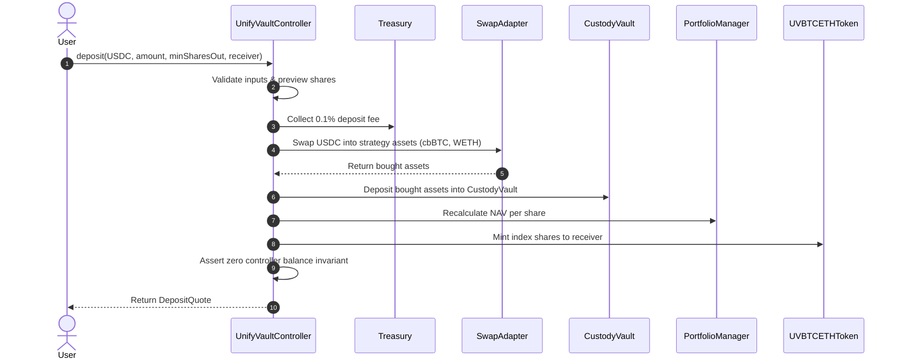
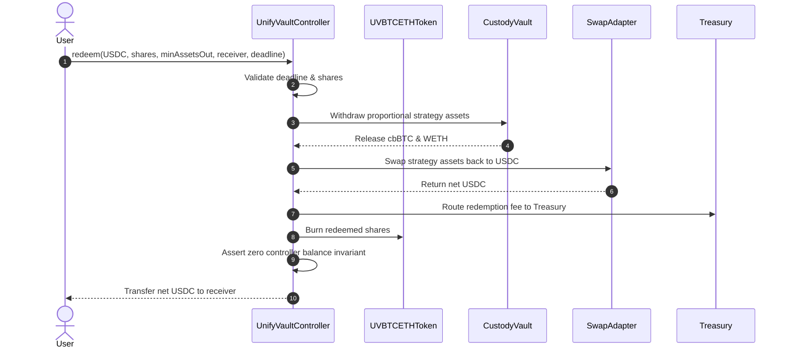
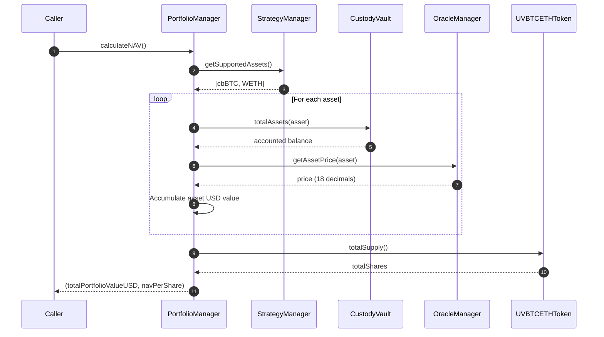
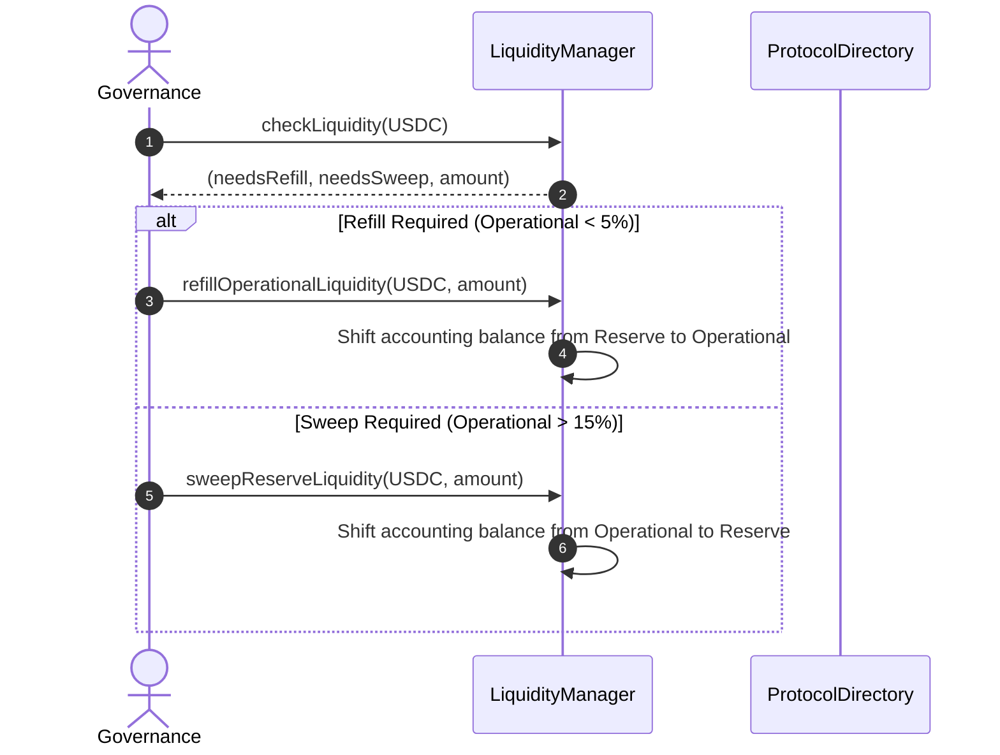

# UnifyVault V2 Architecture

## Overview

UnifyVault V2 is a modular, multi-asset crypto index vault protocol operating on EVM networks (e.g. Base Mainnet). It enables users to deposit collateral (such as USDC) to acquire single-token index shares (`UVBTCETHToken`), representing proportional, fully backed ownership of a dynamic portfolio of underlying crypto strategy assets (e.g., cbBTC and WETH).

The system enforces strict separation of concerns across dedicated modules for registry discovery, parameter governance, price feeds, custody, treasury fee collection, swap routing, liquidity management, and share minting.

---

## Module Responsibilities

```
                               ┌──────────────────────┐
                               │  ProtocolDirectory   │
                               └──────────┬───────────┘
                                          │
    ┌───────────────────┬─────────────────┼───────────────────┬───────────────────┐
    │                   │                 │                   │                   │
    ▼                   ▼                 ▼                   ▼                   ▼
┌──────────────┐ ┌──────────────┐ ┌──────────────┐ ┌──────────────┐ ┌──────────────┐
│  Controller  │ │CustodyVault  │ │ LiquidityMgr │ │   Treasury   │ │OracleManager │
└───────┬──────┘ └──────────────┘ └──────────────┘ └──────────────┘ └──────────────┘
        │
        ├─────────────────────────┐
        ▼                         ▼
┌──────────────┐         ┌──────────────┐
│ PortfolioMgr │         │ SwapAdapter  │
└───────┬──────┘         └──────────────┘
        │
        ▼
┌──────────────┐
│ StrategyMgr  │
└──────────────┘
```

1. **`ProtocolDirectory`**: Central registry contract serving as the single source of truth for module address discovery (`DEPOSIT_MANAGER`, `VAULT`, `TREASURY`, `ORACLE`, `TOKEN`, `PORTFOLIO_MANAGER`, `STRATEGY_MANAGER`, `SWAP_ADAPTER`, `LIQUIDITY_MANAGER`).
2. **`UnifyVaultController`**: The primary user-facing entry point. Orchestrates deposit and redemption workflows, enforces slippage protection, collects protocol fees, and asserts zero residual balance invariants.
3. **`CustodyVault`**: Passive storage vault managing physical ERC20 custody balances and accounted balances for all strategy assets.
4. **`LiquidityManager`**: Manages operational (default 10% target, 5% refill) and reserve (default 15% sweep) liquidity accounting without transferring funds automatically.
5. **`Treasury`**: Safeguards protocol-owned fee revenue separate from vault collateral.
6. **`PortfolioManager`**: Calculates total portfolio valuation in USD (18 decimals) and Net Asset Value (NAV) per share.
7. **`StrategyManager`**: Governs target asset weights in basis points (enforcing total allocation = 10,000 BPS).
8. **`SwapAdapter`**: Executes atomic DEX swaps (e.g. via Uniswap V3 Router) with zero token retention.
9. **`OracleManager`**: Aggregates price feeds (Chainlink / Mock oracles) with stale price and heartbeat enforcement.
10. **`UVBTCETHToken`**: ERC20 token representing index vault shares.

---

## Call Flow Diagrams

### 1. Deposit Flow



### 2. Redeem Flow



### 3. NAV Calculation Flow



### 4. Liquidity Management Flow



---

## Storage Ownership & Trust Boundaries

| Contract            | Storage Scope                      | Access Roles Enforced                |
| :------------------ | :--------------------------------- | :----------------------------------- |
| `ProtocolDirectory` | Registry mappings                  | `GOVERNANCE_ROLE`                    |
| `CustodyVault`      | Accounted & surplus balances       | `CONTROLLER_ROLE`, `GOVERNANCE_ROLE` |
| `Treasury`          | Protocol fee balances              | `CONTROLLER_ROLE`, `GOVERNANCE_ROLE` |
| `LiquidityManager`  | Operational & reserve accounting   | `CONTROLLER_ROLE`, `GOVERNANCE_ROLE` |
| `StrategyManager`   | Target weights (10,000 BPS)        | `GOVERNANCE_ROLE`                    |
| `OracleManager`     | Oracle configurations & heartbeats | `GOVERNANCE_ROLE`                    |
| `UVBTCETHToken`     | ERC20 mint/burn & pause states     | `CONTROLLER_ROLE`, `GOVERNANCE_ROLE` |
