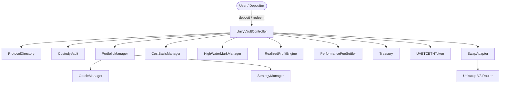

# UnifyVault v2.2.0 — Architecture & Module Specifications

## 1. System Overview

UnifyVault v2.2.0 is a non-custodial, multi-asset crypto index vault protocol designed for Ethereum Virtual Machine (EVM) compatible networks (primarily Base Mainnet). The architecture separates collateral custody, portfolio management, trade execution, performance fee settlement, and protocol access control into decoupled, modular smart contracts registered in a central directory.

---

## 2. Component Hierarchy

```mermaid
graph TD
    User([User / Depositor]) -->|deposit / redeem| Controller[UnifyVaultController]
    Controller --> Directory[ProtocolDirectory]
    Controller --> Custody[CustodyVault]
    Controller --> PM[PortfolioManager]
    Controller --> CBM[CostBasisManager]
    Controller --> HWMM[HighWaterMarkManager]
    Controller --> RPE[RealizedProfitEngine]
    Controller --> PFS[PerformanceFeeSettler]
    Controller --> Treasury[Treasury]
    Controller --> Token[UVBTCETHToken]

    PM --> Oracle[OracleManager]
    PM --> Strategy[StrategyManager]
    Controller --> Swap[SwapAdapter]
    Swap --> DEX[Uniswap V3 Router]
```

---

## 3. Module Inventory & Responsibilities

| Contract Name           | Directory Constant        | Role / Responsibility                                                                                                    |
| :---------------------- | :------------------------ | :----------------------------------------------------------------------------------------------------------------------- |
| `ProtocolDirectory`     | N/A                       | Central registry mapping module IDs to active contract addresses with access-controlled updates.                         |
| `UnifyVaultController`  | `DEPOSIT_MANAGER`         | Main entry point orchestrating deposit, redemption, fee deductions, DEX swaps, and zero residual balance assertions.     |
| `CustodyVault`          | `VAULT`                   | Passive physical asset store holding ERC20 collateral and strategy tokens with controlled deposit/withdraw capabilities. |
| `PortfolioManager`      | `PORTFOLIO_MANAGER`       | Valuation engine computing total Net Asset Value (NAV) and share exchange rates across strategy allocations.             |
| `StrategyManager`       | `STRATEGY_MANAGER`        | Enforces target portfolio allocation weights (10,000 BPS scale) across configured assets.                                |
| `OracleManager`         | `ORACLE`                  | Price feed aggregator validating staleness, heartbeat bounds, and chainlink round freshness.                             |
| `CostBasisManager`      | `COST_BASIS_MANAGER`      | Tracks user weighted average cost basis and active share balances across deposits and redemptions.                       |
| `HighWaterMarkManager`  | `HIGH_WATER_MARK_MANAGER` | Tracks per-user peak NAV cost basis to ensure performance fees are evaluated against net un-assessed gains.              |
| `RealizedProfitEngine`  | `REALIZED_PROFIT_ENGINE`  | Pure mathematical logic contract computing realized profit and chargeable profit during redemptions.                     |
| `PerformanceFeeSettler` | `PERFORMANCE_FEE_SETTLER` | Handles execution and routing of performance fees to Treasury during redemptions.                                        |
| `Treasury`              | `TREASURY`                | Secure store receiving protocol management and performance fees.                                                         |
| `UVBTCETHToken`         | `TOKEN`                   | Mintable/burnable ERC20 token representing proportional ownership of the vault.                                          |
