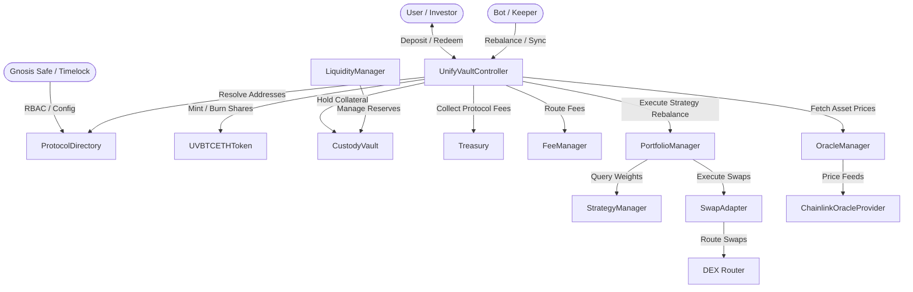
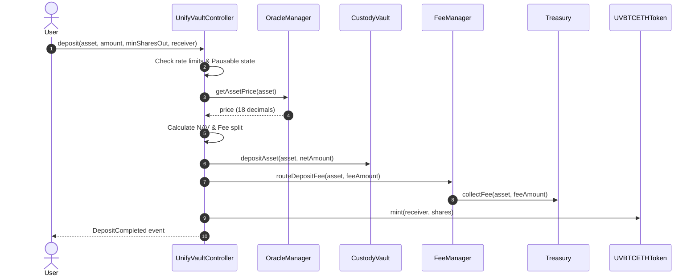
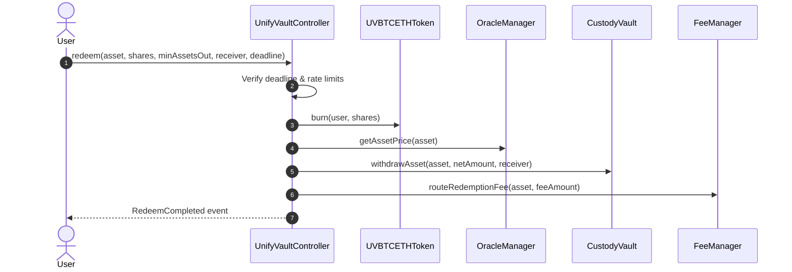

# UnifyVault Protocol Architecture

This document provides a technical specification of the UnifyVault V2 system architecture, component relationships, module responsibilities, storage models, and contract interactions.

---

## 1. System Overview

UnifyVault V2 is structured as a modular, registry-based protocol. Instead of hardcoding contract references, core components resolve sibling module addresses dynamically through `ProtocolDirectory`.

---

## 2. Component Responsibilities

### 2.1 Core Orchestration Layer
- **`UnifyVaultController`**: The main entrypoint for user deposits, share minting, share redemption, rate limit enforcement, and portfolio rebalance triggers. Coordinates interactions across all protocol modules.
- **`ProtocolDirectory`**: Canonical address registry mapping `bytes32` module IDs (e.g. `ModuleIds.VAULT`, `ModuleIds.ORACLE`) to deployed contract addresses. Supports one-way emergency freeze.

### 2.2 Asset & Token Custody Layer
- **`CustodyVault`**: Secure balance holder for underlying collateral assets. Implements donation-immunity by tracking internal accounting balances separately from `IERC20.balanceOf(address(this))`.
- **`UVBTCETHToken`**: ERC20 token contract representing shares in the vault. Minting and burning privileges are restricted exclusively to `CONTROLLER_ROLE`.
- **`Treasury`**: On-chain vault storing protocol performance and deposit fees.
- **`FeeManager`**: Calculates deposit and redemption fees, splits fees between protocol treasury and liquidity providers, and executes transfers.

### 2.3 Oracle & Pricing Layer
- **`OracleManager`**: Primary pricing engine. Validates price freshness against configured heartbeat windows, computes normalized asset valuations, and provides fallback oracle routing.
- **`ChainlinkOracleProvider`**: Adaptor querying Chainlink `AggregatorV3Interface` feeds with strict staleness and negative price checks.
- **`MockOracleProvider`**: Backup/mock pricing provider for local testing and controlled fallback pricing.

### 2.4 Portfolio & Strategy Layer
- **`StrategyManager`**: Configures target asset allocations (basis points, total 10000 BPS) and asset whitelists.
- **`PortfolioManager`**: Computes current portfolio Net Asset Value (NAV), determines asset allocation drift, and executes rebalancing orders through `SwapAdapter`.
- **`SwapAdapter`**: Middleware wrapping external DEX routers (e.g. Uniswap V3 router) to execute token swaps with strict slippage limits (`swapSlippageBps`).
- **`LiquidityManager`**: Monitors vault liquidity reserves against min/max thresholds, sweeping excess funds to strategies or refilling vault reserves.

### 2.5 Governance & Access Layer
- **`UnifyVaultTimelock`**: OpenZeppelin `TimelockController` derivative enforcing a mandatory 48-hour execution delay on administrative and governance transactions.

---

## 3. Data Flow & Contract Interactions

### 3.1 Deposit Lifecycle

### 3.2 Redemption Lifecycle

---

## 4. Storage Architecture & Invariants

### 4.1 Storage Separation
- **`ProtocolStorage`**: Shared library defining layout structures for multi-asset accounting.
- **`CustodyVault` Storage**: Uses `mapping(address => uint256) private _internalBalances` to prevent balance manipulation via raw ERC20 transfers (donation-attack immunity). Surplus balances are tracked via `surplusAssets(asset)`.

### 4.2 Core Invariants
1. **Share Pricing Non-Zero**: Vault NAV cannot be diluted to zero while total share supply exceeds zero.
2. **First Deposit Burning**: Initial deposit burns `DEAD_SHARES` (`1000` wei) to anchor share pricing.
3. **Role Isolation**: Only `CONTROLLER_ROLE` can invoke `mint()` or `burn()` on `UVBTCETHToken` and `withdrawAsset()` on `CustodyVault`.
4. **Registry Immutability**: Once `ProtocolDirectory.freeze()` is executed by `GOVERNANCE_ROLE`, address entries cannot be altered or removed.
