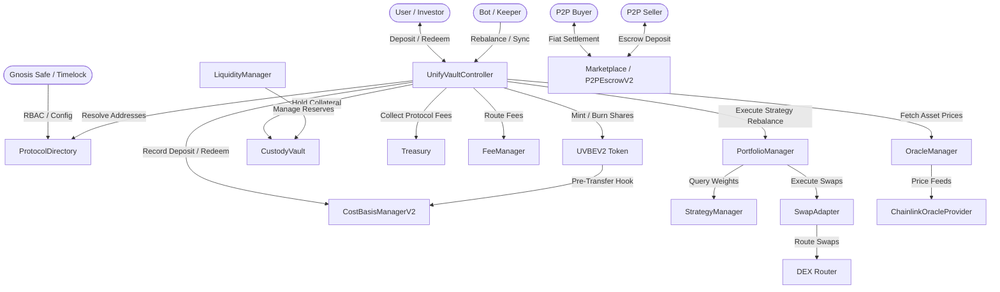
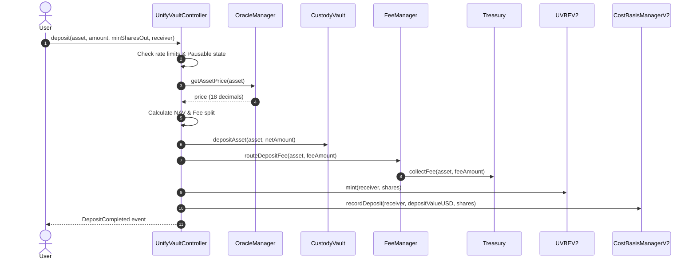
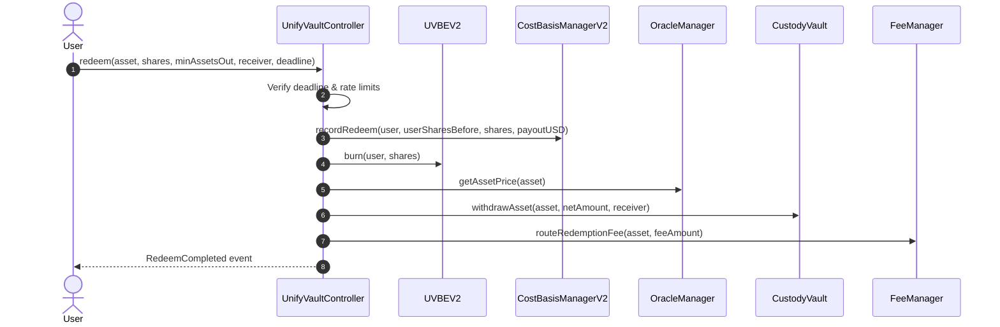
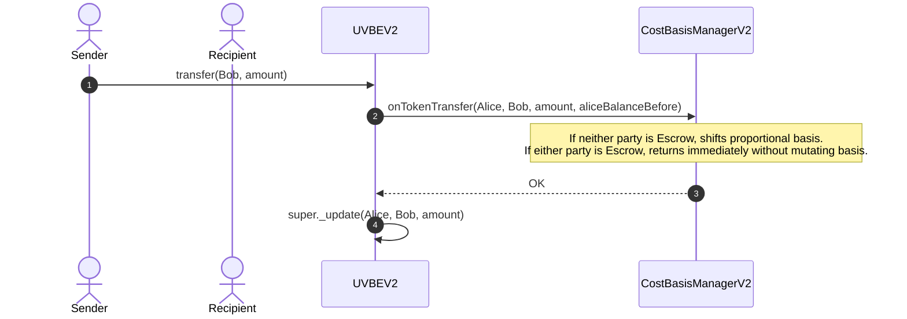

# UnifyVault Protocol Architecture

This document provides a technical specification of the UnifyVault V2 system architecture, component relationships, module responsibilities, storage models, and contract interactions.

---

## 1. System Overview

UnifyVault V2 is structured as a modular, registry-based protocol. Core components resolve sibling module addresses dynamically through `ProtocolDirectory`.

---

## 2. Component Responsibilities

### 2.1 Core Orchestration Layer

- **`UnifyVaultControllerUpgradeable` (ERC-1967 Proxy)**: The upgrade-safe UUPS orchestrator for user deposits, share minting, share redemption, rate limit enforcement, and portfolio rebalances. Resolves sibling modules via `ProtocolDirectory`.
- **`ProtocolDirectory`**: Canonical address registry mapping `bytes32` module IDs (e.g. `ModuleIds.VAULT`, `ModuleIds.ORACLE`, `ModuleIds.COST_BASIS_MANAGER`, `ModuleIds.P2P_ESCROW`, `ModuleIds.STAKING_MLM`) to deployed contract addresses. Supports one-way emergency freeze.

### 2.2 Asset & Token Custody Layer

- **`CustodyVault`**: Secure balance holder for underlying collateral assets (`cbBTC`, `WETH`, `USDC`). Implements donation-immunity by tracking internal accounting balances separately from `IERC20.balanceOf(address(this))`.
- **`UVBEV2` (`UVBEToken`)**: ERC20 token contract representing shares in the vault. Enforces locked pre-transfer cost basis hooks via `CostBasisManagerV2` before executing `super._update()`.
- **`Treasury`**: On-chain vault storing protocol performance, deposit, and P2P escrow fees.
- **`FeeManager`**: Calculates deposit and redemption fees, routing protocol fees to Treasury.

### 2.3 On-Chain Cost Basis & Performance Layer

- **`CostBasisManagerV2`**: Tracks user investment cost basis, average entry prices, realized P&L, and unrealized returns. Conserves total basis on transfers and explicitly ignores P2P Escrow and Staking transfers (`_isEscrow` guard).
- **`PerformanceManager`**: Computes portfolio benchmark tracking, high-water marks, and historical returns.

### 2.4 Oracle & Pricing Layer

- **`OracleManager`**: Primary pricing engine. Aggregates prices from primary (`ChainlinkOracleProvider`) and fallback sources, enforcing heartbeat windows, deviation circuit breakers, and explicit status classification (`LIVE`, `STALE`, `REVERTED`, `UNAVAILABLE`).
- **`ChainlinkOracleProvider`**: Adaptor querying Chainlink `AggregatorV3Interface` feeds with strict staleness and negative price checks.

### 2.5 Portfolio & Strategy Layer

- **`StrategyManager`**: Configures target asset allocations (basis points, total 10000 BPS) and asset whitelists.
- **`PortfolioManager`**: Computes portfolio Net Asset Value (NAV), evaluates allocation drift, calculates UVBE token price, and executes rebalancing orders through `SwapAdapter`.
- **`SwapAdapter`**: Middleware wrapping external DEX routers to execute token swaps with strict slippage limits (`swapSlippageBps`).
- **`LiquidityManager`**: Monitors vault liquidity reserves against min/max thresholds, sweeping excess funds or refilling reserves.

### 2.6 P2P Settlement & Marketplace Layer

- **`P2PEscrowV2`**: Non-custodial escrow clearinghouse for peer-to-peer crypto-fiat settlement. Handles trade funding, cryptographic payment verification (`paymentReference` / `evidenceHash`), release, timeouts, and multi-sig arbitration.
- **`Marketplace`**: Limit orderbook matching engine supporting partial order fills, resting order execution pricing, and automatic creation of linked `P2PEscrow` trade instances.

### 2.7 Account Abstraction & Gasless Layer (ERC-4337)

- **`GasTreasury` / Self-Managed Paymaster**: Provides zero-gas sponsorship for approved operations on Base Sepolia.
- **`PaymasterPolicy`**: Validates UserOperations with strict whitelisting for 1-click batched deposits (`[USDC.approve, Controller.deposit]`), batched P2P funding (`[UVBE.approve, P2PEscrow.fundTrade]`), and staking. Rejects arbitrary calls and unauthorized ETH transfers.

### 2.8 Independent UVBE Staking & MLM Layer (Phase 0 Architecture Boundary)

- **`UVBEStakingMLM`**: Independent staking vault built on already-minted UVBE tokens.
- **Core Isolation Invariants**:
  - Operates strictly as a consumer of already-minted UVBE ERC-20 tokens.
  - Zero coupling with `CustodyVault`, collateral assets, or vault mint/burn mechanisms.
  - Total `UVBE.totalSupply()` is invariant $\implies$ **Vault NAV per share is 100% unaffected**.
  - Maintains separate on-chain ledgers for direct referral commissions, generation income, rank qualifications, and reward pool distributions.

### 2.10 Flash 30s Rapid Binary Prediction Market Layer (Off-Chain Pyth Oracle & Gasless Micro-Vault)

- **Architecture Invariants**:
  - Operates as a fast-paced game layer with zero rehypothecation of `CustodyVault` collateral.
  - Interacts with live Pyth/Chainlink sub-second oracle feeds to evaluate 30-second rapid market strikes.
  - Features dedicated **Gasless Game Vault** for 1-tap rapid betting without repeated wallet popups.
  - Implements **Parimutuel Pool Odds** with dynamic user-customizable reward multipliers (2x to 20x).

### 2.11 Governance & Access Layer

- **`UnifyVaultTimelock`**: OpenZeppelin `TimelockController` derivative enforcing a mandatory 48-hour execution delay on administrative and governance transactions.

---

## 3. Data Flow & Contract Interactions

### 3.1 Deposit Lifecycle

### 3.2 Redemption Lifecycle

### 3.3 Peer-to-Peer Transfer & Cost Basis Hook

---

## 4. Economic & Accounting Isolation of P2P Escrow

UnifyVault P2P is engineered as an **isolated secondary OTC clearinghouse**:

1. **Zero Collateral Exposure**: P2P Escrow holds only seller-deposited circulating tokens; it has zero access to `CustodyVault` reserves.
2. **Zero Supply Inflation**: P2P trades transfer circulating tokens (`transferFrom` / `transfer`); `mint()` and `burn()` are never invoked.
3. **Zero Price Distortion**: `PortfolioManager.calculateUVPrice()` derives token share pricing strictly from `CustodyVault` backing reserves divided by total supply, completely unaffected by P2P transactions.
4. **Zero Cost Basis Contamination**: `CostBasisManagerV2` ignores all transfers involving registered escrow contracts, ensuring off-chain fiat trades do not alter on-chain portfolio cost basis or P&L.

---

## 5. Storage Architecture & Invariants

### 5.1 Storage Separation

- **`CustodyVault`**: Internal balances (`_internalBalances[asset]`) are strictly isolated from untracked balances (`surplusAssets`), preventing donation inflation attacks.
- **`CostBasisManagerV2`**: Maintains independent cost basis and realized P&L mappings for all vault participants.

### 5.2 Core Invariants

1. **Share Pricing Non-Zero**: Vault NAV cannot be diluted to zero while total share supply exceeds zero.
2. **First Deposit Burning**: Initial deposit burns `DEAD_SHARES` (`1000` wei) to anchor share pricing.
3. **Basis Conservation**: Ordinary transfers conserve total cost basis across accounts (`basis(Alice) + basis(Bob) == totalBasisBefore`).
4. **Escrow Neutrality**: Escrow deposits, releases, and refunds execute with zero mutation to investment cost basis.
5. **Registry Immutability**: Once `ProtocolDirectory.freeze()` is executed by `GOVERNANCE_ROLE`, address entries cannot be altered.
