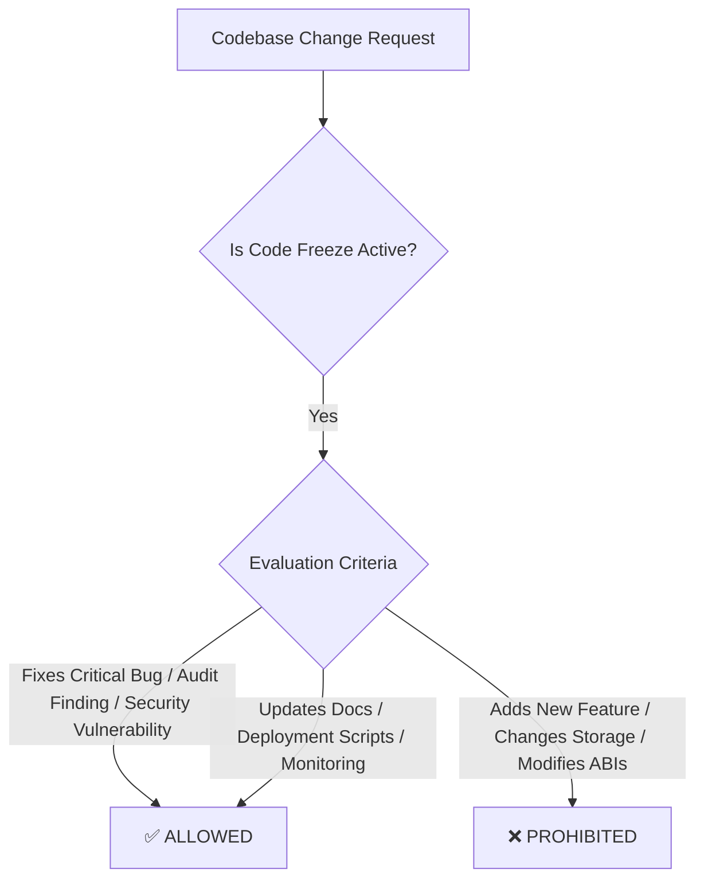

# UnifyVault V2 — Code Freeze Policy

> **Effective Date**: July 27, 2026  
> **Status**: Active (Pre-Mainnet Phase)  
> **Target Release**: UnifyVault V2 — Base Mainnet (Chain ID 8453)

---

## 1. Objective & Philosophy

The **Code Freeze** policy establishes strict constraints on changes to the UnifyVault V2 codebase leading up to the Base Mainnet deployment.

The primary objective is to **minimize operational and smart contract risk**, maintain the validity of security audits, and prevent unexpected side effects or regressions prior to deployment on Base Mainnet.

---

## 2. Allowed vs. Prohibited Scope

### ✅ Allowed Changes (Permitted Scope)

Only changes that fall strictly into the following categories will be merged during the Code Freeze period:

1. **Security Fixes**: Fixes for vulnerabilities identified via internal reviews or static analysis.
2. **Audit Remediation**: Direct resolution of audit findings from third-party smart contract auditors.
3. **Documentation Updates**: Improvements to user documentation, runbooks, specifications, and inline NatSpec comments.
4. **Deployment & Migration Scripts**: Updates to deployment routines, Hardhat/Foundry scripts, and Safe migration tooling.
5. **Monitoring & Alerting Improvements**: Enhancements to indexers, price keepers, PM2 configs, or monitoring dashboards.
6. **CI/CD & Pipeline Fixes**: Infrastructure-level updates to continuous integration scripts or test environment configs.

---

### ❌ Prohibited Changes (Strictly Forbidden)

The following modifications are **STRICTLY PROHIBITED** during Code Freeze. Any PR attempting these will be immediately rejected:

1. **New Smart Contract Features**: Adding new methods, logic branches, or feature extensions to smart contracts.
2. **Storage Layout Changes**: Modifying state variable declarations, order, or types in upgradeable or existing contracts.
3. **ABI / Interface Changes**: Altering function signatures, events, or interface structures.
4. **New Privileged Roles / Functions**: Adding new admin functions, governance endpoints, or role permissions.
5. **New External Dependencies**: Introducing new protocol dependencies, third-party libraries, or external contract integrations.
6. **Tokenomics or Parameter Alterations**: Changing core fee tiers, split ratios, or vault accounting formulas unless explicitly requested by audit.

---

## 3. Exception & Waiver Process

If a critical emergency requirement arises that necessitates an exception to this policy:

1. **Formal Proposal**: A detailed explanation of why the change is essential must be submitted to the Governance Team.
2. **Impact Assessment**: Security and lead developers must perform a full delta analysis and storage check.
3. **Unanimous Approval**: All 3-of-5 Governance Safe signers must approve the exception before merging.
