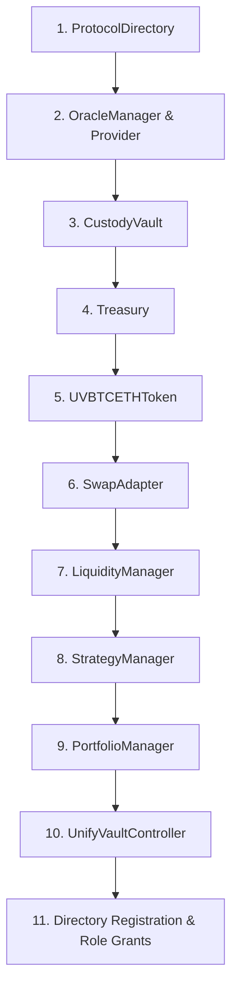

# UnifyVault V2 Deployment & Configuration Guide

## Overview

This guide details the deployment sequence, constructor configurations, contract linkages, role assignments, and verification steps for UnifyVault V2 (as implemented in `script/Deploy.s.sol`).

---

## Deployment Sequence



### Order of Contract Instantiation

1. **`ProtocolDirectory`**: Central module directory registry.
2. **`OracleManager` & `ChainlinkOracleProvider`**: Oracle feed aggregator & price providers.
3. **`CustodyVault`**: Asset custody contract.
4. **`Treasury`**: Protocol fee storage contract.
5. **`UVBTCETHToken`**: Vault index token.
6. **`SwapAdapter`**: DEX router interface (`governance`, `uniswapRouterAddress`).
7. **`LiquidityManager`**: Liquidity manager (`governance`, `directoryAddress`).
8. **`StrategyManager`**: Allocation strategy (`governance`, `initialAssets`, `initialWeightsBps`).
9. **`PortfolioManager`**: NAV calculation engine (`governance`, `directoryAddress`, `strategyManager`, `oracleManager`, `vault`, `token`).
10. **`UnifyVaultController`**: Entry controller (`directoryAddress`, `oracleManager`, `vault`, `treasury`, `token`).

---

## Directory Registration & Role Assignments

### 1. Module Registration

Register all module addresses in `ProtocolDirectory`:

- `ModuleIds.TREASURY` -> `Treasury` address
- `ModuleIds.VAULT` -> `CustodyVault` address
- `ModuleIds.LIQUIDITY_MANAGER` -> `LiquidityManager` address
- `ModuleIds.DEPOSIT_MANAGER` -> `UnifyVaultController` address
- `ModuleIds.ORACLE` -> `OracleManager` address
- `ModuleIds.TOKEN` -> `UVBTCETHToken` address
- `ModuleIds.STRATEGY_MANAGER` -> `StrategyManager` address
- `ModuleIds.PORTFOLIO_MANAGER` -> `PortfolioManager` address
- `ModuleIds.SWAP_ADAPTER` -> `SwapAdapter` address

### 2. Role Grants

- `CustodyVault.grantRole(CONTROLLER_ROLE, Controller)`
- `Treasury.grantRole(CONTROLLER_ROLE, Controller)`
- `UVBTCETHToken.grantRole(CONTROLLER_ROLE, Controller)`
- `LiquidityManager.grantRole(CONTROLLER_ROLE, Controller)`
- `LiquidityManager.syncModules()`

---

## Post-Deployment Verification Commands

Run Foundry deployment verification:

```bash
forge script script/Deploy.s.sol:DeployScript --rpc-url <RPC_URL> --broadcast --verify
```

Verify contract state:

- Check `ProtocolDirectory.getAddress(ModuleIds.DEPOSIT_MANAGER) == ControllerAddress`
- Check `StrategyManager.getTotalAllocationBps() == 10000`
- Check `CustodyVault.hasRole(CONTROLLER_ROLE, ControllerAddress) == true`
