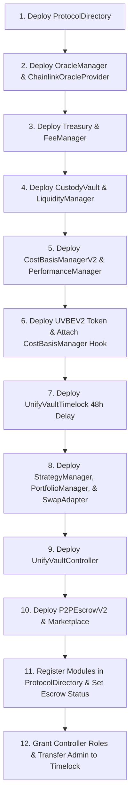

# Deployment Guide & Verification

This document specifies the deployment sequence, environment variables, deployment scripts, supported networks, verification processes, and post-deployment validation steps for UnifyVault V2.

---

## 1. Supported Networks

| Network Name     | Chain ID | RPC URL Environment Variable | Block Explorer               |
| :--------------- | :------- | :--------------------------- | :--------------------------- |
| **Base Mainnet** | `8453`   | `BASE_MAINNET_RPC_URL`       | https://basescan.org         |
| **Base Sepolia** | `84532`  | `BASE_SEPOLIA_RPC_URL`       | https://sepolia.basescan.org |

---

## 2. Deployment Prerequisites & Environment Variables

The following environment variables must be exported prior to running deployment scripts:

```env
# RPC Node Endpoints
BASE_SEPOLIA_RPC_URL=https://sepolia.base.org
BASE_MAINNET_RPC_URL=https://mainnet.base.org

# Deployer & Admin Accounts
PRIVATE_KEY=0x... # Deployer private key
NEXT_PUBLIC_ADMIN_ADDRESS=0xd905920c91853039060246Ed5724AA72B91a96DA
GNOSIS_SAFE_ADDRESS=0x1111111111111111111111111111111111111111 # Multi-sig proposal manager for Timelock

# Etherscan / Basescan Verification API Key
BASESCAN_API_KEY=your_basescan_api_key
```

---

## 3. Mandatory Deployment Sequence



---

## 4. Deployment Scripts

Primary deployment scripts are located in `packages/protocol/script/`:

- **`DeployV2Production.s.sol`**: Complete V2 production deployment including `CostBasisManagerV2`, `UVBEV2`, `P2PEscrowV2`, and `Marketplace`.
- **`DeployMainnet.s.sol`**: Production deployment script for Base Mainnet utilizing real Chainlink oracle feeds and DEX routers.
- **`ReconcileBaseSepoliaState.s.sol`**: State reconciliation and configuration script for Base Sepolia testnet.
- **`mainnet/GrantAdminRoles.s.sol`**: Assigns `GOVERNANCE_ROLE` and `DEFAULT_ADMIN_ROLE` to `UnifyVaultTimelock`.
- **`mainnet/RenounceOldAdmin.s.sol`**: Revokes deployer permissions after governance transfer.

---

## 5. Execution Commands

### 5.1 Local Simulation (No On-Chain State Change)

```bash
cd packages/protocol
forge script script/DeployV2Production.s.sol:DeployV2ProductionScript
```

### 5.2 Testnet Deployment (Base Sepolia)

```bash
cd packages/protocol
forge script script/DeployV2Production.s.sol:DeployV2ProductionScript \
  --rpc-url $BASE_SEPOLIA_RPC_URL \
  --private-key $PRIVATE_KEY \
  --broadcast \
  --verify \
  --etherscan-api-key $BASESCAN_API_KEY
```

### 5.3 Production Mainnet Deployment (Base Mainnet)

```bash
cd packages/protocol
forge script script/DeployMainnet.s.sol:DeployMainnetScript \
  --rpc-url $BASE_MAINNET_RPC_URL \
  --private-key $PRIVATE_KEY \
  --broadcast \
  --verify \
  --etherscan-api-key $BASESCAN_API_KEY
```

---

## 6. Canonical Deployment Addresses (Base Sepolia Testnet - Chain ID 84532)

| Contract Module             | Canonical Address                            |
| :-------------------------- | :------------------------------------------- |
| **ProtocolDirectory**       | `0x8040006d6907a84911aaC0a9aC08278311B156e2` |
| **Treasury**                | `0xB8c8113a042f39936dD966A5983fAaE2bF7b7290` |
| **FeeManager**              | `0x07f8BD7DAf5002C3C62B3c1280e9258AbBEfA2f1` |
| **CustodyVault**            | `0x5534469dA659dC4bB092Df9F7421Ec08fD2588A0` |
| **OracleManager**           | `0xc96d36Acf3ef58d03fdEA56aa90a30d02ceb73BF` |
| **ChainlinkOracleProvider** | `0xCF46A80BbF2e92c16f7e1953F9AC73935340f69B` |
| **LiquidityManager**        | `0xd1DCd311ACD1176E35823360652FCb356a7F227F` |
| **UVBEV2 (UVBEToken)**      | `0x006c5DF13C716E5224b33956651C4356BB90DEc0` |
| **UnifyVaultController**    | `0x424F3D9874BD97dDFDc9C267498dc4E8769B13ec` |
| **StrategyManager**         | `0x73c894DEFBBd69F09134D53a73A0F6bfaeF5A7Bb` |
| **PortfolioManager**        | `0xd34A8d9cE90ebc2987c40ceafE126E5EF2931D9b` |
| **SwapAdapter**             | `0xbc97337dE85654aCD96182C93841f21168da65B4` |
| **CostBasisManagerV2**      | `0x57869372AFbd7b61752f2f8d3e7F37701e28517B` |
| **PerformanceManager**      | `0xF1670ca0054D649d1E3dd2f1d642Cc8Ed70109F6` |
| **P2PEscrowV2**             | `0xd2A5489618759a6c8CA07163ACdC845Cf7D104Bb` |
| **Marketplace**             | `0x5978273B16467E99f45984Dc8AE9048ba05a30F7` |
| **TimelockController**      | `0x9094145Cd2AEA2f309eDf14237444a07edF98d02` |

---

## 7. Post-Deployment Checklist

- [x] Every module address registered in `ProtocolDirectory`.
- [x] Oracles configured with active feeds and non-zero heartbeat limits.
- [x] `CONTROLLER_ROLE` granted to `UnifyVaultController` on `CustodyVault`, `Treasury`, `UVBEV2`, and `CostBasisManagerV2`.
- [x] `CostBasisManagerV2.setEscrowStatus(P2PEscrowAddress, true)` executed to isolate P2P transfers.
- [x] Initial deposit executed to mint and burn `DEAD_SHARES` (`1000` wei).
- [x] Frontend environment variables updated with canonical contract addresses.
