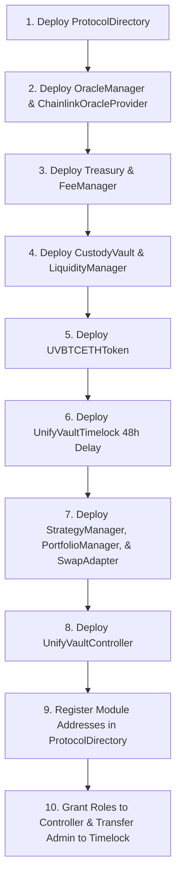

# Deployment Guide & Verification

This document specifies the exact deployment sequence, environment variables, deployment scripts, supported networks, verification processes, and post-deployment validation steps for UnifyVault V2.

---

## 1. Supported Networks

| Network Name | Chain ID | RPC URL Environment Variable | Block Explorer |
| :--- | :--- | :--- | :--- |
| **Base Mainnet** | `8453` | `BASE_MAINNET_RPC_URL` | https://basescan.org |
| **Base Sepolia** | `84532` | `BASE_SEPOLIA_RPC_URL` | https://sepolia.basescan.org |

---

## 2. Deployment Prerequisites & Environment Variables

The following environment variables must be exported prior to running deployment scripts:

```env
# RPC Node Endpoints
BASE_SEPOLIA_RPC_URL=https://sepolia.base.org
BASE_MAINNET_RPC_URL=https://mainnet.base.org

# Deployer & Admin Accounts
PRIVATE_KEY=0x... # Deployer private key
NEXT_PUBLIC_ADMIN_ADDRESS=0xd905920c91853039060246Ed5724AA72B91a96DA
GNOSIS_SAFE_ADDRESS=0x... # Multi-sig proposal manager for Timelock

# Etherscan / Basescan Verification API Key
BASESCAN_API_KEY=YI8JH3STSF6...
```

---

## 3. Mandatory Deployment Order

Due to strict dependency validation in contract constructors, contracts must be deployed in the following order:



---

## 4. Deployment Scripts

Primary deployment scripts are located in `packages/protocol/script/`:

- **`DeployV2.s.sol`**: Complete V2 protocol deployment including test tokens and mock aggregators (for testnet/staging).
- **`DeployMainnet.s.sol`**: Production deployment script for Base Mainnet utilizing real Chainlink oracle feeds and DEX routers.
- **`RegisterAndConfigureV2.s.sol`**: Helper script to register module addresses in `ProtocolDirectory`.
- **`mainnet/GrantAdminRoles.s.sol`**: Assigns `GOVERNANCE_ROLE` and `DEFAULT_ADMIN_ROLE` to `UnifyVaultTimelock`.
- **`mainnet/RenounceOldAdmin.s.sol`**: Revokes deployer permissions after governance transfer.

---

## 5. Execution Commands

### 5.1 Local Simulation (No On-Chain State Change)

```bash
cd packages/protocol
forge script script/DeployV2.s.sol:DeployV2Script
```

### 5.2 Testnet Deployment (Base Sepolia)

```bash
cd packages/protocol
forge script script/DeployV2.s.sol:DeployV2Script \
  --rpc-url $BASE_SEPOLIA_RPC_URL \
  --private-key $PRIVATE_KEY \
  --broadcast \
  --verify \
  --etherscan-api-key $BASESCAN_API_KEY
```

### 5.3 Production Mainnet Deployment (Base Mainnet)

```bash
cd packages/protocol
forge script script/DeployMainnet.s.sol:DeployMainnetScript \
  --rpc-url $BASE_MAINNET_RPC_URL \
  --private-key $PRIVATE_KEY \
  --broadcast \
  --verify \
  --etherscan-api-key $BASESCAN_API_KEY
```

---

## 6. Verification & Ownership Transfer

After broadcasting deployment transactions:

1. **Verify Contracts on Basescan**:
   If automatic verification failed during `forge script`, run:
   ```bash
   forge verify-contract <CONTRACT_ADDRESS> <CONTRACT_NAME> \
     --chain base-sepolia \
     --watch
   ```
2. **Transfer Governance Control to Timelock**:
   Run `GrantAdminRoles.s.sol` and `RenounceOldAdmin.s.sol` to ensure the deployer account no longer possesses single-signature administrative rights.

---

## 7. Post-Deployment Checklist

- [ ] Every module address (`TREASURY`, `VAULT`, `DEPOSIT_MANAGER`, `ORACLE`, `TOKEN`, `STRATEGY_MANAGER`, `PORTFOLIO_MANAGER`, `SWAP_ADAPTER`, `LIQUIDITY_MANAGER`, `FEE_MANAGER`) registered in `ProtocolDirectory`.
- [ ] Oracles configured with active feeds and non-zero heartbeat limits.
- [ ] `CONTROLLER_ROLE` granted to `UnifyVaultController` on `CustodyVault`, `Treasury`, `UVBTCETHToken`, and `LiquidityManager`.
- [ ] Deployer `CONTROLLER_ROLE` revoked on `UVBTCETHToken`.
- [ ] Initial deposit executed to mint and burn `DEAD_SHARES` (`1000` wei).
- [x] Frontend environment variables updated with the new `NEXT_PUBLIC_DIRECTORY_ADDRESS_SEPOLIA` or `NEXT_PUBLIC_DIRECTORY_ADDRESS_MAINNET`.

---

## 8. Latest Deployment Addresses (Base Sepolia Testnet - V2)

| Contract / Role | Address |
| :--- | :--- |
| **ProtocolDirectory** | `0xb5dd6d766867cb4c299ad2711068455c718eddbc` |
| **OracleManager** | `0xB636DD8F0faA46055fB4a0fafB1EEAD33eBa3635` |
| **ChainlinkOracleProvider** | `0xef27d89dcbe99f477f5d5d1bcf20c099be53b09d` |
| **Treasury** | `0x0F51D2135cA7b6b5511bFD3B53EBEf50af01513D` |
| **CustodyVault** | `0x54696d5d00b58F27F9d8C358560ff2a7d10d409e` |
| **LiquidityManager** | `0xf311e7bd0f5c438a11da188e26433996870d29ba` |
| **UVBTCETHToken** | `0x62c20Aa1e0272312BC100b4e23B4DC1Ed96dD7D1` |
| **CostBasisManager** | `0xef0637a3d2080749bbcd5d98e6c68d9944c700a6` |
| **SwapAdapter** | `0xd21060559c9beb54fC07aFd6151aDf6cFCDDCAeB` |
| **StrategyManager** | `0x4C52a6277b1B84121b3072C0c92b6Be0b7CC10F1` |
| **PortfolioManager** | `0x978e3286EB805934215a88694d80b09aDed68D90` |
| **UnifyVaultController** | `0x8B71b41D4dBEb2b6821d44692d3fACAAf77480Bb` |
| **FeeManager** | `0xBb2180ebd78ce97360503434eD37fcf4a1Df61c3` |
| **TimelockController / UnifyVaultTimelock** | `0xDEb1E9a6Be7Baf84208BB6E10aC9F9bbE1D70809` |
| **Gnosis Safe Proposer** | `0x1111111111111111111111111111111111111111` |
