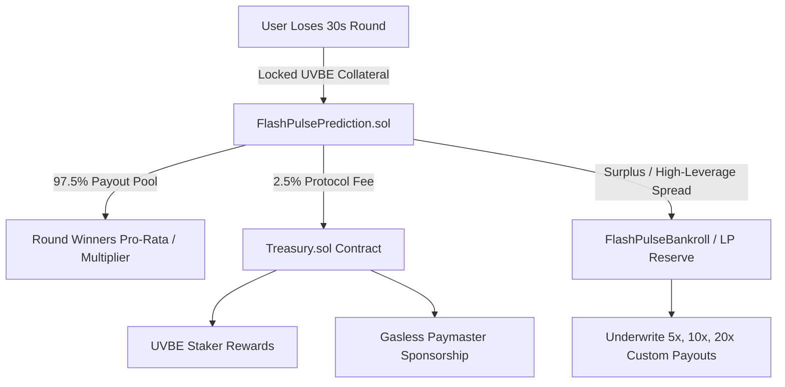

# Flash 30s Prediction Market — Smart Contract Specification

This document details the smart contract architecture, economic flow, fund distribution (losing bets, winning payouts, protocol fees), and interface specifications for the **Flash 30s Rapid Binary Prediction Market** in UnifyVault V2.

---

## 1. Executive Summary

Flash 30s is an institutional-grade, sub-second rapid prediction game deployed on EVM Layer-2 networks (Base Mainnet & Base Sepolia). Users predict whether asset prices (BTC/USD, ETH/USD) will move **UP** or **DOWN** over a 30-second interval, with customizable reward multipliers (2x to 20x) and Parimutuel pool odds.

---

## 2. Where Does the Lost Fund Go? (Economic Flow of Losing Bets)

When a user loses a round, the locked collateral is distributed strictly according to the **Parimutuel & Bankroll Model**:



### Breakdown of Lost Collateral:
1. **🏆 Round Winners (~97.5%)**: In standard Parimutuel mode, losing bets directly fund the winnings of the winning side proportional to their bet size.
2. **🏛️ Protocol Treasury (~2.5% Rake / 250 BPS)**: Sent to `Treasury.sol` for:
   - UVBE Stakers yield distribution.
   - ERC-4337 Paymaster sponsorship fund (gasless transactions).
   - Protocol reserve backing.
3. **💧 Bankroll Reserve**: When users choose custom multipliers (e.g. 5x, 10x, 20x), losing bets accumulate in the Bankroll to underwrite large asymmetric payouts for future high-multiplier winners.

---

## 3. Required Smart Contracts (2 Core Contracts + 1 Optional)

To keep the protocol secure, modular, and gas-efficient, **2 core contracts** are required:

| # | Contract Name | Type | Responsibility |
|---|---|---|---|
| **1** | `FlashPulsePrediction.sol` | Core Game Engine | Round lifecycle (30s), bet locking, Pyth/Chainlink oracle price resolution, payout computation, fee routing. |
| **2** | `FlashPulseVault.sol` | Gasless Micro-Vault | Manages user betting credits, gasless 1-tap fast betting, deposits, and non-custodial withdrawals. |
| **3** | `FlashPulseBankroll.sol` *(Optional)* | Liquidity Pool | Underwrites high-leverage custom multipliers (5x–20x) with LP liquidity. |

---

## 4. Contract 1: `FlashPulsePrediction.sol`

### Responsibilities:
- **Round States**: `BETTING` (10s) $\rightarrow$ `LIVE` (20s) $\rightarrow$ `SETTLED`.
- **Oracle Feed**: Low-latency sub-second pricing via Pyth Network (`IPyth.sol`) or Chainlink low-latency streams.
- **Bet Execution**: Accepts single bets and custom multiplier bets.
- **Settlement**: Evaluates `closePrice > strikePrice ? UP : DOWN`, computes payout, and transfers winnings to `FlashPulseVault`.

### Core Storage & Structures:
```solidity
enum Direction { UP, DOWN }
enum Phase { BETTING, LIVE, SETTLED, CANCELLED }

struct Round {
    uint256 roundId;
    bytes32 priceFeedId;
    Phase phase;
    uint256 startTime;
    uint256 lockTime;       // 10s after start
    uint256 endTime;        // 30s after start
    int64 strikePrice;      // Locked at lockTime
    int64 closePrice;       // Locked at endTime
    uint256 totalUpUVBE;
    uint256 totalDownUVBE;
    uint256 protocolFeeBps; // Default 250 (2.5%)
    Direction winningDirection;
}

struct UserBet {
    address user;
    Direction direction;
    uint256 amountUVBE;
    uint256 customMultiplierBps; // 0 = Auto pool, 20000 = 2x, 50000 = 5x
    bool claimed;
}
```

### Key Functions:
- `createRound(bytes32 feedId)`: Automated keeper or time-triggered round creation.
- `placeBet(uint256 roundId, Direction dir, uint256 amount, uint256 multiplierBps)`: Locks UVBE from user's vault balance.
- `lockRound(uint256 roundId, bytes[] calldata pythPriceUpdate)`: Sets strike price from Pyth oracle.
- `settleRound(uint256 roundId, bytes[] calldata pythPriceUpdate)`: Sets close price, determines winner, routes 2.5% fee to `Treasury`, and credits winnings.

---

## 5. Contract 2: `FlashPulseVault.sol`

### Responsibilities:
- Holds user UVBE collateral for 1-tap instant betting (eliminates per-bet wallet popups).
- Only callable by `FlashPulsePrediction.sol` for locking and settlement credits.
- Users maintain 100% custody and can `deposit()` or `withdraw()` anytime.

### Key Functions:
- `deposit(uint256 amount)`: Transfers UVBE from user wallet to vault.
- `withdraw(uint256 amount)`: Returns unbonded UVBE back to user wallet.
- `lockFunds(address user, uint256 amount)`: Authorized call from `FlashPulsePrediction` to lock bet collateral.
- `creditPayout(address user, uint256 payoutAmount)`: Authorized call to credit winnings.
- `debitLoss(address user, uint256 lostAmount)`: Clears locked balance upon round loss.

---

## 6. Integration with Existing UnifyVault Contracts

| Existing Contract | Interaction |
|---|---|
| `ProtocolDirectory.sol` | Registers `ModuleIds.FLASH_PULSE_PREDICTION` and `ModuleIds.FLASH_PULSE_VAULT`. |
| `UVBEToken.sol` | Underlying ERC-20 token used for betting, deposits, and payouts. |
| `Treasury.sol` | Receives 2.5% protocol rake from every settled round. |
| `CostBasisManagerV2.sol` | Registered under `_isEscrow` guard so gaming transfers do not distort vault NAV or cost basis. |

---

## 7. Security Invariants

1. **Collateral Isolation**: Zero access to `CustodyVault` collateral backing `UVBE` tokens.
2. **Oracle Manipulation Defense**: Strike and close prices are derived from Pyth cryptographic signatures with max staleness threshold of 3 seconds.
3. **No Reentrancy**: All state mutations follow the Checks-Effects-Interactions pattern and OpenZeppelin `ReentrancyGuardUpgradeable`.
4. **Emergency Pause**: `Pausable` circuit breaker controlled by `GUARDIAN_ROLE` / Timelock.
