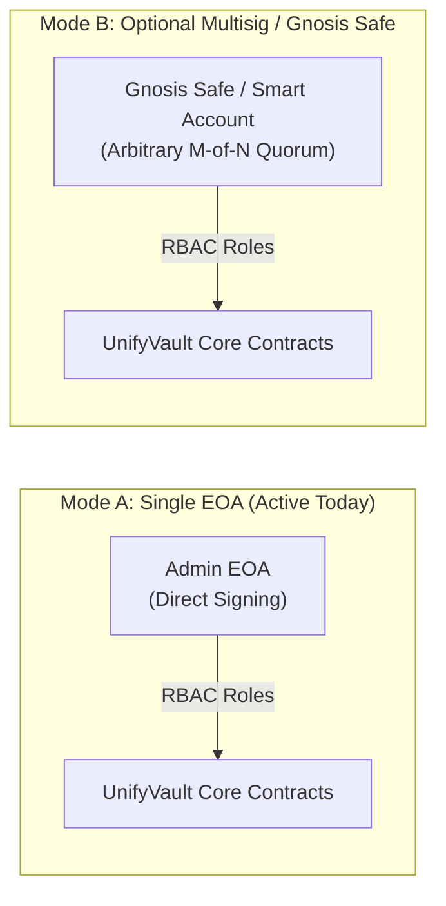

# UNIFYVAULT V2 — GOVERNANCE MIGRATION & OPERATIONAL GUIDE

> **IMPORTANT PRINCIPLE**:  
> **Multisig is optional and is not required for current Single-EOA operation.**  
> UnifyVault V2 is fully operational in **Single-EOA mode** today. The protocol architecture allows seamless, zero-downtime migration to a Gnosis Safe, ERC-4337 smart account, or multi-signature governance at any future point with **0 contract redeployments**.

---

## 1. Governance Modes Overview

- **Mode A (Single EOA)**: A single authorized EOA wallet acts as `DEFAULT_ADMIN_ROLE`, `GOVERNANCE_ROLE`, and `owner()`. Ideal for streamlined bootstrapping and administrative operations.
- **Mode B (Optional Multisig / Gnosis Safe)**: Governance roles are transferred to a Gnosis Safe proxy with any arbitrary threshold ($1$-of-$1$, $2$-of-$3$, $3$-of-$5$, $4$-of-$7$, etc.). No threshold or signer count is hardcoded into Solidity.

---

## 2. Phase A: Single EOA Operation (Active State)

In Single-EOA mode:

1. The Admin EOA (`0xd905...` on testnet) holds:
   - `DEFAULT_ADMIN_ROLE` and `GOVERNANCE_ROLE` across all Core Protocol contracts.
   - `DEFAULT_ADMIN_ROLE` on `UnifyVaultTimelock`.
   - `GUARDIAN_ROLE` on pausable modules.
2. The Deployer EOA (`0x516F...` on testnet) holds `owner()` on `GasTreasury` and `UnifyVaultPaymaster`.
3. All admin dashboards and web consoles dynamically detect the connected EOA, check on-chain role assignments via `hasRole()`, and allow immediate administrative actions (fee updates, oracle feed registration, liquidity rebalancing, parameter tuning).

---

## 3. Phase B: Step-by-Step EOA → Gnosis Safe Migration Procedure

When governance is ready to transition to a Gnosis Safe, execute this non-disruptive 12-step sequence:

### Step 1: Deploy & Verify Gnosis Safe

- Deploy a standard Gnosis Safe proxy on Base Mainnet (`Chain ID: 8453`) with the desired signer keyholders and signature threshold (e.g. 3-of-5 hardware wallets).
- Verify the contract bytecode on BaseScan.

### Step 2: Grant Core Protocol Governance & Admin Roles to Safe

From the active Admin EOA, call `grantRole(GOVERNANCE_ROLE, SAFE_ADDRESS)` and `grantRole(DEFAULT_ADMIN_ROLE, SAFE_ADDRESS)` on:

1. `ProtocolDirectory`
2. `UnifyVaultController` (Proxy: `0x7DC1...`)
3. `CustodyVault`
4. `Treasury`
5. `OracleManager`
6. `ChainlinkOracleProvider`
7. `StrategyManager`
8. `LiquidityManager`
9. `CostBasisManagerV2`
10. `PerformanceManager`
11. `FeeManager`
12. `PortfolioManager`
13. `SwapAdapter`
14. `UVBTCETHToken`
15. `P2PEscrow`
16. `Marketplace`

### Step 3: Grant Emergency Guardian Roles

Call `grantRole(GUARDIAN_ROLE, SAFE_OR_SECURITY_COMMITTEE)` on `Treasury`, `CustodyVault`, `UnifyVaultController`, `P2PEscrow`, and `Marketplace`.

### Step 4: Configure Timelock Roles for Safe

From Admin EOA on `UnifyVaultTimelock`, call:

- `grantRole(PROPOSER_ROLE, SAFE_ADDRESS)`
- `grantRole(CANCELLER_ROLE, SAFE_ADDRESS)`
- `grantRole(DEFAULT_ADMIN_ROLE, SAFE_ADDRESS)`

### Step 5: Transfer Account Abstraction & Infrastructure Ownership

From Deployer EOA, call:

- `GasTreasury.transferOwnership(SAFE_ADDRESS)`
- `UnifyVaultPaymaster.transferOwnership(SAFE_ADDRESS)`

### Step 6: Verify Safe Role Assignments On-Chain

Execute read-only `hasRole(ROLE, SAFE_ADDRESS)` queries across all contracts. Verify `owner() == SAFE_ADDRESS` on `GasTreasury` and `UnifyVaultPaymaster`.

### Step 7: Renounce / Revoke Old EOA Permissions

From the old Admin EOA, renounce roles on each contract:

- `renounceRole(GOVERNANCE_ROLE, OLD_ADMIN_EOA)`
- `renounceRole(DEFAULT_ADMIN_ROLE, OLD_ADMIN_EOA)`
- `renounceRole(GUARDIAN_ROLE, OLD_ADMIN_EOA)`

### Step 8: Renounce Old EOA Timelock Admin

Call `renounceRole(DEFAULT_ADMIN_ROLE, OLD_ADMIN_EOA)` on `UnifyVaultTimelock`.

---

## 4. Phase C: Safe → EOA Emergency Recovery

If the Safe signers ever need to migrate back to a trusted single EOA (e.g. during an emergency or infrastructure migration):

1. Prepare a Safe multi-sig transaction.
2. In the batch proposal, call `grantRole(DEFAULT_ADMIN_ROLE, NEW_EOA)` and `grantRole(GOVERNANCE_ROLE, NEW_EOA)` across all contracts.
3. Call `transferOwnership(NEW_EOA)` on `GasTreasury` and `UnifyVaultPaymaster`.
4. Call `renounceRole(..., SAFE_ADDRESS)` to revoke Safe access.
5. Full operational control returns to the EOA without redeploying any contract.

---

## 5. Verification Checklist After Migration

- [ ] **Role Verification**: `hasRole(GOVERNANCE_ROLE, SAFE)` returns `true` across all 16 core contracts.
- [ ] **Ownership Verification**: `GasTreasury.owner()` and `UnifyVaultPaymaster.owner()` return `SAFE`.
- [ ] **Timelock Proposer/Canceller**: `UnifyVaultTimelock.hasRole(PROPOSER_ROLE, SAFE)` returns `true`.
- [ ] **UUPS Upgrade Authority**: Calling `_authorizeUpgrade()` from the Safe succeeds in simulation; unauthorized calls revert.
- [ ] **Old EOA Revocation**: `hasRole(..., OLD_EOA)` returns `false` for all administrative roles.
- [ ] **Frontend RBAC Detection**: Connect Safe via WalletConnect/Safe Apps; confirm admin dashboard identifies the Safe as primary governor.
