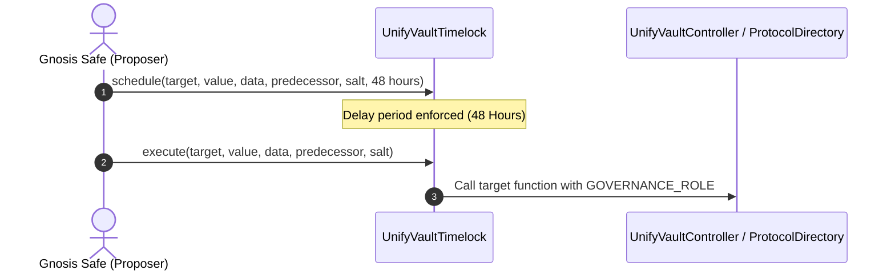

# Protocol Governance Specification

This document describes the **current governance implementation** of the UnifyVault V2 protocol.

---

## 1. Overview

UnifyVault V2 implements a timelocked, multi-role governance architecture. Governance operations are enforced by `UnifyVaultTimelock`, an OpenZeppelin `TimelockController` derivative with a mandatory **48-hour execution delay**.

Proposals are submitted through a Gnosis Safe multi-signature wallet holding the `PROPOSER_ROLE`, and execution is open (`address(0)`) once the timelock delay has elapsed.

---

## 2. Role Hierarchy & Matrix

Permissions are managed via OpenZeppelin `AccessControl`. The system recognizes the following role definitions defined in `AccessRoles`:

| Role Name | Role Hash | Primary Responsibilities |
| :--- | :--- | :--- |
| `DEFAULT_ADMIN_ROLE` | `0x00` | Super-administrative role; grants/revokes other roles. Assigned to `UnifyVaultTimelock`. |
| `GOVERNANCE_ROLE` | `keccak256("GOVERNANCE_ROLE")` | Configures protocol parameters, whitelists assets, sets fee rates, and registers modules in `ProtocolDirectory`. |
| `GUARDIAN_ROLE` | `keccak256("GUARDIAN_ROLE")` | Emergency response role; can pause and unpause `UnifyVaultController`, `CustodyVault`, and `Treasury`. |
| `CONTROLLER_ROLE` | `keccak256("CONTROLLER_ROLE")` | System execution role held exclusively by `UnifyVaultController` to mint shares and withdraw collateral. |
| `BOT_ROLE` | `keccak256("BOT_ROLE")` | Off-chain keeper role authorized to execute portfolio rebalancing and liquidity sweeps. |
| `ORACLE_OPERATOR_ROLE` | `keccak256("ORACLE_OPERATOR_ROLE")` | Authorized to update manual price feeds in `MockOracleProvider`. |

---

## 3. Governance Workflows

### 3.1 Parameter Update Workflow

### 3.2 Key Governance Operations
- **Module Upgrades**: Calling `ProtocolDirectory.updateAddress(bytes32 id, address newAddress)` to point a module identifier to a newly deployed contract implementation.
- **Protocol Directory Freeze**: Calling `ProtocolDirectory.freeze()` to permanently disable further module updates, immutably freezing the protocol architecture.
- **Asset Whitelisting**: Calling `CustodyVault.registerAsset` and `Treasury.registerAsset` to enable new collateral tokens.
- **Limit Adjustments**: Calling `setDepositLimits`, `setRedeemLimits`, and `setSwapSlippageBps` on `UnifyVaultController`.

---

## 4. Unimplemented Governance Features

The following features are **not implemented in the current version**:
- On-chain token-weighted voting (governance token voting for proposals is not active; governance is executed via Gnosis Safe multisig + Timelock).
- Automated optimistic proposal execution without timelock delay.
