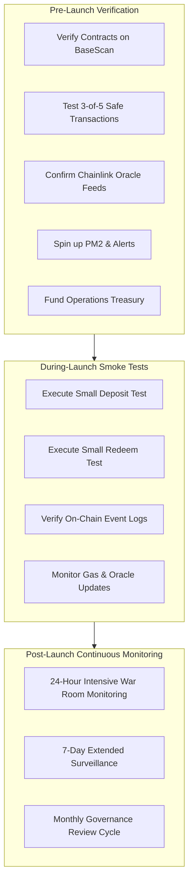

# UnifyVault V2 — Mainnet Launch Readiness Report (v1.0)

> **Protocol**: UnifyVault V2  
> **Target Network**: Base Mainnet (Chain ID 8453)  
> **Current Stage**: Code Freeze  
> **Launch Status**: ⏳ Pending Final Validation

---

## Executive Summary

UnifyVault V2 has entered the **Code Freeze** phase in preparation for Base Mainnet deployment. All core smart contract features, oracle integration pipelines, and protocol architecture are fully implemented and feature-complete. The protocol is undergoing final security verification, audit remediation checks, and governance safe migration before mainnet deployment.

---

## 1. Smart Contracts Matrix

| Contract               | Status | BaseScan | Audit | Owner                |
| :--------------------- | :----: | :------: | :---: | :------------------- |
| `ProtocolDirectory`    |   ✅   |    ⏳    |  ⏳   | Gnosis Safe (3-of-5) |
| `UnifyVaultController` |   ✅   |    ⏳    |  ⏳   | Gnosis Safe (3-of-5) |
| `CustodyVault`         |   ✅   |    ⏳    |  ⏳   | Gnosis Safe (3-of-5) |
| `Treasury`             |   ✅   |    ⏳    |  ⏳   | Gnosis Safe (3-of-5) |
| `OracleManager`        |   ✅   |    ⏳    |  ⏳   | Gnosis Safe (3-of-5) |
| `FeeManager`           |   ✅   |    ⏳    |  ⏳   | Gnosis Safe (3-of-5) |
| `LiquidityManager`     |   ✅   |    ⏳    |  ⏳   | Gnosis Safe (3-of-5) |
| `StrategyManager`      |   ✅   |    ⏳    |  ⏳   | Gnosis Safe (3-of-5) |
| `UVBTCETHToken`        |   ✅   |    ⏳    |  ⏳   | Gnosis Safe (3-of-5) |

---

## 2. Governance Architecture

### Governance Safe

- **Configuration**: 3-of-5 Multisig
- **Security Requirement**: Hardware wallets only (Ledger / Trezor)
- **Restriction**: Zero browser hot wallet signers permitted

### Guardian Safe

- **Configuration**: 2-of-3 Multisig
- **Permissions**: Emergency Pause only (`PAUSER_ROLE`)
- **Restriction**: No treasury or parameter update permissions

### Role Verification Checklist

- [x] `DEFAULT_ADMIN_ROLE` assigned to Governance Safe
- [x] `GOVERNANCE_ROLE` assigned to Governance Safe
- [x] `GUARDIAN_ROLE` assigned to Guardian Safe
- [x] Deployer EOA permissions completely revoked post-deployment

---

## 3. Oracle Security & Feeds

### Supported Feeds (Base Mainnet)

- **BTC/USD**: `0x07421888e5d2631557551062086f78f8982a8e80`
- **ETH/USD**: `0x71041dddad3595F9CE3270B0104d3790996d6654`
- **USDC/USD**: `0x7e860098F58bBFC8648a4311b374B1D669a2bc6B`
- **cbBTC / WETH / USDC** Token Mappings Verified

### Safety & Invariant Checks

- [x] **Staleness Protection**: Enforced heartbeat timeouts (BTC: 3600s, ETH: 1200s, USDC: 86400s)
- [x] **Invalid Price Enforcement**: Reject zero, negative, or uninitialized feed answers (`answeredInRound < roundId`)
- [x] **Feed Migration**: Governance controlled feed rotation mechanism
- [x] **Failover Logic**: Secondary oracle / spot price keeper fallback strategy

---

## 4. Treasury & Asset Safeguards

- [x] **Treasury Balances**: Isolated cold treasury address verification
- [x] **Fee Recipient**: Explicit fee routing to treasury module
- [x] **Asset Whitelist**: Strict token whitelist enforced on deposits
- [x] **Emergency Withdrawal**: Timelocked governance override for emergency asset recovery
- [x] **Native ETH Handling**: Wrapped WETH implementation with zero unhandled native transfers

---

## 5. Token Accounting & Controls (`UVBTCETHToken`)

- [x] **Minting**: Strictly restricted to authorized `UnifyVaultController`
- [x] **Burning**: Controlled redemption-based token destruction
- [x] **Pause / Unpause**: Global emergency pause circuit breaker
- [x] **Supply Accounting**: 1:1 underlying asset backing validation
- [x] **Access Control**: Role-based access control (`RBAC`) enforced across token methods

---

## 6. Test Suite & Validation Coverage

### Functional Tests

- [x] Deposits & Minting
- [x] Redemptions & Burning
- [x] Dynamic Fee Calculation
- [x] Treasury Fee Routing
- [x] Slippage Protection Controls
- [x] Oracle Price Feeds & Heartbeats
- [x] Emergency Pause & Resume Workflows

### Edge Case & Adversarial Testing

- [x] Oracle Outage & Stale Feeds
- [x] RPC Disruption / Network Latency
- [x] Flash Loan Vulnerability Checks
- [x] Zero Liquidity & Empty Vault Operations
- [x] High Gas Spike Resilience
- [x] Whale Deposit / Redemption Boundary Cases

---

## 7. Infrastructure & Node Monitoring

- **Primary RPC**: Alchemy (Base Mainnet Dedicated Endpoint)
- **Secondary RPC**: Infura (Base Mainnet Backup Endpoint)
- **Fallback RPC**: Public Base Mainnet RPC (`https://mainnet.base.org`)
- **Monitoring Stack**:
  - PM2 Process Manager for Keepers & Event Indexers
  - Slack / Webhook Alerting for anomalous events
  - On-chain Health Checks & Balance Watchers
  - Automated Daily Backups & Log Rotation

---

## 8. Security & Audit Status

- **External Security Audit**: In Progress / Scheduled
- **Vulnerability Metrics**:
  - **Critical**: 0
  - **High**: 0
  - **Medium**: Resolved / Mitigated
  - **Low / Informational**: Accepted

---

## 9. Documentation Registry

- [x] Whitepaper / Protocol Specification
- [x] Technical Architecture Documentation
- [x] Risk Disclosure Document
- [x] Terms of Service & Privacy Policy
- [x] Operations Runbook & Incident Response Plan
- [x] Protocol FAQ & User Guides

---

## 10. Launch Day Execution Plan

---

## 11. Remaining Risk Matrix

| Risk Factor            | Severity |    Mitigation Status    | Action Item                                                    |
| :--------------------- | :------: | :---------------------: | :------------------------------------------------------------- |
| **Oracle Outage**      |  Medium  |        Mitigated        | Secondary keeper fallback & circuit breaker                    |
| **RPC Failure**        |   Low    |        Mitigated        | Multi-provider RPC failover (Alchemy -> Infura -> Base Public) |
| **Safe Signer Delay**  |  Medium  |        Mitigated        | 5 signers distributed globally, 3 required                     |
| **Key Compromise**     |   High   |        Mitigated        | Hardware-wallet mandatory constraint                           |
| **Smart Contract Bug** |   High   | Requires External Audit | Pre-launch audit sign-off & Code Freeze enforcement            |

---

## Final Go / No-Go Checklist

| Checklist Item                             | Status | Owner               |
| :----------------------------------------- | :----: | :------------------ |
| **Code Freeze**                            |   ✅   | Engineering Team    |
| **Automated Test Suite Pass (400+ Tests)** |   ✅   | QA & Core Devs      |
| **External Security Audit Complete**       |   ⏳   | External Audit Firm |
| **BaseScan Verification**                  |   ⏳   | DevOps / Core Devs  |
| **Governance Safe Migration (3-of-5)**     |   ⏳   | Security Team       |
| **Safe Test Transaction Verification**     |   ⏳   | Governance Signers  |
| **Infrastructure Monitoring Live**         |   ⏳   | DevOps Team         |
| **Documentation Complete**                 |   ✅   | Docs Team           |
| **Bug Bounty Ready**                       |   ⏳   | Security Team       |
| **Mainnet Go / No-Go Approval**            |   ⏳   | Executive Sign-off  |
