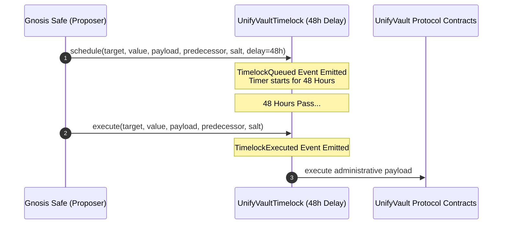

# UnifyVault V2 — Timelock Governance Architecture

## Overview

To achieve institutional-grade security and eliminate central key risks, all administrative and governance operations in UnifyVault V2 are governed by an OpenZeppelin **UnifyVaultTimelock** contract.

No single key or EOA can execute administrative actions directly on protocol contracts.

---

## Timelock Parameters

- **Enforced Delay**: `48 hours` (172,800 seconds)
- **Proposer**: Gnosis Safe Multi-Sig Wallet (`PROPOSER_ROLE`)
- **Executor**: Timelock Controller / Open Execution (`EXECUTOR_ROLE`)
- **Admin**: Timelock Controller (`DEFAULT_ADMIN_ROLE` & `GOVERNANCE_ROLE` on all protocol contracts)

---

## Governance Workflow

1. **Proposal**: Gnosis Safe submits a transaction proposal via `schedule()`.
2. **Queue & Delay**: The transaction enters the queue and must wait at least 48 hours. The `TimelockQueued` monitoring event is emitted.
3. **Execution**: After 48 hours, `execute()` is called. The `TimelockExecuted` monitoring event is emitted and the target protocol contract state is updated.
4. **Cancellation**: If a proposal is malicious or flawed, Gnosis Safe can call `cancel()` prior to execution.

---

## Role Assignment Matrix

| Contract | Admin Role (`0x00`) | Governance Role | Guardian Role | Controller Role |
| :--- | :--- | :--- | :--- | :--- |
| `UnifyVaultTimelock` | Timelock Itself | Gnosis Safe | Gnosis Safe | N/A |
| `UnifyVaultController` | Timelock | Timelock | Guardian Multi-Sig | N/A |
| `CustodyVault` | Timelock | Timelock | Guardian Multi-Sig | Controller |
| `Treasury` | Timelock | Timelock | Guardian Multi-Sig | Controller |
| `OracleManager` | Timelock | Timelock | N/A | N/A |
| `StrategyManager` | Timelock | Timelock | N/A | N/A |
| `PortfolioManager` | Timelock | Timelock | N/A | N/A |
| `SwapAdapter` | Timelock | Timelock | N/A | N/A |
| `FeeManager` | Timelock | Timelock | N/A | N/A |
| `UVBTCETHToken` | Timelock | Timelock | Guardian Multi-Sig | Controller |
