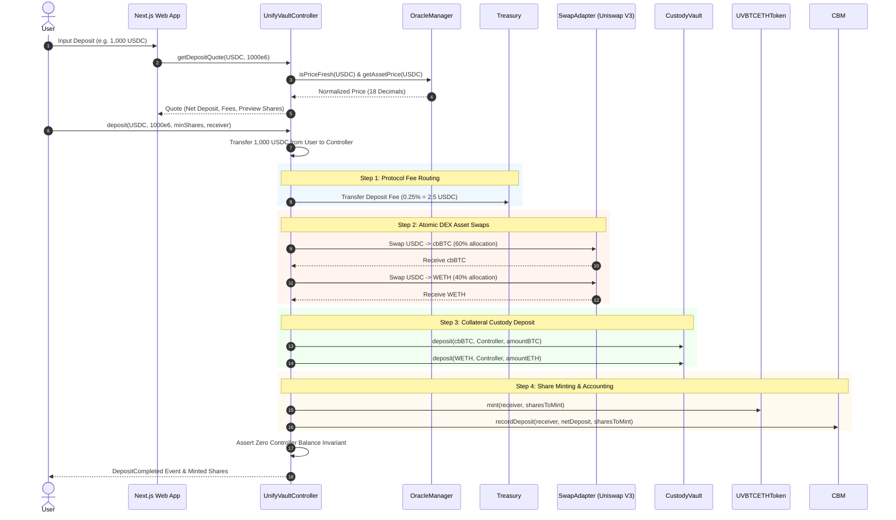
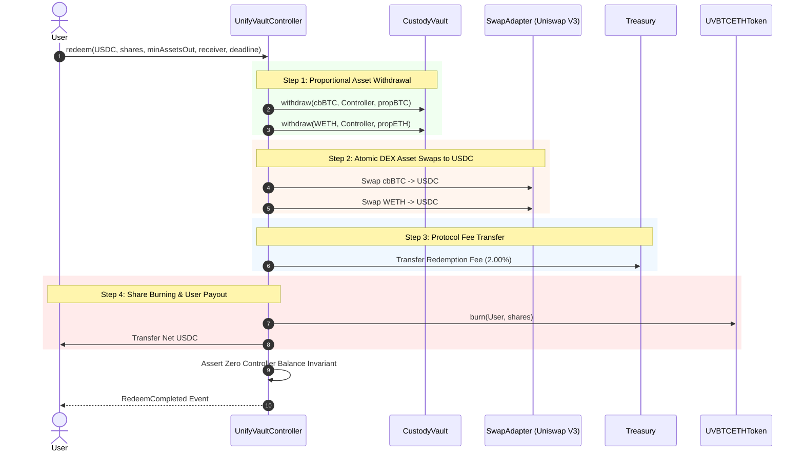

# System Data & Execution Flows

This document details the end-to-end data and transaction flows across smart contracts, oracle price feeds, keeper services, frontend applications, and API gateways in **UnifyVault V2**.

---

## 🔄 1. End-to-End User Deposit Data Flow

---

## 🔄 2. End-to-End User Redemption Data Flow

---

## 🔗 Related Documents

- [`01-overview.md`](01-overview.md) — System Overview
- [`../protocol/deposit-lifecycle.md`](../protocol/deposit-lifecycle.md) — Deposit Lifecycle Specification
- [`../protocol/redeem-lifecycle.md`](../protocol/redeem-lifecycle.md) — Redeem Lifecycle Specification

---

## 🔍 Verification & Audit Metadata

- **Verification Sources**: Source code (), Foundry test suites ()
- **Related Contracts**: , 
- **Related Tests**:
- **Last Reviewed**: 2026-07-30
