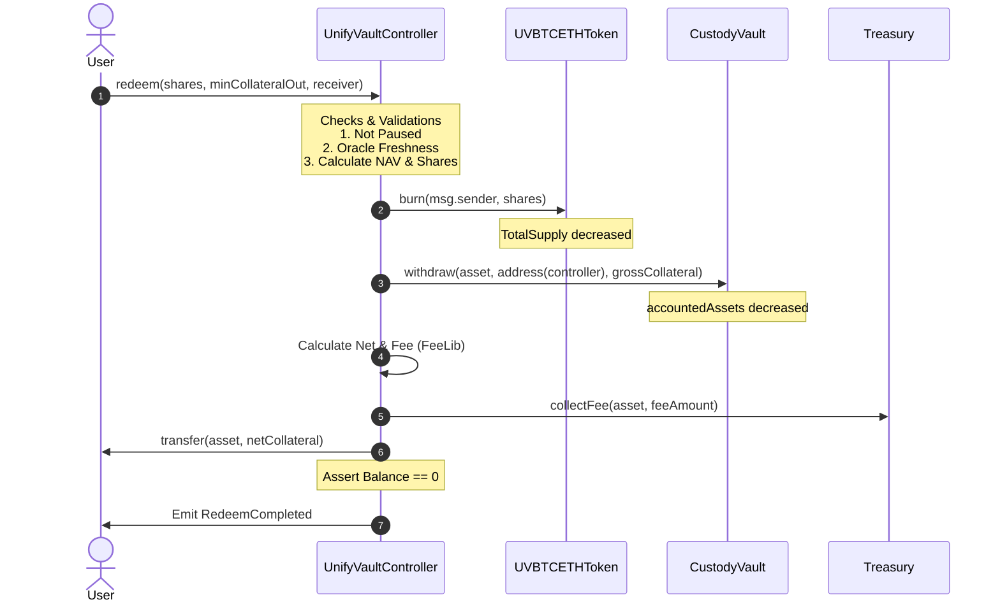

# UnifyVault Redemption Architecture Design

This document details the architectural specifications for the UnifyVault Protocol redemption layer, defining how users exchange `UVBTCETH` index shares for underlying collateral assets.

---

## 1. Core Architectural Questions & Answers

### 1. Burn Sequence: Before vs. After Collateral Transfer?

Index shares **must be burned BEFORE** the collateral transfer is executed.

- **Security Rationale:** Conforms strictly to the Checks-Effects-Interactions pattern. Burning shares reduces the user's balance and the total supply before triggering the external ERC20 token transfer, preventing reentrancy attacks where a malicious contract uses the transfer callback (e.g. ERC777/hook-based tokens) to request multiple redemptions on the same share balance.

### 2. Redemption Fee Routing Strategy

The redemption fee **must be deducted from the returned collateral (Option A)**.

- **Reasoning:** If fees were charged separately, users would need to approve and hold additional collateral to pay the fee during a redemption, severely degrading the UX. Deducting the fee from the outgoing collateral allows a single-transaction redemption flow where the user receives `netCollateralOut = grossCollateralOut - fee`.

### 3. Accounted Assets State Transitions: Before vs. After Transfer?

The internal variable `accountedAssets` **must be decreased BEFORE** the physical transfer is triggered.

- **Security Rationale:** Part of the "Effects" phase of the Checks-Effects-Interactions pattern. Decreasing the internal ledger balance before interacting with external token contracts ensures that any reentrant queries or external contract calls read the correct reduced vault capacity.

### 4. Treasury Fee Collection Routing

Redemption fees should follow the same routing model as deposits:

1.  The `Controller` requests the `CustodyVault` to release the `grossCollateral` to the `Controller`.
2.  The `Controller` routes the `redemptionFee` to the `Treasury` via `collectFee()`.
3.  The `Controller` transfers the `netCollateral` to the user.
4.  The `Controller` verifies its balance returns to exactly `0` at transaction end.

### 5. NAV Calculation during Redemption

NAV is calculated dynamically using `ShareLib` in reverse:

```solidity
grossCollateralOut = (sharesToBurn * accountedAssets) / totalSupply
```

Where `accountedAssets` and `totalSupply` are evaluated before the burn is executed.

### 6. Vault Liquidity Insufficiency

If vault liquidity is insufficient to fulfill the redemption, the operation **must revert**.

- **Reasoning:** Queued redemptions or partial fills introduce massive state complexity, unlocking lockup delays, sandwiching attack vectors, and custody risk. Keeping redemption execution synchronous and instant preserves predictable pricing.

### 7. Slippage Protection & Safety Parameters

Redemptions **must support slippage protection (`minCollateralOut`) and deadlines**.

- **Reasoning:** Protects users against sandwich attacks by MEV bots that artificially manipulate oracle prices or pool balances between transaction broadcasting and block execution.

---

## 2. Mermaid Architecture & Workflow Diagram



---

## 3. State & Accounting Transitions

1.  **Validation:** Reads `totalAssets` (via `CustodyVault.totalAssets()`) and `totalSupply` (via `UVBTCETHToken.totalSupply()`).
2.  **Calculation:**
    - `grossCollateral = (shares * totalAssets) / totalSupply`
    - `fee = FeeLib.calculateRedeemFee(grossCollateral)`
    - `netCollateral = grossCollateral - fee`
3.  **State updates:**
    - `totalSupply_new = totalSupply - shares`
    - `accountedAssets_new = totalAssets - grossCollateral`

---

## 4. Security & Risk Review

- **Reentrancy Safeguards:** Guaranteed by executing `Token.burn()` and updating `Vault.accountedAssets` before triggering any token transfers to the receiver.
- **Flash Loan & Share Manipulation:** Since NAV queries use internally accounted assets and oracle-validated rates, attackers cannot manipulate index share valuations using flash loans.
- **Griefing Prevention:** Incorporates `minCollateralOut` parameter constraints ensuring users can protect themselves against execution frontrunning.

---

## 5. Event Design Schema

```solidity
event RedeemCompleted(
  address indexed receiver,
  address indexed asset,
  uint256 sharesBurned,
  uint256 grossCollateral,
  uint256 protocolFee,
  uint256 netCollateral,
  uint256 timestamp
);
```

---

## 6. Final Recommendation

We recommend the **Synchronous Double-Split Controller Redemption Flow**.

### Pros

- Perfect alignment with current deposit workflow.
- Preserves exact parity between `shares` and `accountedAssets`.
- Zero-balance Controller verification ensures no tokens are locked in the coordinator.

### Cons

- High transaction count increases gas costs slightly.

### Migration & Implementation Path

Requires exposing `burn` in `UVBTCETHToken` restricted to `Controller` and adding `redeem()` implementation to `UnifyVaultController`.
