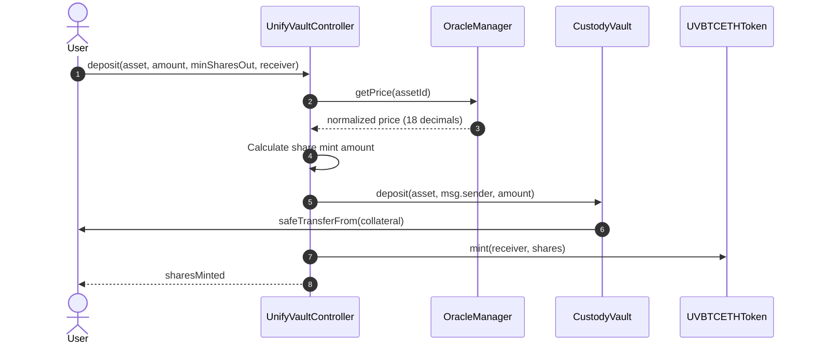
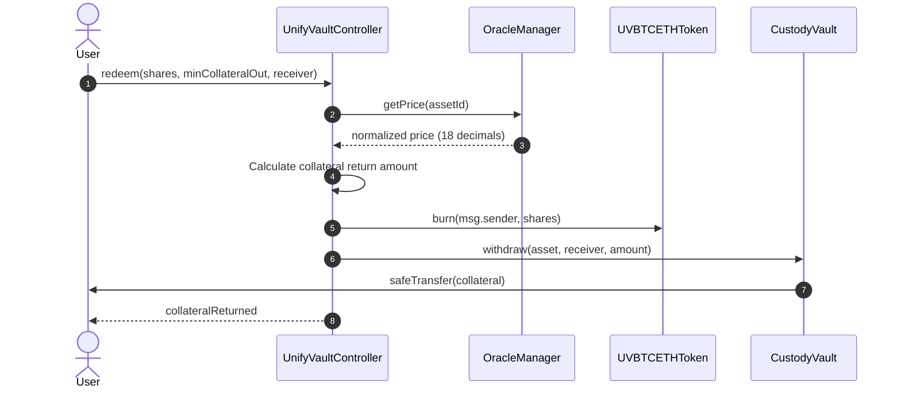

# UnifyVault Controller Architecture Review

This document describes the architectural specifications, future execution workflows, and design decisions for the `UnifyVaultController`.

---

## 1. Design Philosophy: Coordination vs. Ownership

To achieve maximum audibility, upgradeability, and security, the `UnifyVaultController` is built as a **pure coordinator** that owns **no business data**:

1.  **Audibility:** Business workflows (deposits, redemptions, rebalances) are isolated to a single contract. Security reviewers can trace protocol actions without wading through storage packing optimizations or external API adapter code.
2.  **No Collateral Ownership:** By delegating custody strictly to `CustodyVault` and fee reserves to `Treasury`, the Controller holds no funds directly. If a workflow vulnerability is discovered in the Controller, user assets remain isolated within the highly secure vaults.
3.  **No Valuation Cache:** The Controller queries `OracleManager` directly for fresh valuations, preventing the risk of internal pricing mismatches.

---

## 2. Future Execution Workflows

### A. Deposit Workflow

When a user deposits collateral (e.g. WBTC or ETH) into the protocol:

1.  **Initiate Call:** Spender calls `deposit(asset, amount, minSharesOut, receiver)`.
2.  **Price Fetching:** Controller queries `OracleManager.getPrice(assetId)` to obtain the fresh, 18-decimal normalized price of the collateral asset.
3.  **Share Calculation:** Controller computes the value of the incoming collateral and determines the equivalent number of index shares (`UVBTCETHToken`) to mint based on the current total asset valuation and share supply.
4.  **Collateral Transfer:** Controller calls `CustodyVault.deposit(asset, msg.sender, amount)`. The vault pulls the collateral from the user.
5.  **Share Minting:** Controller calls `UVBTCETHToken.mint(receiver, sharesMinted)`.

#### Deposit Sequence Diagram

---

### B. Redemption Workflow

When a user redeems index shares for underlying collateral:

1.  **Initiate Call:** User calls `redeem(shares, minCollateralOut, receiver)`.
2.  **Price Fetching:** Controller queries `OracleManager` for current asset prices to value the index basket.
3.  **Share Value Calculation:** Controller calculates the exact portion of underlying collateral the shares represent.
4.  **Share Burning:** Controller calls `UVBTCETHToken.burn(msg.sender, shares)`.
5.  **Collateral Release:** Controller calls `CustodyVault.withdraw(asset, receiver, amount)`. The vault releases the collateral directly to the receiver.

#### Redemption Sequence Diagram

---

## 3. Storage & Layout Compatibility

To ensure future versions can support timelocks, multi-sig execution, and DAO governance:

- The Controller uses OpenZeppelin's standard `AccessControl` roles (`GOVERNANCE_ROLE` and `GUARDIAN_ROLE`).
- Timelocks and multi-sig controllers are compatible natively out-of-the-box by assigning the role to the multisig or timelock executor contract address.
