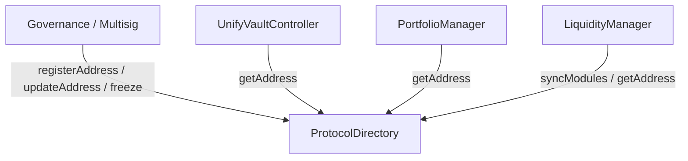

# ProtocolDirectory Contract Specification

- **File Path**: [`packages/protocol/src/ProtocolDirectory.sol`](../../packages/protocol/src/ProtocolDirectory.sol)
- **Inherits**: `AccessControl`, `IProtocolDirectory`
- **Compiler Version**: `>=0.8.20`

---

## 🎯 1. Purpose

`ProtocolDirectory` serves as the central address registry and service locator for the UnifyVault V2 protocol. It resolves dynamic module addresses by key identifier (`bytes32`) and enforces access control over protocol module updates.

---

## ⚙️ 2. Responsibilities

- Maintain an on-chain mapping of module `bytes32` identifiers to target contract addresses.
- Provide gas-efficient, read-only lookups (`getAddress`, `exists`) for inter-contract dependency resolution.
- Enforce strict role-based access control (`GOVERNANCE_ROLE`) over module registrations and updates.
- Offer an immutable one-way freeze mechanism (`freeze()`) to lock registry modifications permanently.

---

## 🏗️ 3. Constructor

```solidity
constructor()
```

- **Execution**: Grants `DEFAULT_ADMIN_ROLE` and `GOVERNANCE_ROLE` to `msg.sender`.

---

## 💾 4. Storage & State Variables

| Name         | Type                          | Visibility | Description                                                   |
| :----------- | :---------------------------- | :--------- | :------------------------------------------------------------ |
| `_addresses` | `mapping(bytes32 => address)` | `private`  | Maps module keccak256 ID hashes to active contract addresses. |
| `_frozen`    | `bool`                        | `private`  | Flag indicating whether the registry is permanently frozen.   |

---

## 🛡️ 5. Roles

- `DEFAULT_ADMIN_ROLE` (`0x00`): Administration over AccessControl permissions.
- `GOVERNANCE_ROLE` (`keccak256("GOVERNANCE_ROLE")`): Permission to register, update, remove addresses, and freeze the registry.

---

## 🔒 6. Modifiers

- `whenNotFrozen()`: Reverts with `Errors.RegistryIsFrozen()` if `_frozen == true`.

---

## 📑 7. Functions

### Public & External Functions

#### `registerAddress(bytes32 id, address target)`

Registers a new module identifier in the directory.

- **Access**: `onlyRole(GOVERNANCE_ROLE)`, `whenNotFrozen`
- **Validation**: Reverts `ZeroAddressDetected` if `target == address(0)`. Reverts `EntryAlreadyExists(id)` if `_addresses[id] != address(0)`.
- **Events**: Emits `Events.AddressRegistered(id, target, msg.sender)`.

#### `updateAddress(bytes32 id, address target)`

Updates the registered address of an existing module.

- **Access**: `onlyRole(GOVERNANCE_ROLE)`, `whenNotFrozen`
- **Validation**: Reverts `ZeroAddressDetected` if `target == address(0)`. Reverts `EntryDoesNotExist(id)` if old address is `address(0)`. Reverts `IdenticalAddressSubmitted` if old address equals `target`.
- **Events**: Emits `Events.AddressUpdated(id, oldTarget, target, msg.sender)`.

#### `removeAddress(bytes32 id)`

Removes an active module mapping entry.

- **Access**: `onlyRole(GOVERNANCE_ROLE)`, `whenNotFrozen`
- **Validation**: Reverts `EntryDoesNotExist(id)` if missing.
- **Events**: Emits `Events.AddressRemoved(id, oldTarget, msg.sender)`.

#### `freeze()`

Permanently disables all registration, update, and removal capabilities.

- **Access**: `onlyRole(GOVERNANCE_ROLE)`, `whenNotFrozen`
- **Events**: Emits `Events.RegistryFrozen(msg.sender)`.

#### `getAddress(bytes32 name) → address`

View function returning the registered contract target for a module ID. Reverts `EntryDoesNotExist(name)` if not found.

#### `exists(bytes32 name) → bool`

View function returning `true` if `name` is registered in `_addresses`.

#### `isFrozen() → bool`

View function returning the current freeze state of the directory.

### Internal Functions

- Inherited `AccessControl` internal role management helpers (`_grantRole`, `_checkRole`).

---

## 🔔 8. Events

- `AddressRegistered(bytes32 indexed id, address indexed target, address indexed caller)`
- `AddressUpdated(bytes32 indexed id, address indexed oldTarget, address newTarget, address indexed caller)`
- `AddressRemoved(bytes32 indexed id, address indexed oldTarget, address indexed caller)`
- `RegistryFrozen(address indexed caller)`

---

## 🚨 9. Errors

- `RegistryIsFrozen()`
- `ZeroAddressDetected()`
- `EntryAlreadyExists(bytes32 id)`
- `EntryDoesNotExist(bytes32 id)`
- `IdenticalAddressSubmitted()`

---

## 📦 10. Dependencies

- `@openzeppelin/contracts/access/AccessControl.sol`
- `interfaces/IProtocolDirectory.sol`
- `errors/Errors.sol`
- `events/Events.sol`
- `libraries/AddressValidationLib.sol`
- `libraries/AccessRoles.sol`

---

## 📊 11. Interaction Diagram



---

## 🔒 12. Security Considerations

- **Access Control Isolation**: Only `GOVERNANCE_ROLE` can mutate directory state.
- **Zero Address Validation**: Reverts on `address(0)` registrations.
- **State Validation**: Prevents duplicate registration or no-op updates to identical targets.

---

## 🔄 13. Upgrade Considerations

- **Non-Upgradeable Implementation**: `ProtocolDirectory` itself is non-upgradeable. System upgradeability is achieved by modifying pointers to upgraded contract implementations via `updateAddress()`.
- **Permanent Freeze**: Once `freeze()` is executed by governance, directory state is locked permanently.

---

## 🧪 14. Related Tests

- [`packages/protocol/test/ProtocolDirectory.t.sol`](../../packages/protocol/test/ProtocolDirectory.t.sol)

---

## 🔗 15. Related Documents

- [`../architecture/02-module-system.md`](../architecture/02-module-system.md) — ProtocolDirectory Architecture
- [`UnifyVaultController.md`](UnifyVaultController.md) — Controller Contract Specification
- [`../references/constants-reference.md`](../references/constants-reference.md) — Module IDs Reference

---

## 🔍 Verification & Audit Metadata

- **Verification Sources**: [`packages/protocol/src/ProtocolDirectory.sol`](../../packages/protocol/src/ProtocolDirectory.sol)
- **Related Contracts**: `UnifyVaultController.sol`, `PortfolioManager.sol`
- **Related Tests**: `packages/protocol/test/ProtocolDirectory.t.sol`
- **Last Reviewed**: 2026-07-30
