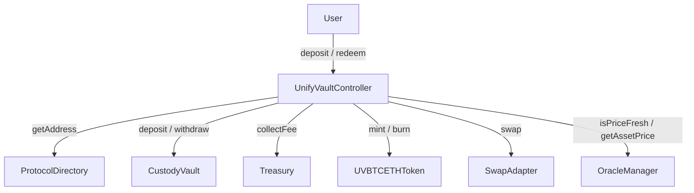

# UnifyVaultController Contract Specification

- **File Path**: [`packages/protocol/src/controller/UnifyVaultController.sol`](../../packages/protocol/src/controller/UnifyVaultController.sol)
- **Inherits**: `AccessControl`, `ReentrancyGuard`, `Pausable`
- **Compiler Version**: `0.8.24`

---

## 🎯 1. Purpose

`UnifyVaultController` is the central orchestrator and live execution engine of UnifyVault V2. It manages deposit collateral collection, atomic multi-asset DEX swaps, protocol fee routing to Treasury, share minting/burning, NAV tracking, and performance fee settlement.

---

## ⚙️ 2. Responsibilities

- Execute live user deposits by pulling USDC, taking protocol fees, executing DEX swaps for strategy tokens (cbBTC, WETH), depositing tokens to `CustodyVault`, and minting `UVBTCETHToken` shares.
- Execute live user redemptions by withdrawing strategy tokens from `CustodyVault`, executing DEX swaps back to USDC, settling protocol and performance fees, burning shares, and transferring net USDC to users.
- Enforce the **Zero-Retained-Balance Invariant** across all operations.
- Enforce slippage limits (`minSharesOut`, `minAssetsOut`), max deposit limits, deadline verification, and pause circuit breakers.

---

## 🏗️ 3. Constructor

```solidity
constructor(
    address directory_,
    address oracle_,
    address vault_,
    address treasury_,
    address token_
)
```

- **Validation**: Reverts `ZeroAddressDetected()` if any parameter is `address(0)`. Reverts `NotAContract(target)` if target has zero code length.
- **Role Assignment**: Grants `DEFAULT_ADMIN_ROLE`, `GOVERNANCE_ROLE`, `GUARDIAN_ROLE`, and `BOT_ROLE` to `msg.sender`.

---

## 💾 4. Storage & State Variables

| Name               | Type      | Visibility          | Description                                                                |
| :----------------- | :-------- | :------------------ | :------------------------------------------------------------------------- |
| `_directory`       | `address` | `private immutable` | Address of `ProtocolDirectory`                                             |
| `_oracle`          | `address` | `private immutable` | Address of `OracleManager`                                                 |
| `_vault`           | `address` | `private immutable` | Address of `CustodyVault`                                                  |
| `_treasury`        | `address` | `private immutable` | Address of `Treasury`                                                      |
| `_token`           | `address` | `private immutable` | Address of `UVBTCETHToken`                                                 |
| `_maxDeposit`      | `uint256` | `private`           | Maximum allowed collateral deposit per call (default `type(uint256).max`). |
| `_swapSlippageBps` | `uint256` | `private`           | Default swap slippage tolerance in Basis Points (default `100` = 1.00%).   |
| `BPS_DENOMINATOR`  | `uint256` | `public constant`   | Basis points denominator (`10000`).                                        |

---

## 🛡️ 5. Roles

- `DEFAULT_ADMIN_ROLE`: Role management.
- `GOVERNANCE_ROLE`: Configuration updates (`setMaxDeposit`, `setSwapSlippageBps`, `resume`).
- `GUARDIAN_ROLE`: Emergency pause capability (`emergencyPause`).
- `BOT_ROLE`: Automated bot execution.

---

## 🔒 6. Modifiers

- `nonReentrant`: Reentrancy guard on `deposit` and `redeem`.
- `whenNotPaused`: Pausable guard on state-changing user functions.

---

## 📑 7. Functions

### External & Public Execution Functions

#### `deposit(address asset, uint256 amount, uint256 minSharesOut, address receiver) → DepositQuote`

Executes a live deposit flow.

- Pulls `amount` of `asset` (USDC) from `msg.sender`.
- Calculates protocol deposit fee via `FeeLib.calculateDepositFee` and transfers fee to `Treasury`.
- Fetches strategy target weights from `StrategyManager`.
- Executes atomic swaps via `SwapAdapter` (asset -> cbBTC / WETH) with slippage limits.
- Deposits strategy assets into `CustodyVault`.
- Mints `shares` of `UVBTCETHToken` to `receiver`.
- Asserts zero controller balance invariant.

#### `redeem(address asset, uint256 shares, uint256 minAssetsOut, address receiver, uint256 deadline) → uint256 netAssets`

Executes a live redemption flow.

- Validates `block.timestamp <= deadline`, `shares > 0`, `receiver != address(0)`.
- Withdraws proportional strategy holdings (cbBTC, WETH) from `CustodyVault`.
- Swaps strategy tokens back to payout asset (USDC) via `SwapAdapter`.
- Deducts protocol redemption fee (2.00%) and routes to `Treasury`.
- Burns `shares` from `msg.sender`.
- Transfers net USDC to `receiver`.
- Asserts zero controller balance invariant.

#### Previews & Configuration

- `previewDeposit(address asset, uint256 amount) → uint256`: Views preview shares to mint.
- `previewRedeem(address asset, uint256 shares) → uint256`: Views preview payout net assets.
- `getDepositQuote(address asset, uint256 amount, uint256 minSharesOut, address receiver) → DepositQuote`: Returns full quote struct.
- `setMaxDeposit(uint256 maxDeposit_)`: `onlyRole(GOVERNANCE_ROLE)`.
- `setSwapSlippageBps(uint256 slippageBps_)`: `onlyRole(GOVERNANCE_ROLE)`.
- `emergencyPause()`: `onlyRole(GUARDIAN_ROLE)`.
- `resume()`: `onlyRole(GOVERNANCE_ROLE)`.

### Internal Functions

- `_validateDeposit(...)`: Validates asset status, amount, oracle freshness, and computes preview quote.
- `_computeMinAmountOut(...)`: Computes minimum output amount for DEX swaps based on oracle pricing and configured slippage tolerance.

---

## 🔔 8. Events

- `DepositExecuted(...)`
- `RedeemExecuted(...)`
- `SwapSlippageUpdated(...)`
- `EmergencyPaused(...)`
- `EmergencyResumed(...)`

---

## 🚨 9. Errors

- `DeadlineExpired(uint256 deadline, uint256 timestamp)`
- `NotAContract(address target)`
- `ProtocolErrors.SlippageLimitExceeded(uint256 expected, uint256 actual)`
- `ProtocolErrors.InsufficientReserves(address asset, uint256 requested, uint256 actual)`
- `ProtocolErrors.ZeroAddressDetected()`

---

## 📦 10. Dependencies

- `@openzeppelin/contracts/access/AccessControl.sol`
- `@openzeppelin/contracts/utils/ReentrancyGuard.sol`
- `@openzeppelin/contracts/utils/Pausable.sol`
- `@openzeppelin/contracts/token/ERC20/utils/SafeERC20.sol`
- `interfaces/IOracle.sol`
- `interfaces/ITreasury.sol`
- `interfaces/ISwapAdapter.sol`
- `vault/CustodyVault.sol`
- `token/UVBTCETHToken.sol`

---

## 📊 11. Interaction Diagram



---

## 🔒 12. Security Considerations

- **Zero-Retained-Balance Invariant**: Asserts zero controller token balance after every transaction.
- **Slippage Bounds**: Enforces `minSharesOut` and `minAssetsOut`.
- **Reentrancy Protection**: Protected by `nonReentrant` modifier.

---

## 🔄 13. Upgrade Considerations

- Implemented as a non-upgradeable contract. Pointers can be updated in `ProtocolDirectory` if an upgraded controller is deployed.

---

## 🧪 14. Related Tests

- `packages/protocol/test/UnifyVaultController.t.sol`
- `packages/protocol/test/DepositMinting.t.sol`
- `packages/protocol/test/Redemption.t.sol`
- `packages/protocol/test/V2ProtocolInvariants.t.sol`
- `packages/protocol/test/EconomicAdversarial.t.sol`

---

## 🔗 15. Related Documents

- [`../protocol/deposit-lifecycle.md`](../protocol/deposit-lifecycle.md) — Deposit Lifecycle
- [`../protocol/redeem-lifecycle.md`](../protocol/redeem-lifecycle.md) — Redeem Lifecycle
- [`CustodyVault.md`](CustodyVault.md) — Custody Vault Specification

---

## 🔍 Verification & Audit Metadata

- **Verification Sources**: [`packages/protocol/src/controller/UnifyVaultController.sol`](../../packages/protocol/src/controller/UnifyVaultController.sol)
- **Related Contracts**: `CustodyVault.sol`, `Treasury.sol`, `UVBTCETHToken.sol`
- **Related Tests**: `packages/protocol/test/UnifyVaultController.t.sol`
- **Last Reviewed**: 2026-07-30
