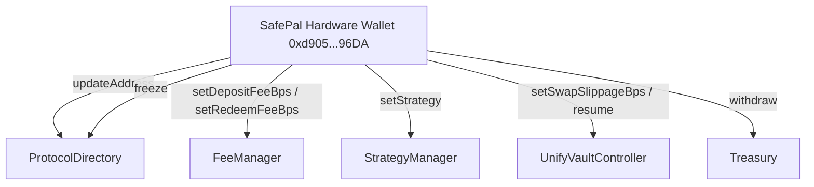

# Governance Architecture & Role Migration

This document details the governance flow, multisig administration, and role migration procedures for **UnifyVault V2**.

- **Permanent Governance Wallet (SafePal Hardware Wallet)**: `0xd905920c91853039060246Ed5724AA72B91a96DA`
- **Previous Deployer Wallet**: `0xB145AC2a59575Fbe306a58Ac924718f4DD4659Da`

---

## 🏛️ 1. Governance Control Flow

Governance over UnifyVault V2 is exercised by the SafePal Hardware Wallet (`0xd905920c91853039060246Ed5724AA72B91a96DA`) holding `DEFAULT_ADMIN_ROLE` and `GOVERNANCE_ROLE` across all system contracts.

---

## 🚀 2. Governance Migration

- **Migration Status**: `COMPLETED`
- **Migration Date**: `2026-07-31`
- **Previous Admin**: `0xB145AC2a59575Fbe306a58Ac924718f4DD4659Da`
- **Current Admin**: `0xd905920c91853039060246Ed5724AA72B91a96DA` (SafePal Hardware Wallet)
- **Migration Method**:
  - Granted `DEFAULT_ADMIN_ROLE` and `GOVERNANCE_ROLE` to SafePal hardware wallet (`0xd905920c91853039060246Ed5724AA72B91a96DA`).
  - Verified admin role on all protocol contracts using [`packages/protocol/script/MigrateGovernance.s.sol`](../../packages/protocol/script/MigrateGovernance.s.sol).
  - Old admin executed `renounceRole(DEFAULT_ADMIN_ROLE)`.
  - Governance successfully transferred.

---

## 🔒 3. Security Notes

- The SafePal hardware wallet (`0xd905920c91853039060246Ed5724AA72B91a96DA`) is now the sole governance administrator.
- The previous hot wallet (`0xB145AC2a59575Fbe306a58Ac924718f4DD4659Da`) no longer possesses `DEFAULT_ADMIN_ROLE`.
- All future governance, treasury, emergency pause, upgrades, and administrative actions must be executed exclusively from the SafePal hardware wallet.
- The previous admin wallet must never be reused for privileged protocol operations.

---

## 🔍 Verification & Audit Metadata

- **Verification Sources**: Source code, Foundry test suites (`GovernanceMigrationTest`)
- **Related Contracts**: [UnifyVaultController](../contracts/UnifyVaultController.md), [ProtocolDirectory](../contracts/ProtocolDirectory.md)
- **Last Reviewed**: 2026-07-31
