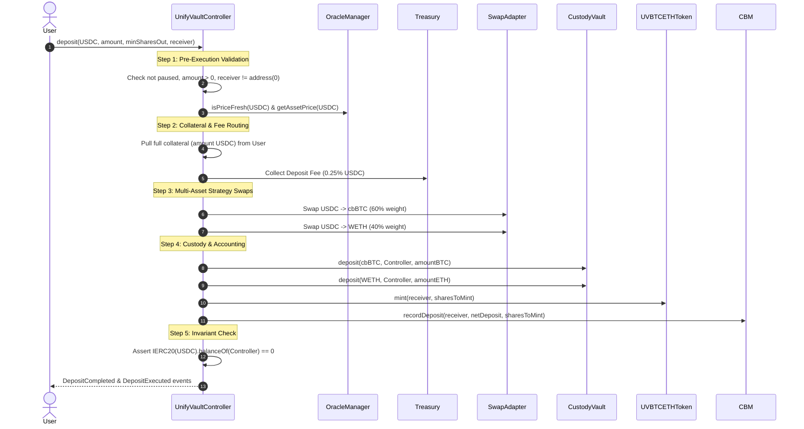

# Deposit Lifecycle & Execution Mechanics

This document provides a comprehensive analysis of the live deposit lifecycle in **UnifyVault V2**, detailing every step from user input validation to share minting.

---

## 🔄 1. Deposit Sequence Overview

---

## 🛡️ 2. Validation & Safety Guards

1. **Price Staleness Verification**: `OracleManager.isPriceFresh(asset)` verifies Chainlink heartbeat timestamps before taking funds.
2. **Single-Pull Transfer Security**: Full collateral is pulled in a single `safeTransferFrom` to prevent double-spend or allowance race conditions.
3. **Slippage Bounds**: Enforces `sharesToMint >= minSharesOut` and individual swap output bounds `minAmountOut`.
4. **Zero-Retained Balance**: Asserts that `UnifyVaultController` balance is exactly 0 at execution end.

---

## 🔍 Verification & Audit Metadata

- **Verification Sources**: Source code (), Foundry test suites ()
- **Related Contracts**: , 
- **Related Tests**:
- **Last Reviewed**: 2026-07-30
