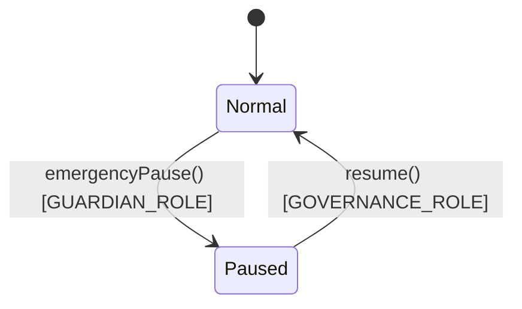

# Emergency Pause & Circuit Breaker Mechanics

This document details the emergency circuit breaker mechanism implemented across UnifyVault V2 contracts.

---

## 🚨 1. Emergency Pause Architecture

The protocol implements OpenZeppelin `Pausable` across all core execution contracts:

- `UnifyVaultController`
- `CustodyVault`
- `Treasury`
- `UVBTCETHToken`

### Role Privileges

- **Pause Execution (`emergencyPause`)**: Can be triggered immediately by `GUARDIAN_ROLE` or `GOVERNANCE_ROLE`.
- **Resume Execution (`resume`)**: Restricted exclusively to `GOVERNANCE_ROLE` (Multisig).

---

## 🔍 Verification & Audit Metadata

- **Verification Sources**: Source code (), Foundry test suites ()
- **Related Contracts**: , 
- **Related Tests**:
- **Last Reviewed**: 2026-07-30
