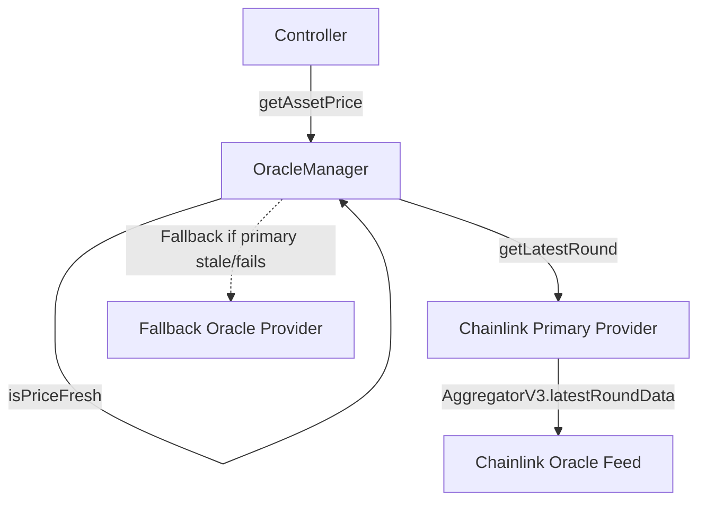

# Oracle Pricing Pipeline & Heartbeat Verification

This document details the pricing pipeline, price scaling, heartbeat staleness checks, and fallback mechanisms in **[`OracleManager`](../contracts/OracleManager.md)** and **[`ChainlinkOracleProvider`](../../packages/protocol/src/oracle/ChainlinkOracleProvider.sol)**.

---

## 🛰️ 1. Price Pipeline Architecture

---

## ⏱️ 2. Heartbeat & Staleness Rules

1. **Staleness Bound Check**:
   $$\text{PriceAge} = \text{block.timestamp} - \text{updatedAt}$$
   If $\text{PriceAge} > \text{heartbeat}$ (default 3,600 seconds), `OracleManager.isPriceFresh()` returns `false`, and price fetches revert with `Errors.OraclePriceStale`.
2. **Negative/Zero Price Protection**:
   If $\text{price} \le 0$, execution reverts with `Errors.OraclePriceNegative`.
3. **Decimal Normalization**:
   Chainlink prices (typically 8 decimals for USD feeds) are scaled up to 18 decimals ($10^{18}$).

---

## 🔍 Verification & Audit Metadata

- **Verification Sources**: Source code (), Foundry test suites ()
- **Related Contracts**: , 
- **Related Tests**:
- **Last Reviewed**: 2026-07-30
