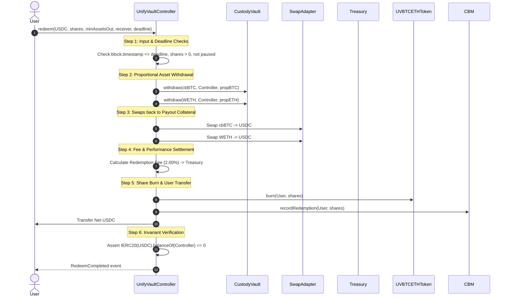

# Redeem Lifecycle & Execution Mechanics

This document details the live redemption flow, asset release, DEX swap back to USDC, and performance fee settlement in **UnifyVault V2**.

---

## 🔄 1. Redemption Sequence Overview

---

## 🔒 2. Key Safeguards

1. **Deadline Protection**: Reverts `DeadlineExpired` if `block.timestamp > deadline`.
2. **Slippage Bounds**: Reverts `SlippageLimitExceeded` if net USDC returned is less than `minAssetsOut`.

---

## 🔍 Verification & Audit Metadata

- **Verification Sources**: Source code (), Foundry test suites ()
- **Related Contracts**: , 
- **Related Tests**:
- **Last Reviewed**: 2026-07-30
