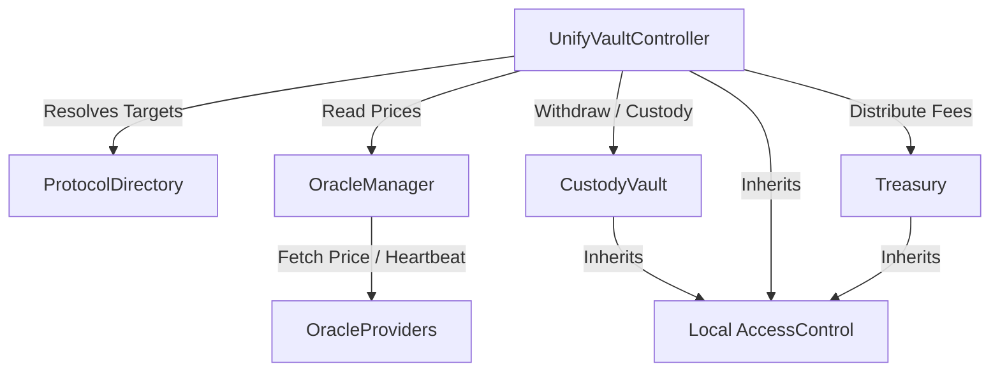

# UnifyVault Smart Contract Architecture

This document describes the design principles, boundary mappings, and layout patterns established for the UnifyVault Protocol smart contracts.

---

## 1. Core Architectural Pillars

### A. Modular Separation & Segregated Scope

Instead of deploying monolithic contract architectures, UnifyVault distributes responsibilities across independent, decoupled components:

- **Controller (`UnifyVaultController`):** Orchester of minting, burning, and collateral rebalancing flows.
- **Custody Vault (`CustodyVault`):** Holds underlying collateral securely.
- **Fee/Operational Treasury (`Treasury`):** Processes fee distributions.
- **Oracle Adapter Manager (`OracleManager`):** Computes normalized token valuations.

### B. Dynamic Address Resolution (`IProtocolDirectory`)

Hardcoding destination addresses inside smart contracts creates deployment rigidities and complicates testing. UnifyVault resolves peer addresses dynamically via a central directory contract. Contracts import [IProtocolDirectory.sol](file:///Users/apple/Documents/UnifyVault-UV/packages/protocol/src/interfaces/IProtocolDirectory.sol) and call address queries on-chain.

### C. Contract-Local Access Controls

Instead of performing external calls to a central validator, authorization is checked using contract-local role management by inheriting OpenZeppelin's standard `AccessControl` library. Role definitions are centralized in [AccessRoles.sol](file:///Users/apple/Documents/UnifyVault-UV/packages/protocol/src/libraries/AccessRoles.sol) to ensure naming consistency across modules.

### D. ERC-7201 Namespaced Storage

Standard upgradeable proxy variables (UUPS) carry layout collision risks if variables are re-arranged. UnifyVault implements **namespaced storage layouts** defined in [ProtocolStorage.sol](file:///Users/apple/Documents/UnifyVault-UV/packages/protocol/src/libraries/ProtocolStorage.sol) conforming to ERC-7201. Data variables are stored in custom pointers computed dynamically, protecting storage slots from overrides.

---

## 2. Directory Mappings & Boundaries

```
src/
├── interfaces/            # API blueprints & functional declarations
├── libraries/             # ERC-7201 Storage pointers & Auth roles constants
├── types/                 # Domain-segregated struct/enum modules
├── errors/                # Centralized custom error catalog
├── events/                # Centralized event emission rules
└── <domain>/              # Implementation modules (Oracle, Vault, Token, etc.)
```

---

## 3. Dependency Boundary Map


